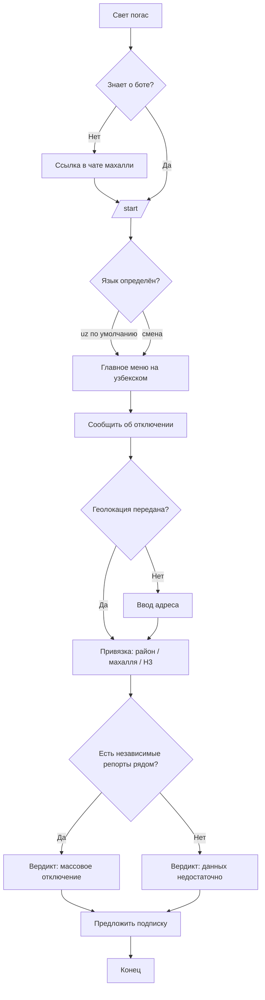
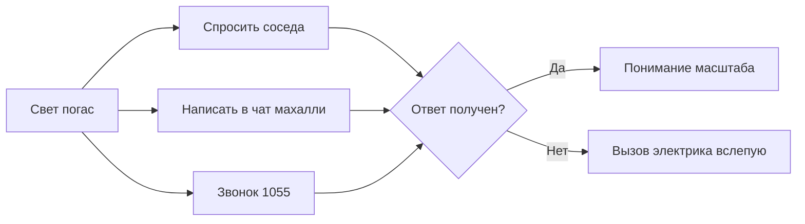
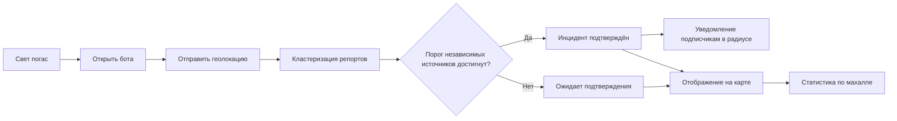
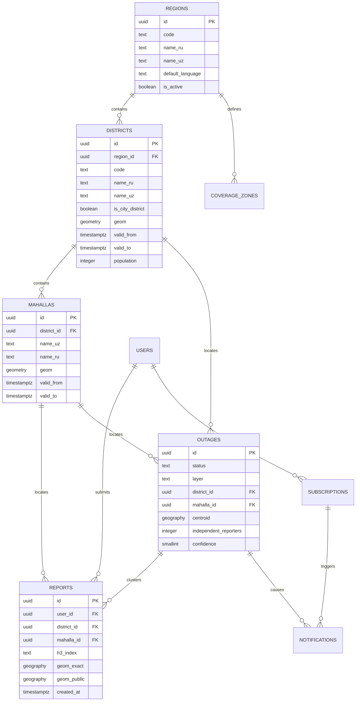
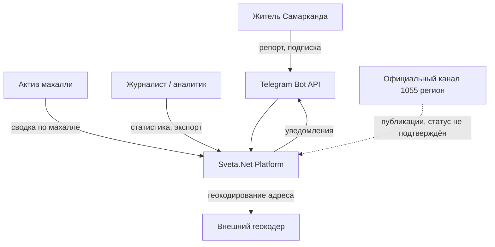
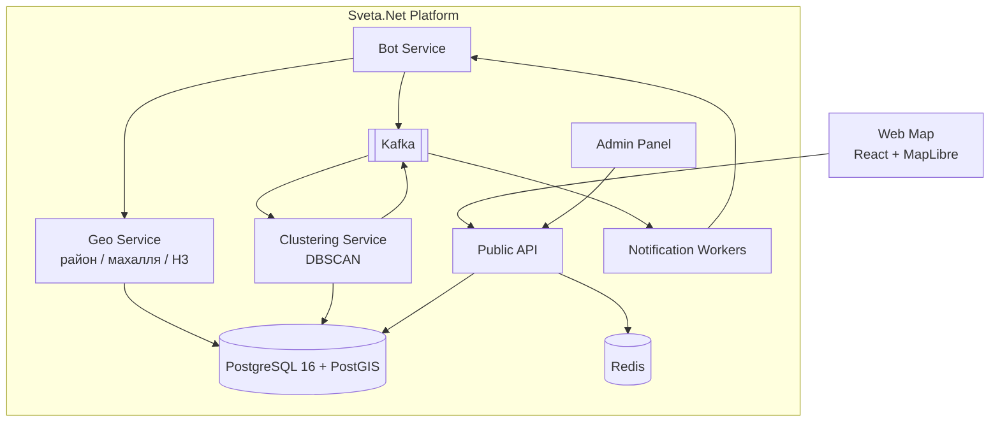

# 01. Product Requirements Document — Sveta.Net Samarkand

**Продукт:** Sveta.Net (svetanet.uz / chiroqyoq.uz / @Sveta_netbot)
**Скоуп документа:** региональное расширение на г. Самарканд и Самаркандскую область
**Версия:** 1.0 · **Статус:** Draft · **Стандарты:** BABOK v3, IEEE 830, ISO/IEC 25010, JTBD, C4, BPMN 2.0

---

## 0. Входные данные

| Параметр | Значение | Статус |
|---|---|---|
| Название | Sveta.Net — Samarqand | `[ДАННЫЕ]` |
| Отрасль | GovTech / Civic Tech, мониторинг инфраструктуры | `[ДАННЫЕ]` |
| Страна | Узбекистан | `[ДАННЫЕ]` |
| Платформа | Telegram Bot (основная), Web (карта, статистика), Public API; PWA — Phase 2 | `[ДАННЫЕ]` |
| Языки | UZ (по умолчанию), RU, EN (только API/документация) | `[ГИПОТЕЗА]` в части приоритета UZ, см. §5 |
| Целевая аудитория | Жители Самарканда и области, столкнувшиеся с отключением | `[ГИПОТЕЗА]` в части персон |
| Конкуренты / альтернативы | Официальные Telegram-каналы «1055», звонок в 1055, махаллинские чаты, «спросить у соседа» | `[ТРЕБУЕТ ПОДТВЕРЖДЕНИЯ]` в части наличия и активности региональных каналов 1055 |
| Модель | Некоммерческая, без рекламы и продажи данных | `[ДАННЫЕ]` |

**Предупреждение о нативном рынке.** Ни один пункт таблицы «Конкуренты» не проверен полевым наблюдением в Самарканде. Наличие активного регионального канала 1055 и его формат публикаций — предмет задачи P0-1 в Phase 0.

---

## 1. Product Vision

**Vision.** Ни один житель Узбекистана не должен сидеть в темноте, не понимая, что происходит и когда это закончится. Самарканд — первая проверка того, переносим ли этот результат за пределы столицы.

**Mission.** Собирать сообщения жителей об отключениях, валидировать их, сводить в достоверные инциденты и возвращать людям картой реального времени, персональными уведомлениями и честной статистикой — на узбекском языке, бесплатно, без регистрации, оставаясь независимым и прозрачным в методологии.

**Проблема.** Житель Самарканда, у которого погас свет, не может за разумное время выяснить, локальная это неисправность или массовая авария. Цена ошибки — вызов электрика при аварии на линии либо часы ожидания при неисправности собственного щитка.

**Решение.** Перенос работающей ташкентской модели (Telegram-бот → кластеризация репортов → карта и уведомления) на самаркандскую географию с адаптацией трёх слоёв: территориального деления, языка и структуры сообщества.

**Ценность.** Ответ на вопрос «локально или массово» за ≤10 секунд без звонка, без регистрации, на родном языке.

**Чего продукт не делает.** Не устраняет отключения, не заменяет 1055, не является официальным источником.

---

## 2. Product Strategy

### 2.1 Positioning Statement
Для **жителей Самарканда, столкнувшихся с отключением света**, которым нужно **немедленно понять масштаб проблемы**, Sveta.Net — это **краудсорсинговая карта отключений реального времени**, которая **за секунды показывает, есть ли авария у соседей**. В отличие от **официальных каналов и звонка в 1055**, продукт **даёт географию, историю и персональные уведомления**, оставаясь **справочным, а не официальным источником**.

### 2.2 Value Proposition

| Сегмент | Основная ценность |
|---|---|
| Житель | Ответ «локально или массово» + уведомление об отключении дома |
| Махаллинский актив | Агрегированная картина по своей махалле |
| Журналист / аналитик | Статистика с раскрытой методологией и индексом покрытия |
| Оператор сети | Обратная связь о реальной географии и длительности (Phase 3) |

### 2.3 Competitive Advantage

| Преимущество | Переносится из Ташкента? |
|---|---|
| Работающий продукт и отлаженный пайплайн | Да, полностью |
| Исторический датасет | Нет — самаркандский датасет начинается с нуля |
| Сеть пользователей | Нет — сообщество строится заново |
| Двуязычие и узбекский интерфейс | Да, усиливается |
| Репутация независимости | Частично — узнаваемость вне столицы не подтверждена `[ГИПОТЕЗА]` |

**Вывод:** переносится технология, не переносится сеть. Это определяет форму запуска: узкое место — не разработка, а набор первой критической массы репортеров.

### 2.4 Product Differentiation
Единственный дифференциатор, недоступный официальным каналам, — **карта с географией и историей**. Всё остальное (факт публикации об аварии) официальный канал делает не хуже. Продуктовая ставка Самарканда — довести долю репортов с точной геолокацией до уровня, при котором карта осмысленна на уровне махалли.

---

## 3. Goals

### Business Goals

| ID | Цель | Метрика | Статус |
|---|---|---|---|
| BG-1 | Подтвердить переносимость модели за пределы столицы | Прохождение критериев выхода Phase 0 | — |
| BG-2 | Стать вторым покрытым регионом | Регион активен в конфигурации, карта наполнена | — |
| BG-3 | Не разрушить репутацию точности | Отсутствие публичных претензий к недостоверности | — |
| BG-4 | Не увеличить постоянные расходы более чем на X% | X подлежит определению после решения по финансированию | `[ОТКРЫТО]` |

### Product Goals

| ID | Цель | Метрика | Горизонт |
|---|---|---|---|
| PG-S1 | Ответ «локально или массово» за ≤10 с | Time-to-answer p90 | Ph.1 |
| PG-S2 | Карта осмысленна на уровне махалли, не только района | Доля махаллей с ≥1 репортом за месяц | Ph.2 |
| PG-S3 | Узбекский как рабочий язык по умолчанию | Доля сессий на UZ | Ph.0 (замер) |
| PG-S4 | Честная статистика с Coverage Index по махаллям | 100% витрин с индексом покрытия | Ph.1 |

### User Goals
Понять масштаб; узнать об отключении дома удалённо; понять, когда ориентировочно вернётся свет; получить всё это на узбекском.

### Technology Goals
Мультирегиональность как конфигурация, а не форк: добавление региона — загрузка полигонов и справочников без изменения кода (наследует FR-807 ташкентского пакета).

---

## 4. Success Metrics

> **Критическое предупреждение.** Ни одна цифра в этом разделе не является самаркандским измерением. Столбец «Baseline» — ташкентское значение, приведённое как точка отсчёта, а не как ожидание. Столбцы Target — гипотезы, подлежащие пересмотру после Phase 0.

| KPI | Baseline (Ташкент) | Статус baseline | Target Ph.1 | Статус target |
|---|---|---|---|---|
| MAU бота (регион) | 20 969 | `[ДАННЫЕ]` (Ташкент) | подлежит установке после Ph.0 | `[ГИПОТЕЗА]` |
| DAU/MAU | н/д | — | подлежит замеру | `[ГИПОТЕЗА]` |
| Репортов в месяц | 7 403 | `[ДАННЫЕ]` (Ташкент) | подлежит установке после Ph.0 | `[ГИПОТЕЗА]` |
| Activation (первый репорт ≤7 дней от /start) | н/д | — | подлежит замеру | `[ГИПОТЕЗА]` |
| Retention D30 | н/д | — | подлежит замеру | `[ГИПОТЕЗА]` |
| Conversion шага «геолокация» | н/д | — | подлежит замеру | `[ГИПОТЕЗА]` |
| Churn (нет активности 60 дней) | н/д | — | подлежит замеру | `[ГИПОТЕЗА]` |
| NPS | н/д | — | замер в Ph.0 на выборке ≥100 | `[ГИПОТЕЗА]` |
| Time to Value | ≤10 с (целевое) | `[BASELINE-TAS]` | ≤10 с | `[ГИПОТЕЗА]` |
| Медианная длительность отключения | 44 мин | `[BASELINE-TAS]` | не применимо как target — это наблюдаемая величина | — |
| P90 длительности | 4 ч 11 мин | `[BASELINE-TAS]` | не применимо как target | — |
| Coverage Index по махаллям | не существует | — | ≥50% махаллей с покрытием выше низкого | `[ГИПОТЕЗА]` |

### Коммерческие метрики `[ГИПОТЕЗА]`

> Продукт некоммерческий и не имеет источника финансирования (наследует открытое замечание C-04 ташкентского пакета). Раздел заполнен по требованию шаблона и **не описывает существующую или планируемую бизнес-модель**. Любое использование этих строк в инвестиционном материале будет искажением.

| Метрика | Значение | Комментарий |
|---|---|---|
| Revenue | 0 | `[ДАННЫЕ]` — выручки нет |
| MRR / ARR | 0 | `[ДАННЫЕ]` |
| CAC | не рассчитывается | `[ГИПОТЕЗА]` — платного привлечения нет; при органическом росте через махаллинские чаты денежная стоимость привлечения ≈ 0, издержки — время команды |
| LTV | неприменимо | `[ГИПОТЕЗА]` — пользователь не генерирует денежный поток; аналог LTV — число репортов за жизненный цикл пользователя |
| Payback | неприменимо | `[ГИПОТЕЗА]` |

**Замена для некоммерческой модели:** вместо LTV/CAC использовать **стоимость одного валидированного инцидента** (инфраструктурные расходы региона ÷ число подтверждённых инцидентов за месяц) — величина рассчитывается после Ph.0.

---

## 5. Target Audience

> **Статус всего раздела — `[ГИПОТЕЗА]`.** Персоны построены переносом ташкентских гипотез (открытое замечание C-06) плюс предположения о региональной специфике. Ни одного интервью в Самарканде не проведено. Раздел подлежит замене по итогам P0-3 (8–12 интервью).

### Persona 1 — Дилшод, 34, житель махалли

| Атрибут | Значение |
|---|---|
| Роль | Наёмный работник, глава домохозяйства |
| Язык | Узбекский — единственный комфортный интерфейсный `[ГИПОТЕЗА]` |
| Устройство | Android среднего сегмента, мобильный интернет `[ГИПОТЕЗА]` |
| Проблема | Погас свет вечером; неясно, звать ли электрика |
| Потребность | Мгновенный ответ без звонков |
| JTBD | «Когда у меня гаснет свет, я хочу за секунды понять, у соседей тоже темно, чтобы не тратить деньги на вызов мастера впустую» |

### Persona 2 — Нигора, 41, работает удалённо

| Атрибут | Значение |
|---|---|
| Проблема | Отключение дома срывает работу; о нём узнаёт постфактум |
| Потребность | Проактивное уведомление |
| JTBD | «Когда я не дома, я хочу узнавать об отключении по своему адресу, чтобы успеть перенести встречи и спасти данные» |

### Persona 3 — Актив махалли

| Атрибут | Значение |
|---|---|
| Проблема | Жители звонят ему, а не в 1055; у него нет картины |
| Потребность | Сводка по своей махалле |
| JTBD | «Когда ко мне обращаются жители, я хочу видеть, что происходит по махалле, чтобы дать один ответ всем» |
| Продуктовая роль | **Ключевой канал первичного набора аудитории** `[ГИПОТЕЗА]` — см. §7 MVP |

### Persona 4 — Журналист / аналитик
Нужна статистика с оговорками о покрытии; риск — неверная интерпретация (наследует риск R-10).

### Customer Journey (Persona 1)

| Стадия | Действие | Точка отказа |
|---|---|---|
| Trigger | Погас свет | — |
| Awareness | Вспоминает о боте / видит ссылку в чате махалли | Не знает о продукте |
| First use | `/start`, выбор языка | Интерфейс не на узбекском |
| Core action | Нажимает «Сообщить», отправляет геолокацию | Отказ делиться геолокацией |
| Value | Получает вердикт о числе сообщений рядом | Рядом нет других репортов → вердикт бесполезен |
| Retention | Подписка на адрес | Не понял, зачем |

**Точка максимального риска — Value при низкой плотности.** В первые недели запуска соседних репортов не будет, и продукт вернёт пустой ответ. Это структурная проблема холодного старта, а не дефект UX; смягчение — §7.

---

## 6. Problem Statement

> Жители Самарканда, столкнувшиеся с отключением электроэнергии, не имеют оперативного, географически точного и узбекоязычного источника информации о масштабе аварии, что приводит к потерям времени, лишним вызовам мастеров и невозможности планировать день.

**Почему будут пользоваться:** нулевое трение (Telegram уже установлен), отсутствие регистрации, единственный ответ, которого нет у официальных каналов, — географический.

**Почему могут не начать пользоваться** (равновероятные гипотезы, проверяются в Ph.0):
- частота отключений в Самарканде ниже порога, при котором продукт вспоминают;
- махаллинские чаты уже решают задачу на своём уровне достаточно хорошо;
- плотность репортеров не достигает критической массы, и карта остаётся пустой.

---

## 7. Scope

### MVP (Phase 0 + Phase 1)

| Входит | Обоснование |
|---|---|
| Активация региона конфигурацией: полигоны районов, махаллей, зона покрытия | Наследует FR-807 |
| Узбекский язык по умолчанию для региона | PG-S3 |
| Приём репортов с геолокацией, кластеризация, карта | Ядро продукта |
| Трёхуровневая привязка: район → махалля → H3 | §17 |
| Coverage Index на уровне махалли с дисклеймером | PG-S4 |
| Подписка на адрес и уведомления | PG-S2 |
| Ручной разбор публикаций регионального источника 1055 (если он существует) | P0-1 |
| Партнёрская схема с махаллинскими чатами для холодного старта | Митигация риска пустой карты |

### Future Release
Автоматический парсинг регионального канала 1055; статистика по махаллям с исторической глубиной; прогноз; официальная интеграция с региональным оператором; распространение на другие города области.

### Out of Scope
Нативные мобильные приложения; монетизация в любой форме; официальный статус источника; SMS-канал (стоимость несовместима с некоммерческой моделью); гарантии времени восстановления.

---

## 8. Functional Requirements (дельта к ташкентскому пакету)

> Модули M1–M12 наследуются из `03_Functional_Requirements.md` ташкентского пакета без изменений, кроме перечисленного ниже. Приоритеты: P0 блокирующий, P1 высокий, P2 средний.

### M8. Геолокация и справочники — изменённые требования

#### FR-S-801 — Справочник районов Самарканда
| Поле | Значение |
|---|---|
| Описание | Справочник административных районов г. Самарканда и районов области с полигонами и названиями ru/uz |
| Приоритет | P0 |
| Риск | Состав и число районов города `[ТРЕБУЕТ ПОДТВЕРЖДЕНИЯ]` — см. OQ-01 |
| AC | Given запрошен справочник региона `samarkand`, Then возвращаются районы с полигонами и двуязычными названиями, And источник и дата актуальности границ указаны в ответе |

#### FR-S-802 — Справочник махаллей
| Поле | Значение |
|---|---|
| Описание | Справочник махаллинских сходов граждан с полигонами; средний уровень гео-модели |
| Приоритет | P0 |
| Ошибки | `MAHALLA_POLYGON_MISSING` — деградация до уровня района |
| AC | Given репорт с координатами внутри известной махалли, Then репорт привязан к району и к махалле, And при отсутствии полигона привязка выполняется только к району без ошибки |

#### FR-S-803 — Версионирование границ
| Поле | Значение |
|---|---|
| Описание | Границы районов и махаллей версионируются (`valid_from` / `valid_to`); историческая статистика пересчитывается по границам, действовавшим на момент инцидента |
| Приоритет | P0 |
| Обоснование | Прямая митигация OQ-01: административная реорганизация не должна обнулять историю |
| AC | Given границы района изменены с даты D, When запрашивается статистика за период до D, Then применяются старые границы, And в ответе указана версия справочника |

#### FR-S-804 — H3-агрегация
| Поле | Значение |
|---|---|
| Описание | Нижний уровень модели — H3 разрешения 8–9; используется для тепловой карты и для кластеризации при отсутствии полигона махалли |
| Приоритет | P1 |
| Параметр | Разрешение H3 — **подлежит калибровке**, не фиксируется в спецификации до Ph.0 |

### M6. Telegram Bot — изменённые требования

#### FR-S-601 — Язык по умолчанию
| Поле | Значение |
|---|---|
| Описание | Для пользователей, чья первая геолокация попадает в регион `samarkand`, либо чей Telegram-язык `uz`, интерфейс по умолчанию узбекский |
| Приоритет | P0 |
| Статус | Правило основано на `[ГИПОТЕЗА]` о языковом профиле региона; порядок языков — параметр конфигурации, изменяемый без релиза |
| AC | Given новый пользователь из региона samarkand, When он выполняет /start, Then первый экран на узбекском, And переключение на русский доступно одним действием |

### M9. Аналитика — изменённые требования

#### FR-S-901 — Дисклеймер молодого региона
| Поле | Значение |
|---|---|
| Описание | Витрина статистики Самарканда сопровождается явной пометкой о недостаточной глубине данных, пока не накоплено ≥N месяцев наблюдений |
| Приоритет | P0 |
| Параметр | N подлежит определению; порог значимости <30 случаев наследуется из FR-901 |

---

## 9. User Stories

**US-S1 (P0).** Как житель Самарканда, я хочу увидеть интерфейс на узбекском без настройки, чтобы понять продукт с первого экрана.
```gherkin
Given я новый пользователь с геолокацией в Самарканде
When я выполняю /start
Then весь интерфейс отображается на узбекском
And переключение языка доступно одной командой
```

**US-S2 (P0).** Как житель, я хочу узнать, есть ли отключение у соседей, чтобы решить, вызывать ли электрика.
```gherkin
Given я отправил геолокацию
When бот обработал репорт
Then я получаю вердикт с числом независимых сообщений рядом за последний час
And если сообщений рядом нет, вердикт явно сообщает, что данных недостаточно, а не что аварии нет
```

**US-S3 (P1).** Как актив махалли, я хочу видеть сводку по своей махалле, чтобы отвечать жителям одним сообщением.
```gherkin
Given я выбрал махаллю
When открывается сводка
Then отображаются активные инциденты, число сообщений и индекс покрытия махалли
And присутствует дисклеймер о краудсорсинговой природе данных
```

**US-S4 (P1).** Как житель, я хочу подписаться на свой адрес, чтобы узнавать об отключении удалённо.

**US-S5 (P2).** Как аналитик, я хочу выгрузить статистику по махаллям, чтобы сравнить надёжность районов.
```gherkin
Given период и регион выбраны
When я запрашиваю экспорт
Then выгрузка содержит индекс покрытия по каждой махалле
And выгрузка содержит версию справочника границ
```

---

## 10. Use Cases

### UC-S1. Репорт об отключении

| Поле | Значение |
|---|---|
| Участники | Житель, Telegram Bot, Geo-сервис, Кластеризатор |
| Предусловия | Бот запущен, регион активен, полигоны загружены |
| Основной сценарий | 1. Житель нажимает «Сообщить». 2. Отправляет геолокацию. 3. Система определяет район, махаллю, H3. 4. Репорт создан, включён в кластеризацию. 5. Бот возвращает вердикт. |
| Альтернативный | Полигон махалли отсутствует → привязка только к району, репорт принят (FR-S-802) |
| Ошибки | `GEO_OUT_OF_COVERAGE` — точка вне зоны; `GEOCODER_UNAVAILABLE` — предложить точку на карте |
| Результат | Репорт в системе, житель получил ответ |

### UC-S2. Активация региона

| Поле | Значение |
|---|---|
| Участники | Оператор платформы, Админ-панель |
| Предусловия | Полигоны районов и махаллей подготовлены и проверены |
| Основной сценарий | 1. Загрузка полигонов. 2. Указание версии и даты актуальности. 3. Валидация геометрии. 4. Активация зоны покрытия. 5. Смоук-проверка привязки на контрольных точках. |
| Альтернативный | Валидация геометрии не пройдена → регион не активируется, отчёт об ошибках |
| Ошибки | Пересечение полигонов; дыры в покрытии; несовпадение суммы махаллей с районом |
| Результат | Регион активен без изменения кода |

### UC-S3. Изменение административных границ

| Поле | Значение |
|---|---|
| Предусловия | Опубликован официальный акт о реорганизации |
| Основной сценарий | 1. Загрузка новой версии полигонов с `valid_from`. 2. Старая версия закрывается `valid_to`. 3. Витрины пересчитываются с учётом версий. 4. Публикуется уведомление о смене методологии. |
| Ошибки | Потеря исторической привязки → блокирующая; миграция обратима |
| Результат | История сохранена, новая статистика корректна |

---

## 11. User Flow



---

## 12. Business Process

### AS-IS (Самарканд, до запуска)



### TO-BE



---

## 13. UX Requirements

Наследуются UX-01…UX-12 ташкентского пакета. Дельта:

| ID | Требование |
|---|---|
| UX-S1 | Первый экран на узбекском; смена языка — одно действие, доступное с любого экрана |
| UX-S2 | При отсутствии соседних репортов вердикт формулируется как «данных недостаточно», **никогда** как «аварии нет» — иначе продукт даёт ложноотрицательный ответ на старте |
| UX-S3 | Карта Самарканда открывается с зумом уровня города; при пустой карте показывается объяснение и CTA, а не пустое полотно |
| UX-S4 | Индекс покрытия махалли отображается рядом с любой цифрой статистики, а не в FAQ |
| UX-S5 | Онбординг из 3 экранов: что делает продукт, зачем геолокация, что такое подписка |
| UX-S6 | Проектная ширина 360 px; работоспособность на 3G обязательна |
| UX-S7 | Accessibility — WCAG 2.1 AA, наследуется A11Y-01…A11Y-10 |

---

## 14. UI Requirements

| Аспект | Решение |
|---|---|
| Основные экраны | Карта · Карточка инцидента · Статистика по махалле · Подписки · Онбординг · Настройки языка |
| Компоненты | Наследуются из существующей дизайн-системы продукта |
| Цветовая схема статусов | Ждёт подтверждения · Авария подтверждена · Из официального источника (не подтв.) · Завершено — те же четыре статуса, что в Ташкенте |
| Дублирование смысла | Статус кодируется цветом **и** формой (пунктир / заливка / иконка) — A11Y-06 |
| Dark Mode | Отдельный токен-набор, авто-переключение по `prefers-color-scheme` |
| Типографика | Узбекская латиница как основной набор; проверка длины строк — узбекские подписи в среднем длиннее русских, макеты не должны ломаться `[ГИПОТЕЗА]`, проверяется на реальных строках |

---

## 15. Non-functional Requirements

Наследуются NFR ташкентского пакета (ISO/IEC 25010). Дельта:

| ID | Требование |
|---|---|
| NFR-S-01 | Добавление региона не требует изменения кода — только конфигурация и загрузка полигонов |
| NFR-S-02 | Мультирегиональные запросы фильтруются по `region_id` на уровне индекса; отсутствие фильтра — дефект |
| NFR-S-03 | Нагрузка Самарканда не рассчитывается отдельно: плановый горизонт платформы 500 тыс. пользователей покрывает оба региона `[BASELINE-TAS]` |
| NFR-S-04 | Локализация хранения данных на территории РУз — требование к инфраструктуре, распространяется на весь регион (наследует открытое замечание C-09) |
| NFR-S-05 | Справочники границ версионируются; изменение границ не искажает историческую статистику |
| NFR-S-06 | Полный интерфейс, уведомления и тексты ошибок доступны на UZ и RU; непереведённая строка — блокирующий дефект релиза региона |
| NFR-S-07 | Availability и latency — целевые значения общие с платформой, отдельного SLO для региона нет |

---

## 16. API Requirements

Наследуется `17_OpenAPI.yaml` (OpenAPI 3.1, REST, `/api/v1`, идемпотентность, rate limit, версионирование). Дельта:

| Изменение | Описание |
|---|---|
| Параметр `region_id` | Обязателен во всех гео-запросах; отсутствие → регион по умолчанию, что подлежит явной фиксации в спецификации |
| `GET /geo/mahallas` | Новый эндпоинт: справочник махаллей с полигонами и версией |
| `GET /geo/districts` | Расширен параметром `region_id` и полем `valid_from` / `valid_to` |
| Ответы статистики | Добавлено поле версии справочника границ и индекса покрытия махалли |
| `Accept-Language` | Значения `uz` и `ru`; порядок по умолчанию зависит от региона |
| Webhook / WebSocket | Не входят в скоуп регионального запуска |
| OAuth / JWT | Наследуются без изменений |

---

## 17. Data Model

**Трёхуровневая гео-модель** — ключевое отличие от Ташкента.



**Изменения относительно ташкентской схемы:**
- новая таблица `mahallas` между `districts` и `reports`;
- `regions.default_language` — язык по умолчанию как атрибут региона;
- `reports.h3_index` — предрасчитанный индекс для тепловой карты;
- `valid_from` / `valid_to` на `districts` и `mahallas` — обязательны, а не опциональны.

---

## 18. Integrations

| Система | Тип | Протокол | Описание | Статус |
|---|---|---|---|---|
| Telegram Bot API | Входящий/исходящий | HTTPS webhook | Основной канал | `[ДАННЫЕ]` |
| Региональный канал «1055» | Входящий | Парсинг публикаций | Наличие и формат не подтверждены | `[ТРЕБУЕТ ПОДТВЕРЖДЕНИЯ]`, задача P0-1 |
| Геокодер | Внешний | HTTPS REST | Адреса Самарканда; полнота покрытия не проверена | `[ТРЕБУЕТ ПОДТВЕРЖДЕНИЯ]`, риск R-13 |
| Источник полигонов махаллей | Разовый импорт | GeoJSON / Shapefile | Источник и лицензия не определены | `[ОТКРЫТО]`, OQ-02 |
| Региональный оператор сети | Двусторонний | REST (Ph.3) | Не начато | `[ГИПОТЕЗА]` |
| Махаллинские чаты | Организационный | Вне системы | Канал холодного старта | `[ГИПОТЕЗА]` |

---

## 19. Notifications

| Канал | Статус в регионе | Обоснование |
|---|---|---|
| Telegram (in-bot) | MVP | Основной, нулевая стоимость |
| In-App (веб-баннер) | MVP | Дёшево |
| Web Push (PWA) | Phase 2 | Наследует платформенный план |
| Email | Не входит | Нет пользовательских email, ПДн не собираются |
| SMS | Не входит | Стоимость несовместима с некоммерческой моделью |
| WhatsApp | Не входит | Нет подтверждённого спроса |

Правило доставки наследуется: уведомление отправляется при подтверждённом инциденте в радиусе подписки. **Радиус для Самарканда подлежит калибровке отдельно** — 500 м Ташкента `[BASELINE-TAS]` могут не соответствовать плотности застройки махаллей.

---

## 20. Security

Наследуется полностью: RBAC, MFA для админ-ролей, шифрование, аудит, политика сессий и паролей, разделение `geom_exact` / `geom_public`, право `outage.read_exact_geo`.

| Пункт | Комментарий для региона |
|---|---|
| PCI DSS | Неприменим — платежей нет |
| GDPR | Неприменим как основной режим; применимое право — законодательство РУз о персональных данных, включая требования к локализации хранения. Юридическая проверка не проведена (C-09) |
| ISO 27001 | Ориентир, не обязательство |
| ПДн | Не собираются: ни ФИО, ни телефон, ни username; идентификатор Telegram хранится в псевдонимизированном виде |
| Геоданные | Точка на публичной карте снапится к сетке; для махаллинского уровня требуется **проверка риска реидентификации** — в малой махалле точность 50 м может указывать на конкретный дом `[ОТКРЫТО]`, OQ-04 |

---

## 21. Analytics

### Event Tracking

| Событие | Ключевые атрибуты |
|---|---|
| `bot_start` | region, language_detected |
| `language_changed` | from, to |
| `report_submit_attempt` | geo_source (gps / address) |
| `report_created` | district_id, mahalla_id, h3, accuracy |
| `geo_permission_denied` | — |
| `verdict_shown` | verdict_type (mass / insufficient_data) |
| `subscription_created` | radius |
| `notification_sent` / `notification_opened` | outage_id |
| `stats_viewed` | district_id, mahalla_id, period |
| `light_returned_pressed` | outage_id |

### Дашборды
Воронка активации (start → geo → первый репорт); плотность репортов по махаллям; доля вердиктов «данных недостаточно»; доля сессий на UZ; Coverage Index по махаллям.

**Главная метрика запуска** — доля вердиктов «данных недостаточно». Её снижение означает достижение критической массы; её устойчиво высокое значение означает провал гипотезы плотности.

---

## 22. Logging & Monitoring

Наследуется платформенный стек: Prometheus, Grafana, ELK/OpenSearch, health-checks, алертинг. Дельта:

| Элемент | Требование |
|---|---|
| Метрики с разрезом по региону | Все продуктовые метрики размечены `region` — иначе самаркандские данные растворятся в ташкентских |
| Алерт | Доля репортов без привязки к махалле >10% → дефект справочника полигонов |
| Алерт | Доля неудачных геокодирований >15% → риск R-13, переход в режим «точка на карте» |
| Health-check | Доступность источника региональных публикаций 1055 |

---

## 23. Acceptance Criteria

Сведены при каждом FR (§8) и User Story (§9). Общий критерий приёмки регионального релиза:

- [ ] Все районы и махалли загружены, геометрия валидна, версии проставлены
- [ ] Контрольная выборка ≥50 точек привязывается к корректной махалле
- [ ] Интерфейс на UZ полон: непереведённых строк нет
- [ ] Coverage Index отображается на всех витринах региона
- [ ] Вердикт при отсутствии соседних репортов сформулирован как «данных недостаточно»
- [ ] Метрики размечены `region`
- [ ] Дисклеймер молодого региона активен

---

## 24. Product Roadmap

> **Phase 0 — единственный шлюз.** Бюджеты Phase 1–2 не утверждаются до прохождения критериев выхода Phase 0. Причина: самаркандских метрик не существует, и любая оценка объёма работ до их появления — угадывание.

### Phase 0 — Валидация гипотез

| ID | Задача | Проверяемая гипотеза |
|---|---|---|
| P0-1 | Полевое наблюдение: существует ли региональный канал 1055, каков формат и частота публикаций | Наличие официального слоя данных |
| P0-2 | Замер частоты отключений в Самарканде по доступным открытым источникам | Востребованность продукта |
| P0-3 | 8–12 интервью с жителями (заменяет персоны §5) | JTBD, языковой профиль, роль махаллинских чатов |
| P0-4 | Получение и проверка полигонов махаллей | Реализуемость трёхуровневой модели |
| P0-5 | Проверка полноты геокодера на адресах Самарканда | Риск R-13 |
| P0-6 | Пилот на 1–2 махаллях: набор ≥N репортеров через актив махалли | Гипотеза холодного старта |
| P0-7 | Юридическая проверка (общая с платформой) | C-09 |

**Критерии выхода Phase 0:**
- [ ] Языковой профиль подтверждён замером, а не гипотезой
- [ ] Полигоны махаллей получены и валидны
- [ ] Пилот показал достижимость плотности репортов, при которой вердикт «массовое отключение» возникает
- [ ] Определён источник финансирования регионального расширения (наследует C-04)
- [ ] Установлены целевые значения KPI на основе замеров, а не переносов

### Phase 1 — Регион в проде
Конфигурация региона, справочники, UZ-first, Coverage Index по махаллям, витрина статистики с дисклеймером.

### Phase 2 — Плотность и доверие
Расширение на все махалли города, калибровка радиуса уведомлений, автоматический парсинг регионального 1055.

### Phase 3 — Область и интеграция
Районы области, переговоры с региональным оператором, Open Data.

**Сроки не проставлены намеренно.** Оценки без участия команды дают ложную точность (наследует открытое замечание C-05).

---

## 25. Release Plan

| Релиз | Содержание | Условие выпуска |
|---|---|---|
| R0 (пилот) | Регион активен для 1–2 махаллей, закрытый круг | Полигоны валидны |
| R1 (MVP) | Город целиком, UZ-first, карта, статистика | Критерии выхода Ph.0 закрыты |
| R1.1 | Подписки и уведомления с калиброванным радиусом | Накоплены данные о плотности |
| R2.0 | Автопарсинг регионального 1055, махаллинские витрины | P0-1 подтвердил наличие источника |
| R3.0 | Область, интеграция с оператором | Переговоры результативны |

**Коммуникация при R1:** статистика Самарканда несопоставима со статистикой Ташкента по глубине данных. Публиковать их рядом без дисклеймера — прямой путь к воспроизведению риска R-10.

---

## 26. Risks

| ID | Риск | Вероятность | Влияние | Снижение |
|---|---|---|---|---|
| RS-01 | Холодный старт: карта остаётся пустой, продукт бесполезен | Высокая | Критическое | Пилот через актив махалли; вердикт «данных недостаточно» вместо ложного «аварии нет» |
| RS-02 | Полигоны махаллей недоступны или неточны | Высокая | Высокое | P0-4; деградация до уровня района (FR-S-802) |
| RS-03 | Административная реорганизация районов ломает историю | Средняя | Высокое | Версионирование границ (FR-S-803) |
| RS-04 | Геокодер не покрывает адреса Самарканда | Высокая | Среднее | P0-5; режим «точка на карте» |
| RS-05 | Частота отключений ниже порога востребованности | Средняя | Критическое | P0-2 до любых вложений |
| RS-06 | Реидентификация в малой махалле по огрублённой точке | Средняя | Высокое | OQ-04, пересмотр сетки снапа для малых полигонов |
| RS-07 | Нет финансирования регионального расширения | Высокая | Критическое | Наследует C-04; шлюз Phase 0 |
| RS-08 | Языковая гипотеза неверна, UZ-first ухудшает конверсию | Низкая | Среднее | Язык — параметр конфигурации, откат без релиза |
| RS-09 | Отсутствие регионального канала 1055 лишает официального слоя | Средняя | Среднее | P0-1; запуск только с краудсорсинговым слоем |
| RS-10 | Некорректная интерпретация молодой статистики в СМИ | Средняя | Высокое | Дисклеймер молодого региона, Coverage Index |

---

## 27. Assumptions

| ID | Допущение | Критичность | Способ проверки |
|---|---|---|---|
| AS-S1 | Отключения в Самарканде достаточно часты | Критическая | P0-2 |
| AS-S2 | Узбекский — предпочтительный язык интерфейса в регионе | Высокая | P0-3 + замер |
| AS-S3 | Полигоны махаллей существуют в машинно-читаемом виде | Высокая | P0-4 |
| AS-S4 | Махаллинские чаты пригодны как канал первичного набора | Высокая | P0-6 |
| AS-S5 | Telegram доминирует в регионе так же, как в столице | Средняя | P0-3 |
| AS-S6 | Ташкентские параметры кластеризации применимы после перекалибровки | Средняя | Калибровка на первых данных |
| AS-S7 | Плотность застройки махалли совместима с радиусом уведомлений | Средняя | Калибровка после накопления данных |
| AS-S8 | Инфраструктурная нагрузка региона укладывается в текущий горизонт 500 тыс. | Средняя | Мониторинг |

---

## 28. Dependencies

| Зависимость | Тип | Блокирует |
|---|---|---|
| Полигоны районов и махаллей | Внешняя, данные | Весь региональный запуск |
| Официальный акт о границах районов | Внешняя, правовая | OQ-01 |
| Геокодер с покрытием Самарканда | Внешняя, сервис | FR-804 |
| Наличие регионального канала 1055 | Внешняя, данные | Официальный слой карты |
| Решение по финансированию | Внутренняя | Phase 1+ |
| Реализация мультирегиональности (FR-807) в платформе | Внутренняя, техническая | R0 |
| Юридическое заключение по ПДн | Внешняя | Прод-запуск |

---

## 29. High-Level Architecture

Архитектура наследуется без изменений; регион — конфигурационная сущность.

### C4 Context



### C4 Container



**Единственное архитектурное следствие Самарканда:** `GEO` получает третий уровень привязки и версионирование справочников. Остальные контейнеры не меняются.

---

## 30. Glossary

| Термин | Определение |
|---|---|
| Махалля | Махаллинский сход граждан; низовая территориальная единица самоуправления. В модели — средний уровень гео-иерархии |
| Report (отметка) | Единичное сообщение жителя об отключении |
| Outage (инцидент) | Кластер репортов, признанный единым событием |
| Подтверждение | Достижение порога независимых источников либо данные официального слоя |
| Автозакрытие | Закрытие инцидента по истечении TTL от последнего сообщения |
| Coverage Index | Индекс покрытия территории репортерами; **формула не валидирована** (наследует C-11) |
| H3 | Гексагональная система индексации Uber, разрешение 8–9 |
| DBSCAN | Алгоритм плотностной кластеризации репортов в инциденты |
| Слой карты | Источник данных: бот / официальный / тепловая карта; слои не смешиваются (BR-08) |
| BASELINE-TAS | Метка значения, перенесённого из ташкентского baseline |

---

## 31. Appendix

### Наследуемые документы
`01_BRD.md`, `02_PRD.md`, `03_Functional_Requirements.md`, `04_NFR.md`, `05_API.md`, `06_Database.md`, `07_RBAC.md`, `08_System_Architecture.md`, `17_OpenAPI.yaml`, `18_ERD.md` — ташкентский пакет v1.0.

### Обязательное к прочтению
`21_Critical_Review.md` ташкентского пакета. Открытые замечания C-04 (экономика), C-05 (оценки), C-06 (персоны), C-09 (право), C-10 (метрики ML), C-11 (Coverage Index) **распространяются на настоящий документ в полном объёме** и здесь не переоткрываются.

### Стандарты
BABOK v3 · PMBOK 7 · IEEE 830-1998 · ISO/IEC 25010 · WCAG 2.1 AA · OpenAPI 3.1 · UML 2.5 · BPMN 2.0 · C4 Model · OWASP ASVS

### Исследования
**Отсутствуют.** Ни одного исследования по самаркандскому рынку не проводилось. Это не пробел оформления, а фактическое состояние: см. Phase 0.
