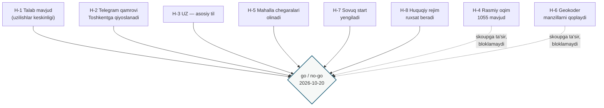
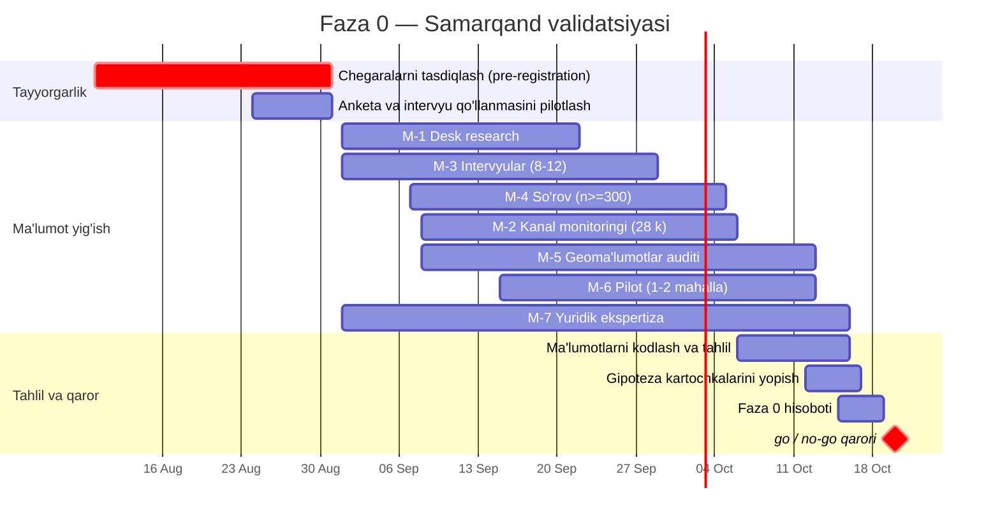

# 02. Faza 0 — Gipotezalarni validatsiya qilish rejasi
## Sveta.Net — Samarqand mintaqaviy konturi

| | |
|---|---|
| **Mahsulot** | Sveta.Net (svetanet.uz / chiroqyoq.uz / @Sveta_netbot) — «Samarqand» mintaqaviy konturi |
| **Hujjat turi** | Discovery / Validation Plan (Faza 0) |
| **Bog'liq hujjatlar** | `BRD_Samarkand.md` (§4, §5.1, §20, §22), `01_PRD_Samarkand.md` (§24 Phase 0) |
| **Versiya** | 1.0 · **Holati:** Draft for review |
| **Sana** | 2026-08-06 |
| **Standartlar** | BABOK v3 (Elicitation & Collaboration, Strategy Analysis), PMBOK 7, ISO/IEC 25010 |
| **O'lchov oynasi** | 2026-09-01 → 2026-10-20 (go / no-go qarori) |

---

## 0. Hujjatni o'qish reglamenti

Bu hujjat **mahsulotni qanday qurishni** tavsiflamaydi. U bitta savolga javob beradi: **Samarqandda mintaqaviy konturni ochish uchun asos bormi?**

BRD va PRD ning markaziy cheklovi shu yerda amalga oshiriladi: **Samarqand bo'yicha birorta ham empirik ko'rsatkich mavjud emas.** BRD §21 dagi barcha maqsadli qiymatlar `BASELINE-TAS` (Toshkent ko'rsatkichini validatsiyasiz ko'chirish) yoki `GIPOTEZA` maqomida. Faza 0 — bu ko'rsatkichlarni **o'lchovga** aylantiradigan yagona shlyuz.

### 0.1 Ishonchlilik belgilari (BRD §0 dan meros)

| Belgi | Ma'nosi |
|---|---|
| `MA'LUMOT` | Mahsulotning birlamchi manbasi bilan tasdiqlangan |
| `BASELINE-TAS` | Toshkent ko'rsatkichi validatsiyasiz ko'chirilgan. **Prognoz emas** |
| `BAHO` | `BASELINE-TAS` yoki ochiq manbalardan hisoblangan |
| `GIPOTEZA` | Faza 0 da rad etilishi yoki tasdiqlanishi kerak bo'lgan da'vo |

### 0.2 Oldindan ro'yxatga olish tamoyili (pre-registration)

**Har bir gipotezaning chegaraviy qiymati ma'lumot yig'ish boshlanishidan oldin belgilanadi va o'zgartirilmaydi.** Sabab: natija qo'lga kirgandan keyin chegarani surish — bu validatsiya emas, ratsionalizatsiya. §3 jadvalidagi barcha chegaralar **2026-09-01 gacha** homiy tomonidan tasdiqlanishi shart. Tasdiqlanmagan chegara bilan boshlangan tadqiqot natijasi go/no-go qarori uchun asos bo'lolmaydi.

---

## 1. Faza 0 ning vazifasi va chegaralari

### 1.1 Nima uchun shlyuz kerak

Toshkent konturi ishlaydi: `MA'LUMOT` 20 969 bot foydalanuvchisi, oyiga 7 403 qayd etilgan holat, 12 tuman qamrovi. Bu raqamlar **Toshkentga tegishli** va Samarqand uchun hech narsani isbotlamaydi. Ikkinchi shaharga kengayish — mahsulot gipotezasining birinchi haqiqiy sinovi: «model poytaxtdan tashqarida ham ishlaydimi?»

Faza 0 siz Faza 1 byudjeti **taxminga** asoslanadi. BRD §23 buni to'g'ridan-to'g'ri qayd etadi: Faza 1–2 resurs bahosi ataylab keltirilmagan.

### 1.2 Faza 0 nimani hal qiladi

| Hal qiladi | Hal qilmaydi |
|---|---|
| Talab bormi (H-1, H-2) | Talabni qanday qondirish (Design fazasi) |
| Til profili qanday (H-3) | Interfeys matnlari va tarjima (Faza 1) |
| Rasmiy ma'lumot qatlami mavjudmi (H-4) | Operator bilan integratsiya (Faza 3) |
| Geomodel texnik jihatdan amalga oshadimi (H-5, H-6) | Geomodelni loyihalash (Discovery) |
| Sovuq start yengib o'tiladimi (H-7) | Marketing strategiyasi |
| Huquqiy rejim ruxsat beradimi (H-8) | Shartnomaviy hujjatlar |

### 1.3 Faza 0 skoupidan tashqarida

| ID | Element | Sabab |
|---|---|---|
| PH0-OS-01 | Har qanday kod yozish yoki migratsiya | Byudjet majburiyatidan oldin ishlab chiqish taqiqlanadi (BRD §22) |
| PH0-OS-02 | Samarqand uchun UI dizayni | Til profili tasdiqlanmaguncha ma'nosiz |
| PH0-OS-03 | Viloyat tumanlari (shahardan tashqari) | Shahar konturidan keyin alohida qaror (OS-01) |
| PH0-OS-04 | Toshkent konturiga har qanday o'zgarish | Regressiya riski, Faza 1 skoupi |
| PH0-OS-05 | Operator bilan rasmiy muzokaralar | H-4 natijasiga bog'liq, Faza 2 |

---

## 2. Gipotezalar arxitekturasi

BRD (`H-1…H-5`, `A-01…A-08`) va PRD (`P0-1…P0-7`, `AS-S1…AS-S5`) da gipotezalar turli belgilash tizimida tarqalgan. Bu hujjat ularni **yagona reestrga** birlashtiradi va trassirovkani §12 da saqlaydi.



**To'xtatuvchi (blocking) gipotezalar:** H-1, H-2, H-3, H-5, H-7, H-8. Ularning rad etilishi no-go yoki skoupning tub qayta ko'rib chiqilishini talab qiladi.
**Skoupga ta'sir qiluvchi gipotezalar:** H-4, H-6. Ularning rad etilishi mahsulotni to'xtatmaydi, lekin funksionallikni degradatsiya qiladi (`FR-S-802` — tuman darajasiga tushish, «xaritada nuqta ko'rsatish» rejimi).

---

## 3. Gipotezalar reestri

Har bir gipoteza **falsifikatsiya qilinadigan** shaklda yozilgan: qanday natija uni rad etishini oldindan aytish mumkin.

### H-1. Uzilishlar keskinligi talabni yaratadi

| | |
|---|---|
| **Manba** | BRD A-01, H-1 · PRD AS-S1, P0-2 · Risk RS-05 |
| **Formulirovka** | Samarqand shahrida elektr uzilishlari shunday chastota va davomiylikda sodir bo'ladiki, aholida «lokalmi yoki ommaviymi?» savoli muntazam paydo bo'ladi |
| **Metod** | M-1 (retrospektiv desk research), M-3 (intervyular), M-2 (kanal monitoringi) |
| **Asosiy o'lchov** | Uy xo'jaligiga oyiga to'g'ri keladigan rejalashtirilmagan uzilishlar soni, so'nggi 12 oy bo'yicha |
| **Tasdiqlash chegarasi** | Retrospektiv 12 oylik ma'lumotda o'rtacha ≥2 rejalashtirilmagan uzilish/oy **va** intervyularning ≥70% ida respondent so'nggi 30 kunda kamida bitta uzilishni eslaydi |
| **Rad etish chegarasi** | Retrospektiv ma'lumotda o'rtacha <0,5 uzilish/oy **va** intervyularning ≤30% ida yaqin uzilish eslanadi |
| **Oraliq natija** | Chegaralar orasidagi qiymat → `aniqlanmadi`, qishki oynada takroriy o'lchov (§5.3) |
| **Mavsumiylik ogohlantirishi** | **Kritik.** O'lchov oynasi (sentabr–oktabr) O'zbekistonda isitish yuklamasi cho'qqisidan oldin joylashgan. Sentabrdagi past ko'rsatkich yil davomidagi past chastotani anglatmaydi. Shu sababli H-1 uchun **asimmetrik qoida** amal qiladi (§5.3) |

### H-2. Telegram qamrovi Toshkentnikiga qiyoslanadi

| | |
|---|---|
| **Manba** | BRD A-02, H-2 · PRD AS-S5 |
| **Formulirovka** | Samarqand aholisining Telegram bilan qamrovi Telegram-first kirish nuqtasini yagona kanal sifatida oqlaydigan darajada yuqori |
| **Metod** | M-1 (ochiq statistika, operatorlar hisobotlari), M-3, M-4 (so'rov) |
| **Asosiy o'lchov** | So'rov respondentlari orasida Telegramdan haftada kamida bir marta foydalanuvchilar ulushi |
| **Tasdiqlash chegarasi** | ≥70% |
| **Rad etish chegarasi** | <45% → Telegram-first strategiyasi mintaqa uchun qayta ko'rib chiqiladi (SMS/IVR/veb-first muqobillari Discovery ga chiqariladi) |
| **Xavf** | So'rov kanali o'zi tanlanmani buzadi: Telegram orqali o'tkazilgan so'rov 100% Telegram foydalanuvchilarini beradi. **Talab:** M-4 kamida 50% oflayn yig'iladi (§4.4) |

### H-3. O'zbek tili — sukut bo'yicha til; uchinchi tilga ehtiyoj yo'q

| | |
|---|---|
| **Manba** | BRD A-03, A-08, H-3 · PRD AS-S2, P0-3 · BG-4 |
| **Formulirovka** | Auditoriyaning ko'pchiligi interfeysni o'zbek tilida afzal ko'radi; tojik yoki boshqa uchinchi tilga tizimli ehtiyoj yo'q |
| **Metod** | M-3 (intervyu), M-4 (so'rov), M-1 (aholi tarkibi bo'yicha ochiq manbalar) |
| **Asosiy o'lchov** | «Interfeysni qaysi tilda ko'rishni afzal ko'rasiz?» — birinchi tanlov taqsimoti |
| **Tasdiqlash chegarasi** | UZ ≥60% birinchi tanlov sifatida |
| **Rad etish chegarasi** | UZ <40%, yoki uchinchi til ≥15% birinchi tanlov sifatida → skoup qayta ko'rib chiqiladi (BRD A-08 rad etiladi, OS-06 qayta ochiladi) |
| **Metodologik shart** | Savol **so'ralayotgan tilga bog'liq** javob beradi. Anketa ikki tilli varaqada beriladi, savol tartibi rotatsiya qilinadi |
| **Eslatma** | BG-4 dagi «≥70% UZ-sessiya» — bu **foydalanish** ko'rsatkichi, Faza 0 esa **afzallik**ni o'lchaydi. Ular aynan bir narsa emas va aralashtirilmasligi kerak |

### H-4. Mintaqa bo'yicha rasmiy ommaviy oqim mavjud

| | |
|---|---|
| **Manba** | BRD A-04, H-4, BP-6 · PRD P0-1, RS-09 · UC-5 |
| **Formulirovka** | Samarqand bo'yicha uzilishlar haqida muntazam ommaviy e'lonlar oqimi (1055 mintaqaviy kanali yoki analogi) mavjud va mashina o'qiy oladigan darajada strukturalangan |
| **Metod** | M-2 (kanal monitoringi, 28 kun) |
| **Asosiy o'lchov** | Kuzatuv davrida Samarqand bo'yicha geografik aniqlikka ega e'lonlar soni va ularning format barqarorligi |
| **Tasdiqlash chegarasi** | ≥20 e'lon/oy, ulardan ≥60% ko'cha yoki mahalla darajasidagi geografik ishoraga ega |
| **Rad etish chegarasi** | <5 e'lon/oy yoki geografik ishora yo'q → UC-5 (kraudsorsni rasmiy manba bilan solishtirish) v1 dan chiqariladi, R2.0 relizi kechiktiriladi |
| **Ta'siri** | Bloklamaydi. Mahsulot faqat kraudsorsing qatlami bilan ishga tushirilishi mumkin |

### H-5. Mahalla chegaralari olinadi yoki oqilona muddatda raqamlashtiriladi

| | |
|---|---|
| **Manba** | BRD A-05, H-5, BP-5 · PRD P0-4, RS-02 · AC-0.3 |
| **Formulirovka** | Samarqand shahri mahallalarining chegaralari mashina o'qiy oladigan ko'rinishda mavjud yoki ≤30 odam-kun ichida raqamlashtirilishi mumkin |
| **Metod** | M-5 (geoma'lumotlar auditi) |
| **Asosiy o'lchov** | Chegarasi olingan mahallalar ulushi; raqamlashtirish mehnat hajmi bahosi |
| **Tasdiqlash chegarasi** | Shahar mahallalarining ≥80% i uchun poligon olingan yoki ≤30 odam-kunda tayyorlanadi |
| **Rad etish chegarasi** | <50% va raqamlashtirish >60 odam-kun → uch bosqichli geomodel v1 dan chiqariladi, `FR-S-802` bo'yicha tuman darajasiga degradatsiya |
| **Qo'shimcha talab** | Ma'muriy bo'linishning **haqiqiy** holati hujjat bilan tasdiqlanishi shart (AC-0.2). Ma'muriy qayta tashkil etish tarixi so'nggi 3 yil uchun tekshiriladi (risk RS-03) |

### H-6. Geokoder Samarqand manzillarini qoplaydi

| | |
|---|---|
| **Manba** | PRD P0-5, RS-04 · Toshkent riski R-13 |
| **Formulirovka** | Mavjud geokodlash yechimi Samarqand manzillarini xarita nuqtasiga o'girish uchun yetarli to'liqlikka ega |
| **Metod** | M-5 (200 manzillik test to'plami bo'yicha nazorat sinovi) |
| **Asosiy o'lchov** | To'g'ri geokodlangan manzillar ulushi (≤150 m xatolik) |
| **Tasdiqlash chegarasi** | ≥85% |
| **Rad etish chegarasi** | <60% → «xaritada nuqta ko'rsatish» rejimi asosiy kirish usuli bo'ladi, manzil qidiruvi v1 dan chiqariladi |
| **Test to'plami tarkibi** | 200 manzil: 60 markaz, 60 yangi turar-joy massivlari, 60 mahalla ichki ko'chalari, 20 ataylab noto'g'ri yozilgan (transliteratsiya variantlari: «ko'cha / kucha / kocha») |

### H-7. Sovuq start mahalla aktivi orqali yengib o'tiladi

| | |
|---|---|
| **Manba** | BRD BP-7, RS-01 · PRD P0-6, AS-S4 |
| **Formulirovka** | 1–2 mahalla doirasida, mahalla aktivi va mahalliy chatlar orqali, «ommaviy uzilish» verdikti paydo bo'ladigan reporter zichligiga erishish mumkin |
| **Metod** | M-6 (cheklangan pilot, 4 hafta) |
| **Asosiy o'lchov** | Bitta uzilish hodisasi bo'yicha mustaqil xabar beruvchilar soni |
| **Tasdiqlash chegarasi** | Kuzatilgan uzilish hodisalarining ≥50% ida bitta mahalla ichida ≥3 mustaqil xabar (Toshkent tasdiqlash mantiqi bo'yicha minimal klaster) |
| **Rad etish chegarasi** | Hodisalarning <20% ida ≥3 xabar → kraudsorsing modeli mintaqada ishlamaydi; no-go yoki modelning tub qayta ko'rilishi |
| **Kritik shart** | Pilot **haqiqiy uzilishlar** bo'lishini talab qiladi. Agar kuzatuv oynasida mahallalarda uzilish bo'lmasa — bu H-7 ning rad etilishi emas, balki H-1 ning natijasidir. Ikkalasini aralashtirmaslik kerak |
| **Etik cheklov** | Pilot ishtirokchilariga mahsulot **rasmiy manba emasligi** aniq aytiladi (BRD BP-6 mantiqi) |

### H-8. Huquqiy rejim ishlashga ruxsat beradi

| | |
|---|---|
| **Manba** | BRD AC-0.4 · PRD P0-7, C-09, NFR-S-04 |
| **Formulirovka** | O'zbekiston Respublikasining shaxsiy ma'lumotlar va ma'lumotlarni saqlash lokalizatsiyasi to'g'risidagi qonunchiligi mahsulotning mintaqaviy konturini mavjud arxitekturada ishlatishga to'sqinlik qilmaydi |
| **Metod** | M-7 (yuridik ekspertiza, tashqi) |
| **Asosiy o'lchov** | Yozma yuridik xulosa |
| **Tasdiqlash chegarasi** | Xulosa: joriy arxitektura talablarga javob beradi yoki ≤30 odam-kunlik moslashtirish talab qiladi |
| **Rad etish chegarasi** | Xulosa: faoliyat litsenziyalash yoki rasmiy status talab qiladi, yoki infratuzilma tubdan o'zgartirilishi kerak → no-go Faza 1 uchun, huquqiy yo'l xaritasi ishlab chiqilgunga qadar |
| **Eslatma** | Bu gipoteza **butun platformaga** tegishli, faqat Samarqandga emas. Uning rad etilishi Toshkent konturiga ham ta'sir qiladi |

---

## 4. Tadqiqot metodlari

### M-1. Desk research — ochiq manbalar

| | |
|---|---|
| **Nimani ta'minlaydi** | H-1, H-2, H-3 |
| **Mazmuni** | So'nggi 12–24 oy uchun mintaqadagi uzilishlar bo'yicha ochiq nashrlar; aholi va uy xo'jaliklari statistikasi; til tarkibi; mobil internet qamrovi |
| **Chiqish artefakti** | Manbalar reestri (manba, sana, ishonchlilik bahosi, olingan raqam) |
| **Sifat mezoni** | Har bir raqam manbaga havola bilan. Havolasiz raqam hujjatga kirmaydi |
| **Cheklov** | Ochiq manbalar uzilishlarni **kam baholaydi**: qayd etilmagan qisqa uzilishlar statistikaga tushmaydi. Shu sababli M-1 natijasi H-1 ni tasdiqlashi mumkin, lekin yolg'iz o'zi rad eta olmaydi |

### M-2. Kanal monitoringi

| | |
|---|---|
| **Nimani ta'minlaydi** | H-4, qisman H-1 |
| **Davomiyligi** | 28 kun uzluksiz (2026-09-08 → 2026-10-05) |
| **Kuzatuv obyekti** | 1055 ning mintaqaviy kanallari (mavjud bo'lsa), viloyat hokimligi kanallari, mahalliy yangiliklar kanallari, mahalla chatlari (kirish ruxsati bo'lganida) |
| **Kodlash sxemasi** | Ilova C |
| **Chiqish artefakti** | E'lonlar korpusi + format tahlili + parsing amalga oshuvchanligi bahosi |
| **Xavf** | Kanal mavjud, lekin monitoring oynasida jim bo'lishi mumkin. 28 kunlik jimlik — «mavjud emas» degani emas; kanal tarixi retrospektiv ko'riladi |

### M-3. Chuqurlashtirilgan intervyular

| | |
|---|---|
| **Nimani ta'minlaydi** | H-1, H-2, H-3; PRD §5 personalarini almashtiradi |
| **Hajmi** | 8–12 intervyu (PRD P0-3), har biri 40–60 daqiqa |
| **Tanlanma kvotalari** | Yosh: ≤30 (3–4), 31–50 (3–4), ≥51 (2–3) · Turar joy turi: markaz ko'p qavatli (3), mahalla xususiy uy (4–5), yangi massiv (2–3) · Til: uyda UZ (5–7), uyda RU yoki aralash (2–3), boshqa (1–2) |
| **Rekrutlash** | Aralash: mahalla aktivi orqali **va** undan mustaqil kanal orqali. Faqat aktiv orqali rekrutlash tanlanmani buzadi |
| **Formati** | Yarim strukturalangan, qo'llanma — Ilova A |
| **Chiqish artefakti** | Transkript kodlari, JTBD formulirovkalari, yangilangan personalar loyihasi |
| **Cheklov** | 8–12 intervyu — bu **sifat** metodi. Undan foizlar chiqarish mumkin emas. Kvantitativ da'volar faqat M-4 dan |

### M-4. Kvantitativ so'rov

| | |
|---|---|
| **Nimani ta'minlaydi** | H-2, H-3 |
| **Maqsadli hajm** | n ≥ 300 to'ldirilgan anketa |
| **Yig'ish kanallari** | ≥50% oflayn (mahalla yig'inlari, bozor, ko'p qavatli uylar hovlisi) + onlayn (mahalliy chatlar, kanallar) |
| **Anketa** | Ilova B, ikki tilli varaq, 8 savoldan oshmasin |
| **Statistik ogohlantirish** | n=300 tasodifiy bo'lmagan tanlanmada xatolik chegarasi hisoblanmaydi. Natija **indikativ**, reprezentativ emas. Hujjatda shunday belgilanadi |
| **Nima uchun 300** | Kvota ichidagi kichik guruhlar (uyda RU so'zlashuvchilar, ≥51 yosh) uchun ≥30 kuzatuv olish minimumi. Bu statistik quvvat emas, balki mazmunli taqsimotni ko'rish minimumi |

### M-5. Geoma'lumotlar auditi

| | |
|---|---|
| **Nimani ta'minlaydi** | H-5, H-6 |
| **Bloklari** | (a) ma'muriy bo'linishning haqiqiy holatini hujjatlashtirish; (b) mahalla poligonlarini qidirish va olish; (c) olingan poligonlarni maydonga solishtirib tekshirish (namuna: 10 mahalla); (d) geokoder nazorat sinovi (200 manzil) |
| **Chiqish artefakti** | Poligonlar to'plami yoki uning yo'qligi to'g'risida hujjat + raqamlashtirish mehnat hajmi bahosi + geokoder sinov protokoli |
| **Sifat mezoni** | Poligon «mavjud» hisoblanadi, agar u geometrik yopiq, koordinata tizimi aniqlangan va qo'shni mahallalar bilan bo'shliq/ustma-ustlik ≤2% bo'lsa |

### M-6. Cheklangan pilot (sovuq start sinovi)

| | |
|---|---|
| **Nimani ta'minlaydi** | H-7 |
| **Qamrovi** | 1–2 mahalla, yopiq doira |
| **Davomiyligi** | 4 hafta (2026-09-15 → 2026-10-12) |
| **Texnik asos** | Mavjud bot, Samarqand uchun **qo'lda** sozlangan kontur. Kod yozilmaydi (PH0-OS-01) |
| **Muvaffaqiyat o'lchovi** | H-7 chegaralari |
| **Chiqish artefakti** | Xabarlar jurnali, zichlik grafigi, ishtirokchilar bilan yakuniy suhbat (n≥5) |
| **Xavf** | Uzilish bo'lmasa — natija bo'lmaydi. §5.3 asimmetrik qoidasi qo'llaniladi |

### M-7. Yuridik ekspertiza

| | |
|---|---|
| **Nimani ta'minlaydi** | H-8 |
| **Bajaruvchi** | Tashqi yuridik maslahatchi (O'zbekiston huquqi) |
| **Savollar ro'yxati** | Shaxsiy ma'lumotlar maqomi (geolokatsiya + Telegram ID kombinatsiyasi); saqlash lokalizatsiyasi talablari; uzilishlar to'g'risidagi ma'lumotni nashr etish rejimi; rasmiy manba bo'lmagan xizmat uchun javobgarlik; ro'yxatdan o'tish yoki litsenziyalash zarurati |
| **Davomiyligi** | 45 kun (2026-09-01 → 2026-10-15) |
| **Chiqish artefakti** | Yozma xulosa |

---

## 5. Taqvim va qaror nuqtasi

### 5.1 Ish grafigi



### 5.2 Kritik yo'l

Kritik yo'l — **M-7 (yuridik, 45 kun)** va **M-6 (pilot, uzilish hodisalariga bog'liq)**. M-7 kechikishi qarorni to'g'ridan-to'g'ri suradi; shuning uchun u boshqa ishlardan oldin, 2026-09-01 da ishga tushiriladi.

### 5.3 Mavsumiylik va asimmetrik qaror qoidasi

**Muammo.** O'lchov oynasi 1 sentabr — 20 oktabr. O'zbekistonda elektr tarmog'iga yuklama cho'qqisi isitish mavsumida (noyabr–fevral). Sentabr–oktabrdagi uzilishlar chastotasi yillik o'rtachadan **past** bo'lishi kutiladi.

**Oqibat.** Bu oynadagi past ko'rsatkich ikki xil izohga ega: (a) Samarqandda uzilishlar kam — talab yo'q; (b) Samarqandda uzilishlar mavsumiy — o'lchov noto'g'ri oynaga tushdi. O'lchovning o'zi bu ikkisini ajrata olmaydi.

**Qoida.** H-1 va H-7 uchun:

| Natija | Xulosa |
|---|---|
| Chegaradan yuqori (tasdiqlash) | **To'liq kuchga ega.** Past mavsumda ham talab ko'rinsa, yuqori mavsumda u faqat kuchayadi |
| Chegaradan past (rad etish) | **Yolg'iz o'zi no-go uchun asos emas.** Retrospektiv 12 oylik ma'lumot (M-1) va intervyulardagi qishki tajriba tavsiflari (M-3) bilan birgalikda ko'riladi |
| Retrospektiv ma'lumot ham past | **No-go uchun asos.** Ikki mustaqil manba bir yo'nalishda |

Bu qoida ataylab asimmetrik: **tasdiqlash oson, rad etish qiyin.** Sabab — noto'g'ri no-go qarorining narxi (ishlaydigan mahsulotni kengaytirmaslik) va noto'g'ri go qarorining narxi (bo'sh xarita, sarflangan resurs) bir xil emas. Ikkinchisi qaytariladi, birinchisi — yo'q.

---

## 6. Rollar va mas'uliyat (RACI)

| Ish | Product Owner | BA / Tadqiqotchi | Geo-mutaxassis | Yurist | Mahalla koordinatori | Homiy |
|---|---|---|---|---|---|---|
| Chegaralarni tasdiqlash | R | R | C | C | I | **A** |
| M-1 Desk research | I | **A/R** | C | — | — | I |
| M-2 Kanal monitoringi | I | **A/R** | — | — | C | I |
| M-3 Intervyular | C | **A/R** | — | — | **R** | I |
| M-4 So'rov | C | **A/R** | — | — | **R** | I |
| M-5 Geoaudit | I | **A** | **R** | — | C | I |
| M-6 Pilot | **A** | R | C | — | **R** | I |
| M-7 Yuridik | A | I | — | **R** | — | C |
| Faza 0 hisoboti | **A** | R | C | C | I | C |
| go / no-go qarori | R | I | I | I | I | **A** |

`R` — bajaruvchi, `A` — javobgar, `C` — maslahatlashiladi, `I` — xabardor qilinadi.

**Tahrir (2026-08-11, 👤 qaror):** `A` ustuni tuzatildi. Ilgari
«Chegaralarni tasdiqlash» qatorida javobgar ikkita (PO va Homiy),
`M-1`–`M-5` qatorlarida esa umuman yo'q edi — o'nta qatordan oltitasi
RACI konventsiyasini buzardi (100-run topilmasi). Endi: chegaralarni
tasdiqlashda yakka `A` — Homiy (§0.2 pre-registration buni baribir
talab qiladi), o'lchov ishlarida (`M-1`–`M-5`) javobgar —
BA/Tadqiqotchi (`A/R`; M-5 da bajaruvchi geo-mutaxassis bo'lib qoladi).

**Bo'sh joy.** «Mahalla koordinatori» roli hozircha to'ldirilmagan. M-3, M-4 va M-6 ning sifati to'g'ridan-to'g'ri shu rolga bog'liq: mahalla aktiviga kirish bo'lmasa, rekrutlash tanlanmasi buziladi. **Bu Faza 0 ning eng zaif nuqtasi va u ish boshlanishidan oldin yopilishi kerak.**

---

## 7. Resurslar

Baholar **odam-kunlarda** beriladi, pul birligida emas. Sabab: mahsulotning moliyalashtirish manbasi aniqlanmagan (BRD C-04 merosi), va pul bahosi manba aniqlanmagunga qadar soxta aniqlik beradi.

| Metod | Odam-kun | Izoh |
|---|---|---|
| M-1 Desk research | 8 | BA |
| M-2 Kanal monitoringi | 10 | Kunlik 20–30 daqiqa × 28 kun + tahlil |
| M-3 Intervyular | 18 | Rekrutlash 6, o'tkazish 6, kodlash 6 |
| M-4 So'rov | 22 | Oflayn yig'ish mehnat talab qiladi |
| M-5 Geoaudit | 25 | Poligonlarni qidirish 10, tekshirish 8, geokoder sinovi 7 |
| M-6 Pilot | 15 | Sozlash 3, olib borish 10, tahlil 2 |
| M-7 Yuridik | tashqi | Sotib olinadigan xizmat |
| Tahlil va hisobot | 12 | |
| **Jami (M-7 siz)** | **110 odam-kun** | `BAHO` |

**Ogohlantirish.** Bu baho tashqi shart-sharoitlarni bilmasdan tuzilgan: mahalla aktiviga kirish qanchalik oson, poligonlar qayerda saqlanadi, so'rovni oflayn yig'ish qanday tezlikda boradi. Xatolik diapazoni ±40%. Baho **rejalashtirish uchun**, majburiyat uchun emas.

---

## 8. Qaror mezonlari (go / no-go)

### 8.1 Qaror matritsasi

| Holat | Shart | Qaror |
|---|---|---|
| **GO** | Barcha to'xtatuvchi gipotezalar (H-1, H-2, H-3, H-5, H-7, H-8) tasdiqlangan | Faza 1 ga o'tish; KPI maqsadli qiymatlari o'lchovlar asosida qayta belgilanadi |
| **SHARTLI GO** | H-1, H-2, H-7, H-8 tasdiqlangan; H-3 yoki H-5 rad etilgan | Faza 1 ga o'tish **qisqartirilgan skoup bilan**: H-3 rad etilsa — ko'p tilli teng interfeys; H-5 rad etilsa — tuman darajasi (`FR-S-802`) |
| **KECHIKTIRISH** | H-1 «aniqlanmadi» maqomida (§5.3 bo'yicha) | Qishki oynada takroriy o'lchov (2026-12 → 2027-02), qaror 2027-03 ga suriladi. Faza 1 boshlanmaydi |
| **NO-GO** | H-8 rad etilgan | To'liq to'xtatish. Huquqiy yo'l xaritasi ishlab chiqilgunga qadar |
| **NO-GO** | H-1 ikki manbada rad etilgan, yoki H-7 rad etilgan | Mintaqaviy kengayish to'xtatiladi. Toshkent konturi o'z holicha qoladi |
| **NO-GO** | H-2 rad etilgan | Telegram-first strategiyasi mintaqa uchun yaroqsiz. Muqobil kirish kanali alohida Discovery talab qiladi |

### 8.2 Faza 0 chiqish mezonlari (BRD AC-0.* bilan trassirovka)

| ID | Mezon | BRD/PRD manbasi | Holati |
|---|---|---|---|
| PH0-EXIT-1 | H-1…H-8 tekshirilgan; har biri bo'yicha natija qayd etilgan (tasdiqlandi / rad etildi / aniqlanmadi) | AC-0.1 | ☐ |
| PH0-EXIT-2 | Ma'muriy bo'linishning haqiqiy holati hujjat bilan tasdiqlangan | AC-0.2 | ☐ |
| PH0-EXIT-3 | Mahalla chegaralarining mavjudligi va raqamlashtirish mehnat hajmi baholangan | AC-0.3 | ☐ |
| PH0-EXIT-4 | Shaxsiy ma'lumotlar va lokalizatsiya bo'yicha yuridik xulosa olingan | AC-0.4 | ☐ |
| PH0-EXIT-5 | go / no-go qarori qabul qilingan va asoslangan holda hujjatlashtirilgan | AC-0.5 | ☐ |
| PH0-EXIT-6 | Til profili gipoteza emas, o'lchov bilan tasdiqlangan | PRD Ph.0 | ☐ |
| PH0-EXIT-7 | Pilot zichlikka erishish mumkinligini ko'rsatgan | PRD Ph.0 | ☐ |
| PH0-EXIT-8 | Mintaqaviy kengayishning moliyalashtirish manbasi aniqlangan | PRD Ph.0, C-04 | ☐ |
| PH0-EXIT-9 | KPI maqsadli qiymatlari `BASELINE-TAS` dan **o'lchovga** ko'chirilgan | BRD §21 | ☐ |

**PH0-EXIT-8 alohida eslatma.** Bu mezon tadqiqot bilan hal qilinmaydi — u homiyning qaroriga bog'liq. Agar u ochiq qolsa, boshqa sakkiztasi yopilgan bo'lsa ham, Faza 1 boshlanmaydi. Buni Faza 0 boshlanishida ochiq aytish kerak, oxirida emas.

---

## 9. Natijalarni hujjatlashtirish

Har bir gipoteza bo'yicha yagona formatdagi **gipoteza kartochkasi** to'ldiriladi:

```
GIPOTEZA: H-N
FORMULIROVKA: <o'zgarmagan holda §3 dan ko'chiriladi>
OLDINDAN BELGILANGAN CHEGARA: <o'zgarmagan holda §3 dan ko'chiriladi>
QO'LLANILGAN METODLAR: <M-N ro'yxati>
YIG'ILGAN MA'LUMOT: <hajm, sana, manba>
OLINGAN QIYMAT: <raqam>
NATIJA: tasdiqlandi | rad etildi | aniqlanmadi
IZOH: <nima o'lchovga to'sqinlik qildi, qanday cheklovlar>
QARORGA TA'SIRI: <§8 matritsasi bo'yicha>
```

**Qoida:** «Oldindan belgilangan chegara» maydoni ma'lumot yig'ilgandan keyin tahrirlanmaydi. Agar chegara noto'g'ri tanlangani ma'lum bo'lsa — bu kartochkada «Izoh» sifatida qayd etiladi, chegara esa o'z holicha qoladi.

---

## 10. Faza 0 ning o'z risklari

Bular mahsulot risklari emas, **tadqiqotning** risklari — ular natijani buzadi.

| ID | Risk | Ehtimol | Ta'sir | Kamaytirish |
|---|---|---|---|---|
| PH0-R-01 | Mavsumiylik: o'lchov oynasi past yuklama davriga tushadi | **Yuqori** | Yuqori | §5.3 asimmetrik qoida; retrospektiv ma'lumot majburiy |
| PH0-R-02 | Rekrutlash tanlanmasining buzilishi: hamma respondentlar bitta kanaldan | Yuqori | Yuqori | Aralash rekrutlash; kvotalar; oflayn ulush ≥50% |
| PH0-R-03 | Gatekeeper effekti: mahalla aktivi «to'g'ri» javob beradiganlarni tanlaydi | O'rta | Yuqori | Aktivdan mustaqil kanal; intervyularda kesishgan savollar |
| PH0-R-04 | Til effekti: so'rov tili javobni belgilaydi (H-3 uchun halokatli) | **Yuqori** | Yuqori | Ikki tilli varaq; savol tartibi rotatsiyasi; intervyuer tilini qayd etish |
| PH0-R-05 | Pilot oynasida uzilish bo'lmaydi → H-7 o'lchanmaydi | O'rta | Yuqori | Pilotni 6 haftagacha uzaytirish imkoni; H-1 natijasi bilan bog'liq izohlash |
| PH0-R-06 | Mahalla koordinatori roli to'ldirilmaydi | **Yuqori** | Kritik | §6 dagi bo'sh joy; ish boshlanishidan oldin yopilishi shart |
| PH0-R-07 | Yuridik xulosa 45 kundan cho'ziladi | O'rta | O'rta | Eng erta ishga tushirish; oraliq og'zaki xulosa |
| PH0-R-08 | Tasdiqlash tarafkashligi: jamoa mahsulotni ishga tushirishni xohlaydi va ma'lumotni shunga moslab o'qiydi | **Yuqori** | Kritik | Oldindan ro'yxatga olish (§0.2); gipoteza kartochkalari; qaror matritsasining qat'iyligi |
| PH0-R-09 | Poligonlar «mavjud», lekin sifati o'lchanmagan | O'rta | O'rta | M-5 dagi sifat mezoni; 10 mahallada maydon tekshiruvi |
| PH0-R-10 | 1055 kanali monitoring oynasida jim | O'rta | Past | Retrospektiv tarix ko'rish; H-4 bloklamaydi |

**PH0-R-08 alohida.** Tasdiqlash tarafkashligi bu ro'yxatdagi eng jiddiy risk, chunki u boshqa hamma o'lchovni bir vaqtning o'zida buzadi va o'zini ko'rsatmaydi. Yagona himoya — chegaralarni oldindan belgilash va ularni o'zgartirmaslik. Shu sababli §0.2 tavsiya emas, **qoida**.

---

## 11. Etika va shaxsiy ma'lumotlar

| Talab | Amalga oshirish |
|---|---|
| Xabardor rozilik | Har bir intervyu va pilot ishtirokchisiga maqsad, ma'lumot ishlatilishi va chiqish huquqi og'zaki tushuntiriladi |
| Anonimlashtirish | Transkriptlarda ism yo'q; kod (R-01, R-02…) ishlatiladi |
| Ma'lumotni saqlash | Xom transkriptlar Faza 0 hisoboti tasdiqlangandan so'ng 30 kun ichida o'chiriladi |
| Pilot ishtirokchilariga ogohlantirish | Mahsulot rasmiy manba emas; 1055 ni almashtirmaydi |
| Manzil ma'lumoti | So'rovda aniq manzil so'ralmaydi — faqat mahalla darajasi |
| Yuridik rejimga muvofiqlik | M-7 xulosasi kelgunga qadar Samarqand bo'yicha yig'ilgan har qanday shaxsiy ma'lumot minimal hajmda saqlanadi |

---

## 12. Trassirovka

| Bu hujjat | BRD_Samarkand.md | 01_PRD_Samarkand.md |
|---|---|---|
| H-1 | A-01, H-1, BG-1, RS-01 | AS-S1, P0-2, RS-05 |
| H-2 | A-02, H-2 | AS-S5 |
| H-3 | A-03, A-08, H-3, BG-4 | AS-S2, P0-3, §5 (personalar) |
| H-4 | A-04, H-4, BP-6, BG-7 | P0-1, RS-09, §25 R2.0 |
| H-5 | A-05, H-5, BP-5, BG-5, AC-0.3 | P0-4, RS-02, FR-S-802/803 |
| H-6 | (bilvosita BG-5) | P0-5, RS-04, R-13 |
| H-7 | BP-7, RS-01, BG-2 | P0-6, AS-S4, RS-01, §25 R0 |
| H-8 | AC-0.4 | P0-7, C-09, NFR-S-04 |
| §8 qaror matritsasi | AC-0.5, §22 | §24 «Phase 0 chiqish mezonlari» |
| §5 taqvim | §23 Gantt (Ph.0 bloki) | §24 (muddatlar qo'yilmagan) |
| §7 resurslar | §23 dagi «faqat Ph.0 bahosi» | C-05 (baholar bo'yicha ochiq izoh) |

**Qarama-qarshilik qayd etildi.** PRD §24 muddatlarni ataylab qo'ymaydi («jamoa ishtirokisiz baho soxta aniqlik beradi»), BRD §23 esa Faza 0 uchun aniq sanalarni beradi (2026-09-01 → 2026-10-20). Bu hujjat BRD sanalarini asos qilib oladi, chunki Faza 0 — tadqiqot ishi va uning hajmi ishlab chiqish hajmidan ko'ra ancha aniq baholanadi. PRD ning ehtiyotkorligi Faza 1+ ga tegishli va u yerda kuchda qoladi.

---

## Ilova A. Intervyu qo'llanmasi (M-3)

**Ochilish (5 daq).** Maqsad, anonimlik, rozilik. «To'g'ri javob yo'q» formulirovkasi.

**1-blok — So'nggi tajriba (H-1).**
- So'nggi marta uyingizda chiroq o'chgani qachon edi? Nima bo'ldi?
- Qancha davom etdi? Qanchalik tez-tez shunday bo'ladi?
- Qish paytida qanday? Yozda-chi? *(mavsumiylikni ochish uchun)*

**2-blok — Xatti-harakat (JTBD).**
- Chiroq o'chganda birinchi navbatda nima qilasiz?
- «Faqat bizdami yoki hammadami?» — buni qanday bilib olasiz?
- Qanchalik tez bilib olishingiz kerak? Nima uchun aynan shu tezlik?
- Bilolmasangiz nima bo'ladi? *(bilmaslik narxini o'lchash)*

**3-blok — Kanallar (H-2, H-4).**
- Telegramdan foydalanasizmi? Qanchalik tez-tez?
- Mahalla chati bormi? U yerda uzilishlar haqida yozishadimi?
- 1055 ga qo'ng'iroq qilganmisiz? Natijasi qanday bo'ldi?
- Rasmiy kanallarni kuzatasizmi?

**4-blok — Til (H-3).** *(ikki tilli varaqni ko'rsatib)*
- Telefondagi ilovalarni qaysi tilda ishlatasiz?
- Uyda qaysi tilda gaplashasiz?
- Agar shunday xizmat bo'lsa — qaysi tilda ko'rishni xohlardingiz?
- Boshqa til kerak bo'lgan yaqinlaringiz bormi?

**5-blok — Reaksiya (yopilish).**
- *(mahsulot tavsifini ko'rsatib)* Bu foydali bo'larmidi? Nima uchun?
- Nima ishonchsizlik uyg'otadi?
- Siz o'zingiz xabar yuborarmidingiz? Nima uchun ha / yo'q?

**Qayd etish:** intervyu tili, joyi, respondent kodi, turar joy turi.

---

## Ilova B. So'rov anketasi (M-4)

Ikki tilli varaq (UZ/RU, ustunlarda yonma-yon), 8 savol, ~3 daqiqa.

| № | Savol | Turi |
|---|---|---|
| B-1 | So'nggi 30 kunda uyingizda necha marta chiroq o'chdi? | 0 / 1 / 2–3 / 4+ / eslamayman |
| B-2 | Odatda qancha davom etadi? | <30 daq / 30 daq–2 soat / 2–6 soat / >6 soat |
| B-3 | Chiroq o'chganda «hammadami yoki faqat bizdami» degan savol tug'iladimi? | Doim / ba'zan / yo'q |
| B-4 | Buni qanday bilib olasiz? | Qo'shnidan / mahalla chati / 1055 / rasmiy kanal / bilmayman |
| B-5 | Telegramdan qanchalik tez-tez foydalanasiz? | Kunda / haftada bir necha / kamdan-kam / ishlatmayman |
| B-6 | Telefoningiz interfeysi qaysi tilda? | UZ / RU / EN / boshqa |
| B-7 | Bunday xizmatni qaysi tilda ko'rishni afzal ko'rasiz? | UZ / RU / boshqa (yozing) |
| B-8 | Mahallangiz nomi | ochiq maydon |

**Qayd etish (anketachi to'ldiradi):** yig'ish kanali (oflayn/onlayn), joy, sana, varaq tili.

**Metodologik izoh.** B-6 va B-7 ataylab ajratilgan: telefon tili — bu **odat**, afzallik — bu **tanlov**. Ular mos kelmasligi mumkin va bu mos kelmaslik H-3 uchun eng qimmatli ma'lumot.

---

## Ilova C. Kanal monitoringi kodlash sxemasi (M-2)

Har bir e'lon uchun qayd etiladi:

| Maydon | Qiymatlar |
|---|---|
| Sana va vaqt | ISO 8601 |
| Kanal | manba identifikatori |
| Hudud aniqligi | viloyat / tuman / mahalla / ko'cha / yo'q |
| Uzilish turi | rejalashtirilgan / avariya / aniqlanmagan |
| Vaqt oralig'i ko'rsatilganmi | ha / yo'q |
| Tiklanish vaqti ko'rsatilganmi | ha / yo'q |
| Til | UZ / RU / aralash |
| Format barqarorligi | shablonli / erkin matn |
| Parsing amalga oshadimi | ha / shartli / yo'q |

**Chiqish tahlili:** e'lonlar chastotasi, geografik aniqlik taqsimoti, shablonli e'lonlar ulushi (bu H-4 ning parsing amalga oshuvchanligi qismini hal qiladi).

---

## Ilova D. Meros qilib olingan ochiq izohlar

Toshkent paketining `21_Critical_Review.md` hujjatidagi C-04 (iqtisodiyot), C-05 (baholar), C-06 (personalar), C-09 (huquq), C-10 (ML metrikalari), C-11 (Coverage Index) izohlari ushbu hujjatga **to'liq hajmda tegishli** va bu yerda qayta ochilmaydi. Faza 0 ulardan ikkitasini yopishga urinadi: C-06 (M-3 orqali) va C-09 (M-7 orqali). Qolganlari ochiq qoladi.
