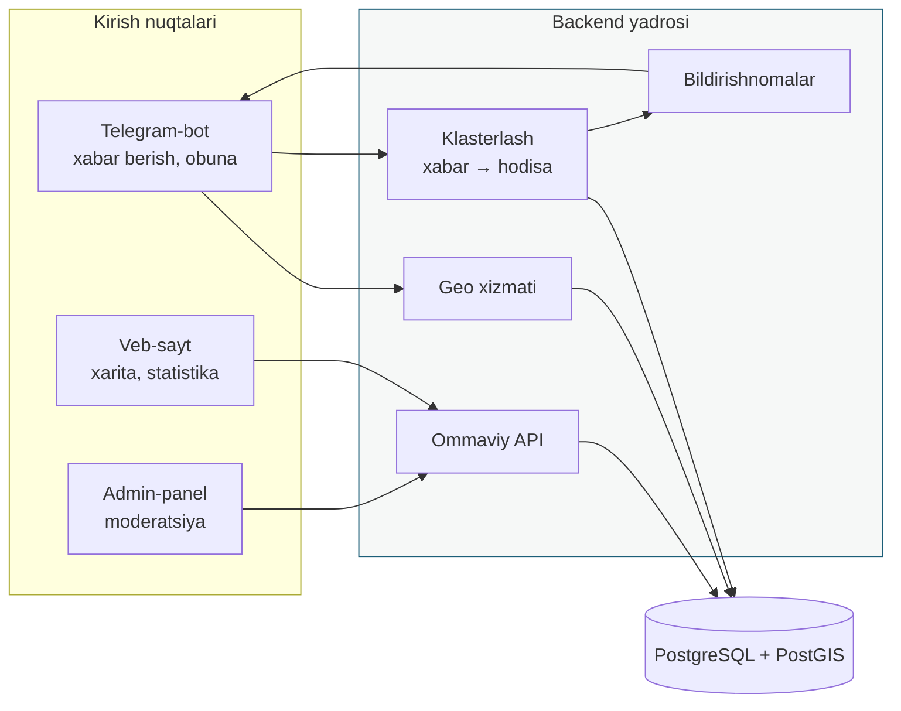
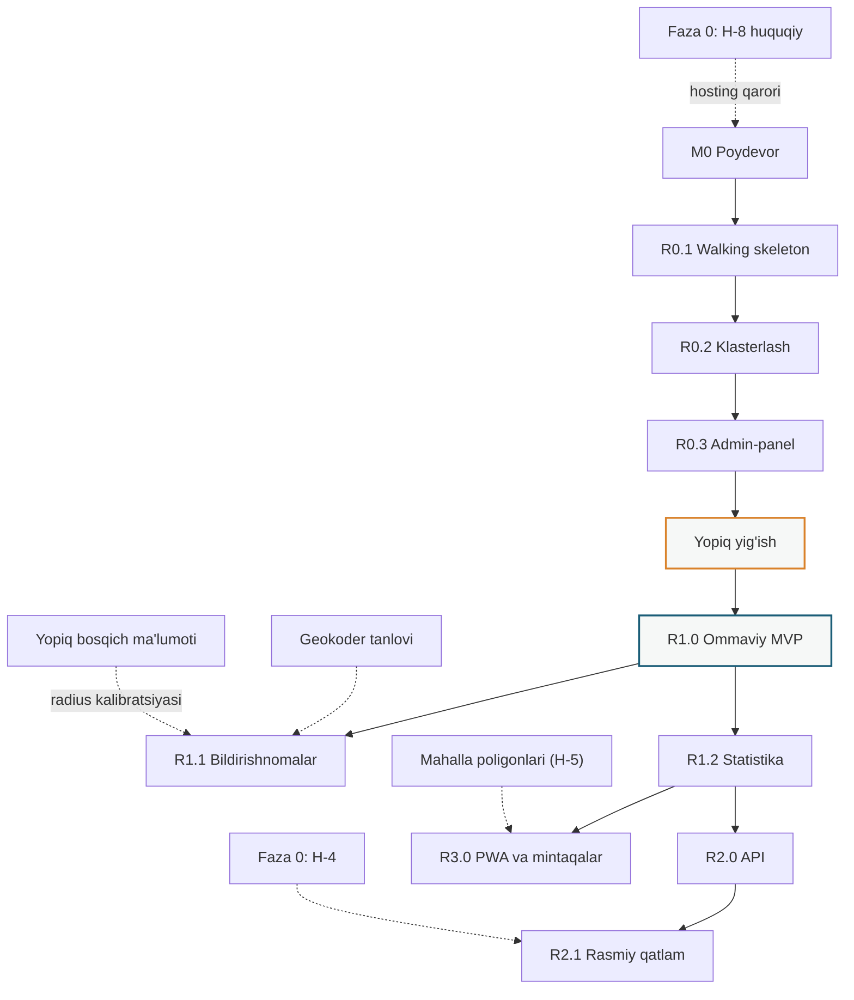

# 03. Ishlab chiqish yo'l xaritasi
## Sveta.Net — bot va veb-platformani noldan qurish

| | |
|---|---|
| **Mahsulot** | Sveta.Net — elektr uzilishlarini kraudsorsing monitoringi |
| **Qamrov** | To'liq mahsulot noldan: Telegram-bot + veb-sayt (xarita, statistika) + backend |
| **Daraja** | Reliz / milestone (homiy va menejer uchun) |
| **Bog'liq hujjatlar** | `BRD_Samarkand.md`, `01_PRD_Samarkand.md` (§17 ma'lumot modeli, §29 arxitektura), `02_Phase0_Validation_Plan_Samarqand.md` |
| **Versiya** | 1.0 · **Holati:** Draft for review |
| **Sana** | 2026-08-06 |

---

## 0. Hujjatni o'qish reglamenti

### 0.1 Nima uchun kalendar sanalar yo'q

Bu hujjatda **mutlaq sanalar qo'yilmagan**. Muddatlar `T0 + hafta` ko'rinishida beriladi, bunda `T0` — jamoa to'liq shakllantirilgan va ishga tushirilgan kun.

Sabab PRD §24 dagi izohga mos: jamoa tarkibi, uning tezligi va tashqi bog'liqliklar (geokoder, poligonlar manbasi, hosting) aniqlanmagan holda kalendar sana **soxta aniqlik** beradi. Nisbiy muddat rejalashtirish uchun yetarli, majburiyat sifatida esa xato bo'lmaydi.

### 0.2 Baholarning maqomi

| Belgi | Ma'nosi |
|---|---|
| `ANIQ` | Ish hajmi tushunarli, texnologiya ma'lum, tashqi bog'liqlik yo'q |
| `BAHO` | Hisoblangan, ±40% diapazon |
| `SHARTLI` | Tashqi natijaga bog'liq (Faza 0, huquqiy xulosa, poligonlar manbasi) |

---

## 1. Nima quriladi

Uch mustaqil yetkazib berish yuzasi, bitta backend:



**Mahsulotning yagona qiymat zanjiri:** foydalanuvchi xabar yuboradi → tizim uni boshqa xabarlar bilan birlashtiradi → «ommaviy uzilish» verdikti tug'iladi → bu xarita va bildirishnoma orqali qaytariladi.

Bu zanjir **eng yuqori riskli qism** va shuning uchun u birinchi bo'lib, ingichka kesim (walking skeleton) sifatida quriladi — barcha xizmatlarni keng qurishdan **oldin**.

---

## 2. Rejaning tuzilishini belgilagan qarorlar

Bu bo'lim reja nima uchun aynan shunday tartibda ekanini tushuntiradi. Uni o'qimasdan §3 ni o'qish tavsiya etilmaydi.

### Q-1. PRD §29 arxitekturasi — bu maqsad holati, boshlang'ich holat emas

PRD §29 da Kafka, Redis, alohida Geo/Clustering/Notification xizmatlari ko'rsatilgan. **Bu 500 ming foydalanuvchi gorizontidagi maqsad holati.** Uni birinchi kundan qurish — ishlab chiqishni 2–3 barobar sekinlashtiradi va hech qanday foyda bermaydi, chunki birinchi oyda yuklama nolga yaqin.

| Komponent | Boshlang'ich holat | Qachon maqsad holatiga o'tadi |
|---|---|---|
| Kafka | **Yo'q.** Postgres outbox + ichki navbat | Kunlik xabar >50k yoki klasterlash kechikishi >30 s |
| Redis | **Yo'q.** Postgres + HTTP cache-header | API p95 >300 ms |
| Alohida mikroservislar | **Yo'q.** Modulli monolit, aniq ichki chegaralar bilan | Jamoa >6 dev yoki komponentlar mustaqil masshtablanishi kerak bo'lganda |
| PostGIS | **Ha, boshidan** | — |

**Muhim shart:** modulli monolit ichida modul chegaralari mikroservis chegaralari kabi qat'iy saqlanadi (bir modul boshqasining jadvaliga to'g'ridan-to'g'ri murojaat qilmaydi). Aks holda keyinchalik ajratish imkonsiz bo'ladi. Bu — arxitektura qarzini **boshqarish**, uni yig'ish emas.

### Q-2. Moderatsiya ommaviy xaritadan oldin quriladi

Kraudsorsing moderatsiyasiz — bu shovqin va noto'g'ri ma'lumotni ommaga chiqarish. Admin-panel (R0.3) ommaviy xaritadan (R1.0) **oldin** ishga tushadi. Aks holda birinchi ommaviy relizda moderator qo'lida hech qanday asbob bo'lmaydi.

### Q-3. Ommaviy xarita chegara bilan ochiladi

BRD AC-1.6 talabi: xarita zichlik chegarasiga yetmaguncha ommaviy ochilmaydi. Bo'sh xarita mahsulotning ishonchini bir marta va butunlay yo'q qiladi. Shuning uchun R1.0 dan oldin **yopiq yig'ish rejimi** bosqichi bor.

### Q-4. Bildirishnoma radiusi ma'lumotdan keyin sozlanadi

Obuna radiusi (Toshkentda 500 m `BASELINE-TAS`) qurilish zichligiga bog'liq. Uni ma'lumot to'planmasdan sozlash — taxmin. Shuning uchun bildirishnomalar (R1.1) ommaviy xaritadan **keyin** keladi, garchi texnik jihatdan ilgari qilish mumkin bo'lsa ham.

### Q-5. Mahalla darajasi shartli

Uch bosqichli geomodel (tuman → mahalla → H3) poligonlar mavjudligiga bog'liq (H-5, Faza 0). Reja **ikki yo'lda** tuzilgan: poligonlar bor bo'lsa — to'liq model; yo'q bo'lsa — tuman darajasi va H3, mahalla keyinroq qo'shiladi. Ma'lumot sxemasi ikkala holatda ham bir xil (mahalla maydoni `nullable`), shuning uchun bu qayta yozishni talab qilmaydi.

---

## 3. Relizlar xaritasi

```mermaid
gantt
  title Sveta.Net — ishlab chiqish yo'l xaritasi (o'q birligi = 1 hafta, T0 = 0)
  dateFormat X
  axisFormat %s

  section Poydevor
  M0 Infratuzilma va CI/CD        :m0,    0, 4
  section Yadro
  R0.1 Walking skeleton           :r01,   4, 5
  R0.2 Klasterlash yadrosi        :r02,   9, 4
  R0.3 Admin-panel va moderatsiya :r03,  13, 4
  section Ommaviy mahsulot
  Yopiq yig'ish rejimi            :crit, pilot, 17, 6
  R1.0 Ommaviy MVP (bot + xarita) :r10,  23, 5
  R1.1 Obuna va bildirishnomalar  :r11,  28, 4
  R1.2 Statistika va Coverage     :r12,  32, 4
  section Kengaytirish
  R2.0 Ommaviy API va OpenAPI     :r20,  36, 4
  R2.1 Rasmiy manba qatlami       :r21,  40, 5
  R3.0 PWA va ko'p mintaqalilik   :r30,  45, 8
```



### Bosh jadval

| Reliz | Nomi | Asosiy savol | Davomiylik | Baho maqomi |
|---|---|---|---|---|
| **M0** | Poydevor | Kod ishga tushadimi va kuzatiladimi? | 4 hafta | `ANIQ` |
| **R0.1** | Walking skeleton | Xabar botdan bazaga yetib boradimi? | 5 hafta | `ANIQ` |
| **R0.2** | Klasterlash yadrosi | Xabarlar hodisaga birlashadimi? | 4 hafta | `BAHO` |
| **R0.3** | Admin-panel | Moderator ishlay oladimi? | 4 hafta | `ANIQ` |
| **—** | Yopiq yig'ish | Zichlik to'planadimi? | 6 hafta | `SHARTLI` |
| **R1.0** | Ommaviy MVP | Mahsulot ommaga foyda beradimi? | 5 hafta | `BAHO` |
| **R1.1** | Bildirishnomalar | Foydalanuvchi qaytadimi? | 4 hafta | `BAHO` |
| **R1.2** | Statistika | Raqamlarga ishonish mumkinmi? | 4 hafta | `BAHO` |
| **R2.0** | Ommaviy API | Uchinchi tomon ishlata oladimi? | 4 hafta | `BAHO` |
| **R2.1** | Rasmiy qatlam | Kraudsorsni rasmiy bilan solishtirish mumkinmi? | 5 hafta | `SHARTLI` (H-4) |
| **R3.0** | PWA va mintaqalar | Model ko'chadimi? | 8 hafta | `SHARTLI` |

**T0 dan R1.0 gacha: ~28 hafta (≈6,5 oy).** Bu diapazon `BAHO` maqomida, ±40%.

---

## 4. Relizlar tafsiloti

### M0 — Poydevor (T0 → T0+4)

**Maqsad:** birinchi qator mahsulot kodi yozilishidan oldin muhandislik poydevorini qurish.

| Tarkib | Izoh |
|---|---|
| Repozitoriy tuzilishi, monorepo yoki ajratilgan — qaror qayd etiladi | ADR-001 |
| PostgreSQL 16 + PostGIS, migratsiya asbobi | Sxema versiyalanadi |
| CI: build, lint, test, migratsiya tekshiruvi | Har PR da |
| CD: staging muhitiga avtomatik deploy | Prod qo'lda tasdiqlash bilan |
| Kuzatuvchanlik: strukturalangan loglar, metrikalar, xatolik trekingi | Kodgacha, keyin emas |
| Sirlarni boshqarish, muhit konfiguratsiyasi | |
| Ma'lumotlarni saqlash lokalizatsiyasi talabi bo'yicha hosting qarori | H-8 ga bog'liq (`SHARTLI`) |

**Chiqish mezoni (DoD):** bo'sh «hello» xizmati commit dan staging ga qo'lsiz yetib boradi; log va metrika ko'rinadi; migratsiya orqaga qaytariladi.

**Nima uchun 4 hafta ajratiladi.** Kuzatuvchanlikni keyinga qoldirish — eng qimmat qarz turi: birinchi prod incidenti paytida uni qurish 5 barobar qimmatga tushadi va incident davomida qilinadi.

---

### R0.1 — Walking skeleton (T0+4 → T0+9)

**Maqsad:** butun zanjirning eng ingichka, lekin **to'liq** kesimi.

| Tarkib | Izoh |
|---|---|
| Telegram-bot: `/start`, geolokatsiya yuborish, xabar qabul qilish | Minimal ssenariy |
| Ma'lumot sxemasi: `regions`, `districts`, `reports`, `users` | PRD §17 asosida, `mahallas` maydoni `nullable` |
| Geo-bog'lash: nuqta → tuman (PostGIS `ST_Contains`) | H3 keyinroq |
| Ikki til: UZ/RU string katalogi, `region.default_language` | Boshidan, keyin emas |
| Ichki texnik xarita (autentifikatsiya bilan) | Faqat jamoa uchun |

**Chiqish mezoni:** haqiqiy telefondan yuborilgan xabar ≤5 soniyada bazada paydo bo'ladi, tumanga bog'lanadi va ichki xaritada ko'rinadi.

**Kritik qoida.** Ikki tillilik shu bosqichda kiritiladi. Lokalizatsiyani keyinga qoldirish — bu butun kod bo'ylab tarqalgan qattiq kodlangan matnlarni keyinchalik yig'ish demak. Bu ish hajmi bo'yicha 3–4 barobar qimmat.

---

### R0.2 — Klasterlash yadrosi (T0+9 → T0+13)

**Maqsad:** xabarlar to'plamidan **hodisa** tug'ilishi.

| Tarkib | Izoh |
|---|---|
| DBSCAN klasterlash: fazoviy + vaqt oynasi | Parametrlar konfiguratsiyada |
| Hodisa statuslari: kutilmoqda → tasdiqlangan → hal qilingan | Toshkent mantiqi |
| Mustaqil xabar beruvchilar hisobi (`independent_reporters`) | Tasdiqlash mezoni |
| Avtoyopish: yangi xabarlar to'xtaganda | Vaqt chegarasi konfiguratsiyada |
| «Ma'lumot yetarli emas» verdikti | **«Uzilish yo'q» emas** |
| Retrospektiv qayta hisoblash asbobi | Parametrlarni sozlash uchun majburiy |

**Chiqish mezoni:** sun'iy yuklamada (yozilgan ssenariylar) klasterlash to'g'ri hodisalarni yig'adi; parametr o'zgarishi tarixiy ma'lumotda qayta hisoblanadi va natija solishtiriladi.

**Nima uchun retrospektiv qayta hisoblash majburiy.** Klasterlash parametrlari (radius, vaqt oynasi, minimal xabar soni) ma'lumotsiz to'g'ri tanlanmaydi. Ularni prodda «sinab ko'rish» yo'li bilan sozlash — foydalanuvchiga noto'g'ri verdikt ko'rsatish demak. Qayta hisoblash asbobi bu sozlashni oflayn qiladi.

**«Ma'lumot yetarli emas» haqida.** Bu mahsulotning eng muhim mahsulot qarori. Zichlik past bo'lganda tizim «uzilish yo'q» demaydi — u bilmasligini tan oladi. Aks holda mahsulot foydalanuvchini chalg'itadi va bir marta chalg'itgandan keyin qaytmaydi.

---

### R0.3 — Admin-panel va moderatsiya (T0+13 → T0+17)

**Maqsad:** hodisalar ustidan inson nazorati.

| Tarkib | Izoh |
|---|---|
| Moderator interfeysi: hodisalar ro'yxati, xarita, xabarlar tafsiloti | |
| Qo'lda tasdiqlash / rad etish / birlashtirish / ajratish | |
| Foydalanuvchini bloklash, spam belgilash | Suiiste'molga qarshi |
| Rollar va huquqlar: admin, moderator, mintaqaviy operator | Skoup bo'yicha cheklov |
| Audit jurnali: kim, nima, qachon | Retroaktiv tahlil uchun |
| Qo'lda hodisa yaratish (rasmiy manbadan) | R2.1 gacha vaqtinchalik yechim |

**Chiqish mezoni:** moderator jamoadan tashqari odam bo'lib, yozma qo'llanma bilan bir smenani mustaqil o'tkazadi; barcha harakatlari auditda ko'rinadi.

**Gate:** bu relizsiz yopiq yig'ish rejimiga o'tilmaydi.

---

### Yopiq yig'ish rejimi (T0+17 → T0+23)

Bu **reliz emas**, balki operatsion bosqich. Kod deyarli yozilmaydi.

| Tarkib | Izoh |
|---|---|
| Cheklangan foydalanuvchilar doirasi (mahalla aktivi orqali) | Faza 0 M-6 mantiqi |
| Ommaviy xarita **yopiq** | Ma'lumot yig'iladi, nashr etilmaydi |
| Klasterlash parametrlarini haqiqiy ma'lumotda sozlash | R0.2 asbobi bilan |
| Bildirishnoma radiusini hisoblash uchun ma'lumot to'plash | R1.1 uchun kirish |
| Moderatsiya operatsion modelini sinash | SLA, smena, yuklama |

**Chiqish mezoni (ommaviy xarita ochilishi uchun gate):**
- Kuzatilgan uzilish hodisalarining ≥50% ida ≥3 mustaqil xabar
- Qamrov: shahar hududining ≥N% ida kamida bitta xabar *(N Faza 0 natijalari bo'yicha belgilanadi)*
- Klasterlash parametrlari sozlangan va qayta hisoblashda barqaror
- Moderatsiya SLA amaliyotda bajarildi

**Agar gate yopilmasa:** bosqich uzaytiriladi yoki mahsulot modeli qayta ko'riladi. **Xarita gate yopilmasdan ochilmaydi** — bu qat'iy qoida, muhokama predmeti emas.

---

### R1.0 — Ommaviy MVP (T0+23 → T0+28)

**Maqsad:** mahsulot ommaga chiqadi.

| Tarkib | Izoh |
|---|---|
| Veb-sayt: real vaqt xaritasi (React + MapLibre) | Asosiy sahifa |
| Hodisa statuslari legendasi, oxirgi yangilanish vaqti | Shaffoflik |
| Mobil brauzer uchun optimallashtirish | Trafikning ko'p qismi |
| Bot: to'liq xabar berish ssenariysi, tilni tanlash | |
| «Ma'lumot yetarli emas» holatini ko'rsatish | Q-3 mantiqi |
| Yosh mintaqa dislaymeri | FR-S-901 |
| FAQ, metodologiya sahifasi | Ishonch |
| «Rasmiy manba emas» ogohlantirishi | Barcha yuzalarda |

**Chiqish mezoni:** «lokalmi yoki ommaviymi» savoliga javob p90 ≤10 soniyada olinadi (ro'yxatdan o'tishsiz); xarita 60 soniyada yangilanadi; UZ/RU string pariteti 100%.

**Nima uchun metodologiya sahifasi MVP da.** Mahsulot rasmiy manba emas va shunday bo'lib qoladi. Uning yagona ishonch aktivi — metodologiyaning ochiqligi. Buni keyinga qoldirish mahsulotning pozitsiyasini buzadi.

---

### R1.1 — Obuna va bildirishnomalar (T0+28 → T0+32)

| Tarkib | Izoh |
|---|---|
| Manzil yoki nuqta bo'yicha obuna | Geokoder ishlatiladi |
| Radius kalibratsiyasi yopiq bosqich ma'lumoti asosida | Q-4 |
| Bot orqali bildirishnoma (tasdiqlangan hodisada) | |
| Bildirishnomalar chastotasini cheklash (anti-spam) | Foydalanuvchini yo'qotmaslik uchun |
| Obunani boshqarish, o'chirish | |
| In-app veb-banner | Arzon kanal |

**Chiqish mezoni:** bildirishnoma tasdiqlangan hodisadan ≤2 daqiqa ichida yetkaziladi; noto'g'ri bildirishnoma ulushi o'lchanadi va qayd etiladi.

**Xavf.** Bildirishnoma — mahsulotning eng qaytaruvchi funksiyasi va ayni paytda eng katta obunani bekor qilish sababi. Radius keng bo'lsa — shovqin, tor bo'lsa — foydasiz. Shuning uchun u ma'lumotsiz sozlanmaydi.

---

### R1.2 — Statistika va Coverage Index (T0+32 → T0+36)

| Tarkib | Izoh |
|---|---|
| Statistika vitrinasi: hudud, davr, davomiylik kesimlarida | |
| Coverage Index — har bir hudud uchun ma'lumot to'liqligi ko'rsatkichi | Majburiy |
| Tarixiy chuqurlik, eksport (CSV) | |
| Metodologiya bo'limi bilan bog'lanish | |
| H3 issiqlik xaritasi | Agar mahalla poligonlari bo'lmasa — asosiy granularlik |

**Chiqish mezoni:** hududlar bo'yicha yig'indi umumiy natijadan ≤5% farq qiladi; har bir vitrina Coverage Index bilan birga ko'rsatiladi.

**Coverage Index nima uchun majburiy.** Kraudsorsing statistikasi qamrovsiz o'qilsa, u yolg'on gapiradi: xabar kam bo'lgan hudud «tinch hudud» kabi ko'rinadi, aslida u shunchaki qamralmagan. Indekssiz raqam nashr etish — jurnalist tomonidan noto'g'ri talqin qilinishiga to'g'ridan-to'g'ri taklif.

---

### R2.0 — Ommaviy API (T0+36 → T0+40)

| Tarkib | Izoh |
|---|---|
| OpenAPI 3.1 spetsifikatsiyasi, `/api/v1` | |
| Rate limit, idempotentlik, versiyalash | |
| `region_id` barcha geo-so'rovlarda majburiy | PRD §16 |
| Hujjatlar sahifasi (EN) | Yagona EN yuzasi |
| Kesh qatlami (agar p95 talab qilsa — Redis) | Q-1 mezoni |

**Chiqish mezoni:** tashqi ishlab chiquvchi hujjatlar bo'yicha yordamsiz birinchi so'rovni bajaradi; API p95 ≤300 ms.

---

### R2.1 — Rasmiy manba qatlami (T0+40 → T0+45) · `SHARTLI`

**Shart:** H-4 tasdiqlangan (rasmiy ommaviy oqim mavjud va strukturalangan).

| Tarkib | Izoh |
|---|---|
| Rasmiy e'lonlarni avtomatik parsing | Format H-4 natijasiga bog'liq |
| Kraudsorsing va rasmiy qatlamlarni solishtirish | UC-5 |
| Xaritada qatlamlarni ajratib ko'rsatish | Manba shaffofligi |
| Nomuvofiqliklarni qayd etish | Analitik qiymat |

**Agar H-4 rad etilgan bo'lsa:** reliz bekor qilinadi, R0.3 dagi qo'lda hodisa yaratish doimiy yechim bo'lib qoladi.

---

### R3.0 — PWA va ko'p mintaqalilik (T0+45 → T0+53) · `SHARTLI`

| Tarkib | Izoh |
|---|---|
| PWA, Web Push | Telegramdan tashqari kanal |
| Mintaqani konfiguratsiya bilan qo'shish (kodsiz) | «Mintaqa ishga tushirish paketi» |
| Chegaralarni versiyalash (`valid_from` / `valid_to`) | Ma'muriy qayta tashkil etishga chidamlilik |
| Mahalla darajasi (agar poligonlar olingan bo'lsa) | Q-5 |

**Chiqish mezoni:** ikkinchi mintaqa **kod yozmasdan** ishga tushiriladi. Bu — butun arxitektura qarorining haqiqiy sinovi.

---

## 5. Bog'liqliklar



### Tashqi bog'liqliklar reestri

| ID | Bog'liqlik | Kimga ta'sir qiladi | Yopilmasa nima bo'ladi |
|---|---|---|---|
| DEP-1 | Huquqiy xulosa (H-8), saqlash lokalizatsiyasi | M0 hosting qarori | Poydevor noto'g'ri joyda quriladi, ko'chirish qimmat |
| DEP-2 | Geokoder tanlovi va uning qamrovi (H-6) | R1.1 obuna | Manzil bo'yicha obuna o'rniga faqat «xaritada nuqta» |
| DEP-3 | Mahalla poligonlari manbasi va litsenziyasi (H-5) | R1.2, R3.0 | Tuman darajasida qolish |
| DEP-4 | Rasmiy oqim mavjudligi (H-4) | R2.1 | Reliz bekor qilinadi |
| DEP-5 | Mahalla aktivi bilan kelishuv | Yopiq yig'ish bosqichi | Zichlik to'planmaydi, gate yopilmaydi |
| DEP-6 | Moliyalashtirish manbasi | Butun reja | Ish to'xtaydi |

**DEP-1 alohida.** Bu yagona bog'liqlik bo'lib, u **birinchi kunga** ta'sir qiladi. Hosting joyi bo'yicha qaror huquqiy xulosadan oldin qabul qilinsa va noto'g'ri chiqsa — migratsiya narxi butun M0 dan yuqori bo'ladi.

---

## 6. Reliz gate mezonlari

Har bir gate — **to'xtash nuqtasi**, tavsiya emas. Yopilmagan gate keyingi relizni bloklaydi.

| Gate | Qachon | Mezon | Yopilmasa |
|---|---|---|---|
| G-0 | M0 oxiri | Deploy quvuri ishlaydi, kuzatuvchanlik bor | Kod yozilmaydi |
| G-1 | R0.1 oxiri | End-to-end zanjir haqiqiy qurilmada ishlaydi | Kengaytirilmaydi |
| G-2 | R0.2 oxiri | Klasterlash retrospektiv qayta hisoblanadi | Yopiq bosqich boshlanmaydi |
| G-3 | R0.3 oxiri | Tashqi moderator mustaqil ishlaydi | Foydalanuvchi qo'shilmaydi |
| **G-4** | Yopiq bosqich oxiri | **Zichlik chegarasi + qamrov chegarasi** | **Ommaviy xarita ochilmaydi** |
| G-5 | R1.0 oxiri | p90 ≤10 s, string pariteti 100% | Bildirishnoma qo'shilmaydi |
| G-6 | R1.1 oxiri | Noto'g'ri bildirishnoma ulushi o'lchangan | Statistika nashr etilmaydi |
| G-7 | R1.2 oxiri | Agregatlar farqi ≤5%, Coverage Index bor | API ochilmaydi |
| G-8 | R3.0 oxiri | Ikkinchi mintaqa kodsiz ishga tushdi | Uchinchi mintaqa rejalashtirilmaydi |

**G-4 eng muhim gate.** Qolgan hammasi muhandislik sifati haqida; G-4 esa mahsulotning yashash huquqi haqida. Uni «biroz yumshatish» taklifi paydo bo'lganda — bu tasdiqlash tarafkashligining belgisi, texnik zarurat emas.

---

## 7. Jamoa profili

| Rol | M0 | R0.1–R0.3 | Yopiq | R1.x | R2.x–R3.0 |
|---|---|---|---|---|---|
| Backend dev | 1 | 2 | 1 | 2 | 2 |
| Frontend dev | — | 0,5 | 0,5 | 1,5 | 1 |
| DevOps / SRE | 1 | 0,5 | 0,5 | 0,5 | 0,5 |
| Geo-mutaxassis | — | 0,5 | 0,5 | 0,5 | 1 |
| Product / BA | 0,5 | 0,5 | 1 | 1 | 0,5 |
| Moderator (operatsion) | — | — | 1 | 1–2 | 2 |
| QA | — | 0,5 | 0,5 | 1 | 1 |

Raqamlar — **bir vaqtdagi to'liq stavka ekvivalenti (FTE)**.

**Cho'qqi:** R1.x bosqichida ~7 FTE. **Minimal ishlaydigan tarkib:** 2 backend + 1 frontend + 0,5 DevOps + 1 product. Undan pastda reja cho'ziladi, to'xtamaydi.

**Moderator roli — operatsion, muhandislik emas.** U R0.3 dan boshlab doimiy zarur va mahsulot yashagan davomida qoladi. Uni loyiha xarajati emas, **doimiy xarajat** sifatida rejalashtirish kerak. Bu nekommersiya modeli uchun eng jiddiy uzoq muddatli moliyaviy majburiyat.

---

## 8. Ish hajmi bahosi

| Blok | Odam-oy | Maqomi |
|---|---|---|
| M0 Poydevor | 2,5 | `ANIQ` |
| R0.1 Walking skeleton | 4 | `ANIQ` |
| R0.2 Klasterlash | 4 | `BAHO` |
| R0.3 Admin-panel | 4 | `ANIQ` |
| Yopiq bosqich (muhandislik qismi) | 2 | `BAHO` |
| R1.0 Ommaviy MVP | 6 | `BAHO` |
| R1.1 Bildirishnomalar | 4 | `BAHO` |
| R1.2 Statistika | 4 | `BAHO` |
| **T0 → R1.2 jami** | **30,5 odam-oy** | ±40% |
| R2.0 API | 3,5 | `BAHO` |
| R2.1 Rasmiy qatlam | 4 | `SHARTLI` |
| R3.0 PWA va mintaqalar | 8 | `SHARTLI` |

**Baho nimani o'z ichiga olmaydi:** moderatsiyaning operatsion xarajati, hosting, geokoder litsenziyasi, huquqiy xizmatlar, dizayn ishi (agar tashqi bo'lsa).

**Baho nima uchun ±40%.** Uchta noma'lum: jamoaning haqiqiy tezligi (o'lchanmagan), geokoder va poligonlar bilan integratsiyaning murakkabligi (manba tanlanmagan), moderatsiya interfeysining chuqurligi (haqiqiy yuklama ko'rilmagan). Bu diapazon toraytiriladi — R0.1 tugagandan keyin, jamoaning birinchi o'lchangan tezligi asosida.

---

## 9. Ataylab keyinga qoldirilgan narsalar

Bu — texnik qarz emas, **ongli ketma-ketlik qarori**. Farq shundaki, har biri uchun qaytish sharti belgilangan.

| Element | Nima uchun keyinga | Qaytish sharti |
|---|---|---|
| Kafka | Yuklama yo'q | Kunlik xabar >50k yoki klaster kechikishi >30 s |
| Redis | Kesh talab qilinmaydi | API p95 >300 ms |
| Mikroservislarga ajratish | Jamoa kichik | Jamoa >6 dev |
| H3 agregatsiya | Zichlik past, issiqlik xaritasi ma'nosiz | R1.2 |
| Mahalla darajasi | Poligonlar yo'q | H-5 tasdiqlangach |
| Web Push / PWA | Telegram yetarli | R3.0 |
| Prognozlash / ML | Tarixiy ma'lumot yo'q | ≥12 oy ma'lumot to'planganda |
| Ko'p mintaqalilik konfiguratsiyasi | Bitta mintaqa | R3.0 |

**Qoida:** bu jadvaldagi elementni «hozir qilib qo'yaylik, keyin kerak bo'ladi» degan asos bilan ilgari surish taqiqlanadi. Qaytish sharti — yagona asos.

---

## 10. Yetkazib berish risklari

| ID | Risk | Ehtimol | Ta'sir | Kamaytirish |
|---|---|---|---|---|
| D-01 | G-4 gate yopilmaydi: zichlik to'planmaydi | **Yuqori** | Kritik | Yopiq bosqichni uzaytirish; aktiv orqali rekrutlashni kuchaytirish; no-go ga tayyorlik |
| D-02 | Klasterlash parametrlari sozlanmaydi, verdiktlar noto'g'ri | O'rta | Yuqori | Retrospektiv qayta hisoblash asbobi (R0.2 da majburiy) |
| D-03 | Geokoder Samarqand manzillarini qoplamaydi | Yuqori | O'rta | «Xaritada nuqta» rejimi asosiy sifatida tayyor |
| D-04 | Moderatsiya yuklamasi kutilganidan yuqori | O'rta | Yuqori | Avtotasdiqlash chegarasini pasaytirish; moderator soni |
| D-05 | Lokalizatsiya keyinga qoldiriladi va qarzga aylanadi | O'rta | Yuqori | R0.1 da majburiy; tarjimasiz string — bloklovchi defekt |
| D-06 | Arxitektura maqsad holatidan boshlanadi (Kafka birinchi kundan) | O'rta | Yuqori | Q-1 jadvalidagi qaytish shartlari; ADR talabi |
| D-07 | Ommaviy xarita gate yopilmasdan ochiladi | O'rta | **Kritik** | G-4 qat'iy qoida; qaror homiy darajasida |
| D-08 | Kuzatuvchanlik keyinga qoldiriladi | O'rta | Yuqori | M0 DoD ga kiritilgan |
| D-09 | Moliyalashtirish oraliqda tugaydi | Yuqori | Kritik | Relizlar mustaqil qiymat beradigan qilib bo'lingan; har bir gate — to'xtash imkoni |
| D-10 | Jamoaning haqiqiy tezligi bahodan past | Yuqori | O'rta | R0.1 dan keyin bahoni qayta ko'rish; skoup emas, muddat siljiydi |

**D-09 haqida.** Reja ataylab shunday bo'lingan: har bir gate — nafaqat sifat nazorati, balki **loyihani to'xtatish nuqtasi**. Moliyalashtirish R1.0 dan keyin tugasa, mahsulot ishlaydigan holatda qoladi. Bu nekommersiya loyihasi uchun arxitektura talabidan kam bo'lmagan talab.

---

## 11. Nima o'lchanadi

| Bosqich | Ko'rsatkich | Nima uchun |
|---|---|---|
| M0–R0.3 | Deploy chastotasi, quvur o'tish vaqti | Muhandislik salomatligi |
| Yopiq bosqich | Hodisaga to'g'ri keladigan xabarlar soni; qamralgan hudud ulushi | G-4 kirishi |
| R1.0 | Time-to-answer p90; xarita yangilanish kechikishi | Mahsulot va'dasi |
| R1.1 | Bildirishnoma yetkazish vaqti; obunani bekor qilish ulushi | Foydalanuvchini yo'qotmaslik |
| R1.2 | Agregatlar farqi; Coverage Index taqsimoti | Ma'lumotga ishonch |
| R2.0 | API p95; tashqi foydalanuvchilar soni | Ochiqlik |
| Doimiy | Moderatsiya SLA; avtotasdiqlash ulushi | Operatsion masshtablanuvchanlik |

---

## Ilova A. Reliz DoD shabloni

```
RELIZ: R-N
GATE: G-N

FUNKSIONAL
[ ] Reliz tarkibidagi barcha punktlar bajarilgan
[ ] UZ/RU string pariteti 100% (tarjimasiz string — bloklovchi defekt)
[ ] Degradatsiya ssenariylari sinovdan o'tgan (tashqi xizmat ishlamaganda)

SIFAT
[ ] Avtotestlar o'tadi; kritik yo'l qamralgan
[ ] Migratsiya oldinga va orqaga sinovdan o'tgan
[ ] Yuklama sinovi joriy gorizontda (maqsad holatida emas)

OPERATSION
[ ] Loglar, metrikalar, ogohlantirishlar sozlangan
[ ] Rollback protsedurasi yozilgan va sinalgan
[ ] Moderator/operator qo'llanmasi yangilangan

MAHSULOT
[ ] «Rasmiy manba emas» ogohlantirishi barcha yangi yuzalarda
[ ] Metodologiya sahifasi o'zgarishlarni aks ettiradi
[ ] Gate mezoni o'lchangan va qayd etilgan

QAROR: chiqariladi / kechiktiriladi
```

---

## Ilova B. Bu rejadan tashqarida

| Element | Sabab |
|---|---|
| Native mobil ilovalar | Telegram-first strategiyasi |
| SMS / IVR kanali | Nekommersiya modeli bilan sig'ishmaydi |
| Monetizatsiya, reklama | Neytrallikka zid |
| Tiklanish vaqtining kafolati | Mahsulot operator emas |
| Boshqa kommunal resurslar (gaz, suv) | Mahsulotni yoyib yuboradi |
| Rasmiy manba maqomi | Huquqiy va tashkiliy masala, muhandislik emas |

---

## Ilova C. Trassirovka

| Bu hujjat | 01_PRD_Samarkand.md | BRD_Samarkand.md | 02_Phase0 |
|---|---|---|---|
| Q-1 arxitektura bosqichliligi | §29 (maqsad holati) | §24 | — |
| Q-3 xarita chegarasi | §7 MVP | AC-1.6, BP-7 | H-7 |
| Q-4 radius kalibratsiyasi | §19 | — | — |
| Q-5 mahalla shartliligi | FR-S-802 | A-05, AC-0.3 | H-5 |
| R0.1 ikki tillilik | FR-S-601, NFR-S-06 | BG-4 | H-3 |
| R0.2 «ma'lumot yetarli emas» | RS-01 | BP-7 | H-7 |
| R1.2 Coverage Index | §21, C-11 | BG-5 | — |
| R2.1 rasmiy qatlam | §18, P0-1 | A-04, BP-6 | H-4 |
| R3.0 ko'p mintaqalilik | NFR-S-01, FR-807 | BO-11, BO-12 | — |
| DEP-1 hosting | NFR-S-04, C-09 | AC-0.4 | H-8 |
| DEP-2 geokoder | §18, R-13 | — | H-6 |

**Eslatma.** Bu yo'l xaritasi mahsulotni **noldan** qurishni tavsiflaydi. Agar Toshkent konturi allaqachon ishlayotgan bo'lsa, M0–R0.3 bloklari qayta bajarilmaydi — ular mavjud platformaning holati bilan solishtiriladi va faqat bo'shliqlar to'ldiriladi. Bu holda kirish nuqtasi — `BRD_Samarkand.md` §23 dagi mintaqaviy reja.
