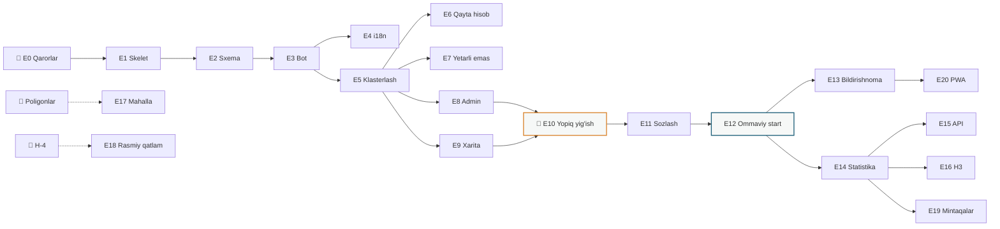

# 04. EPIC yo'l xaritasi — yagona ishlab chiquvchi rejimi

| | |
|---|---|
| **Kontekst** | Butun kodni bitta ijrochi (Claude) yozadi. Jamoa yo'q, sprint yo'q, handoff yo'q |
| **O'lchov birligi** | **Sessiya** — bitta uzluksiz ish bloki, bir necha soat. Odam-oy emas |
| **Almashtiradi** | `03_Development_Roadmap.md` §7 (jamoa) va §8 (odam-oy baholari). Qolgan bo'limlar kuchda |
| **Sana** | 2026-08-06 |

---

## 0. Nima o'zgaradi

| 03-hujjatda | Bu yerda | Sabab |
|---|---|---|
| 7 FTE, 53 hafta | Sessiyalar, ketma-ket | Parallellik yo'q — bitta ijrochi |
| Sprint va reliz jarayoni | Epic → tekshirish → keyingisi | Muvofiqlashtirish xarajati nolga tushdi |
| Kod yozish — asosiy cheklov | **Qaror va tashqi bog'liqlik — asosiy cheklov** | Kod tez yoziladi, hosting va poligonlar tez kelmaydi |
| QA roli | Har epic ichida avtotest + qo'lda tekshiruv | Ajratilgan QA yo'q |
| Moderator FTE | **O'zgarmaydi — bu inson ishi** | Avtomatlashtirilmaydi |

**Yangi bosh cheklov.** Yagona ijrochi rejimida kod yozish tezligi cheklov bo'lishdan to'xtaydi. Cheklov uch narsaga ko'chadi:

1. **Sizning qarorlaringiz** — stek, hosting, geokoder, domen, Telegram token.
2. **Tashqi manbalar** — mahalla poligonlari, huquqiy xulosa, mahalla aktivi bilan aloqa.
3. **Haqiqiy vaqt** — uzilishlar sodir bo'lishini kutish. Buni hech qanday tezlik qisqartirmaydi.

Shuning uchun quyidagi ro'yxatda **sizga tegishli bloklar alohida belgilangan** (👤). Ular yo'l xaritasining haqiqiy kritik yo'li.

---

## 1. Stek (qaror, o'zgartirilishi mumkin)

| Qatlam | Tanlov | Nima uchun solo uchun |
|---|---|---|
| Baza | PostgreSQL 16 + PostGIS | PRD §17 talabi; PostGIS o'rnini bosuvchi yo'q |
| Backend | Python + FastAPI | Bot, API va ishchilar bitta kod bazasida |
| Bot | aiogram (webhook) | FastAPI bilan bitta protsessda |
| Migratsiya | Alembic | |
| Frontend | React + MapLibre, statik build | PRD §29 |
| Fon vazifalari | APScheduler yoki Postgres-based navbat | Kafka yo'q (03-hujjat Q-1) |
| Deploy | Docker Compose, bitta VPS | Kubernetes yo'q |
| Kuzatuv | Strukturalangan log + Sentry + oddiy healthcheck | |

**Bitta repo, bitta protsess, bitta konteyner to'plami.** Solo rejimida mikroservis — sof zarar.

---

## 2. EPIC ro'yxati

| # | Epic | Bog'liq | Sessiya | Tayyor deb hisoblanadi |
|---|---|---|---|---|
| **E0** | 👤 Qarorlar va kirishlar | — | 👤 | Domen, VPS, Telegram token, geokoder kaliti mavjud |
| **E1** | Skelet: repo, Docker, DB, migratsiya, CI | E0 | 1–2 | `docker compose up` → bo'sh API javob beradi |
| **E2** | Ma'lumot sxemasi + hudud yuklash | E1 | 1–2 | Tuman poligonlari bazada, `ST_Contains` ishlaydi |
| **E3** | Bot: `/start`, til, geolokatsiya, xabar qabul | E2 | 2 | Telefondan yuborilgan xabar bazada, tumanga bog'langan |
| **E4** | i18n karkasi (UZ/RU) | E3 bilan birga | 1 | Barcha matn katalogdan; qattiq kodlangan string yo'q |
| **E5** | Klasterlash: DBSCAN, hodisa statuslari | E3 | 2–3 | Sun'iy ssenariyda xabarlar hodisaga birlashadi |
| **E6** | Retrospektiv qayta hisoblash asbobi | E5 | 1 | Parametr o'zgarishi tarixiy ma'lumotda qayta hisoblanadi |
| **E7** | «Ma'lumot yetarli emas» verdikti | E5 | 0,5 | Past zichlikda tizim bilmasligini aytadi |
| **E8** | Admin-panel: moderatsiya, rollar, audit | E5 | 2–3 | Tashqi moderator qo'llanma bilan smena o'tkazadi |
| **E9** | Veb-xarita (ommaviy, hali yopiq) | E5 | 2–3 | Xarita 60 s da yangilanadi, legenda va dislaymer bor |
| **E10** | 👤 Yopiq yig'ish bosqichi | E8, E9 | 👤 **4–6 hafta** | G-4: hodisalarning ≥50% ida ≥3 mustaqil xabar |
| **E11** | Parametrlarni haqiqiy ma'lumotda sozlash | E10, E6 | 1 | Qayta hisoblashda barqaror natija |
| **E12** | Ommaviy ishga tushirish: FAQ, metodologiya, SEO | E11 | 1–2 | Xarita ochiq; p90 ≤10 s |
| **E13** | Obuna + bildirishnomalar | E12 | 2 | Tasdiqlangan hodisadan ≤2 daq |
| **E14** | Statistika + Coverage Index | E12 | 2 | Agregat farqi ≤5%; indeks har vitrinada |
| **E15** | Ommaviy API + OpenAPI | E14 | 1–2 | Tashqi so'rov hujjat bo'yicha ishlaydi |
| **E16** | H3 issiqlik xaritasi | E14 | 1 | Zichlik yetarli bo'lganda |
| **E17** | Mahalla darajasi | 👤 poligonlar | 1–2 | Uch bosqichli bog'lash ishlaydi |
| **E18** | Rasmiy manba parsing | 👤 H-4 | 2 | Ikki qatlam solishtiriladi |
| **E19** | Ko'p mintaqalilik konfiguratsiya bilan | E14 | 2 | Ikkinchi mintaqa **kodsiz** ishga tushadi |
| **E20** | PWA + Web Push | E13 | 2 | Telegramdan tashqari kanal |

**Kod jami: ~30 sessiya.** 👤 bloklar bunga kirmaydi.

---

## 3. Ketma-ketlik

**E1 → E9 uzluksiz kod bloki: ~15 sessiya.** Undan keyin reja kodga emas, **haqiqiy hayotga** tayanadi.

---

## 4. Sizga tegishli bloklar (👤)

| Blok | Nima kerak | Qachon | Kechiksa nima bo'ladi |
|---|---|---|---|
| E0-a | Domen + VPS (saqlash lokalizatsiyasi talabini hisobga olib) | E1 dan oldin | Hech narsa boshlanmaydi |
| E0-b | Telegram bot token (@BotFather) | E3 dan oldin | Bot yozilmaydi |
| E0-c | Geokoder tanlovi va kaliti | E13 dan oldin | Faqat «xaritada nuqta» rejimi |
| E0-d | Tuman poligonlari (shahar darajasi) | E2 dan oldin | Geo-bog'lash ishlamaydi |
| E0-e | Huquqiy xulosa (H-8) | E12 dan oldin | Ommaviy ishga tushirish riskli |
| E10-a | 1–2 mahalla aktivi bilan kelishuv | E10 | **Yopiq bosqich boshlanmaydi** |
| E10-b | 10–30 sinov foydalanuvchisi | E10 | Zichlik to'planmaydi |
| E10-c | Moderator (o'zingiz yoki boshqa odam) | E8 dan boshlab doimiy | Xarita nazoratsiz qoladi |
| E17-a | Mahalla poligonlari | E17 | Tuman darajasida qolinadi |
| E18-a | Rasmiy kanal mavjudligi (H-4) | E18 | Epic bekor qilinadi |

**Eng qattiq cheklov — E10-a.** Kod tayyor bo'lgach, mahsulot mahalla aktivisiz oldinga siljimaydi. Bu blokni **hozirdan**, E1 bilan parallel boshlash kerak — u kod tayyor bo'lgunga qadar hal bo'lishi shart.

---

## 5. Solo rejimning haqiqiy risklari

| Risk | Nima uchun aynan solo rejimida | Kamaytirish |
|---|---|---|
| **Kod tez o'sadi, qarorlar orqada qoladi** | Ijrochi kutmaydi, siz esa kutishingiz mumkin | Har epic oxirida to'xtash va qabul qilish |
| **Review yo'q** | Xatoni ko'radigan ikkinchi odam yo'q | Avtotest majburiy; har epic uchun qo'lda tekshiruv ro'yxati |
| **Kontekst yo'qoladi** | Sessiyalar orasida uzilish | ADR fayllari; `README` da joriy holat; migratsiyalar tarixi |
| **«Bir sessiyada hammasini» vasvasasi** | Chegara qo'yadigan sprint yo'q | Epic chegaralari qat'iy; tayyor bo'lmagan epic keyingisiga o'tmaydi |
| **Moderatsiya sizga tushadi** | Boshqa odam yo'q | E8 ni avtotasdiqlash chegarasi bilan qurish; yuklamani o'lchash |
| **Ishga tushirgandan keyin qo'llab-quvvatlash** | Navbatchilik yo'q | Ogohlantirishlarni minimal va aniq qilish; degradatsiya avtomatik |

**Eng jiddiy risk — birinchi qatordagi.** Bir hafta ichida ishlaydigan mahsulot paydo bo'lishi mumkin, lekin huquqiy xulosa, hosting joyi va mahalla kelishuvi hali yo'q. Bu holda ishlaydigan kod **noto'g'ri xavfsizlik hissi** beradi: mahsulot tayyordek ko'rinadi, aslida uni ishga tushirib bo'lmaydi.

---

## 6. O'zgarmagan narsalar

Quyidagilar 03-hujjatdan **to'liq kuchda qoladi** va solo rejimi ularni yumshatmaydi:

- **G-4 gate.** Zichlik chegarasiga yetmaguncha ommaviy xarita ochilmaydi (E10 → E12).
- **«Ma'lumot yetarli emas»** verdikti — «uzilish yo'q» emas (E7).
- **i18n boshidan** (E4), keyinga qoldirilmaydi.
- **Coverage Index** har bir statistika vitrinasida (E14).
- **«Rasmiy manba emas»** ogohlantirishi barcha yuzalarda.
- **Kafka/Redis/mikroservis yo'q**, qaytish shartlari 03-hujjat §9 da.

Bular jamoa hajmiga bog'liq emas — ular mahsulot qarorlari.

---

## 7. Boshlash nuqtasi

**Keyingi qadam: E0.** Beshta javob kerak:

1. Hosting qayerda (O'zbekiston hududidami?)
2. Domen bormi
3. Telegram token
4. Tuman poligonlarini qayerdan olamiz
5. Birinchi mahalla — qaysi va u yerda kim bilan gaplashamiz

Shulardan **1 va 4 siz E1 boshlanmaydi.** Qolganlari keyinroq kerak bo'ladi.
