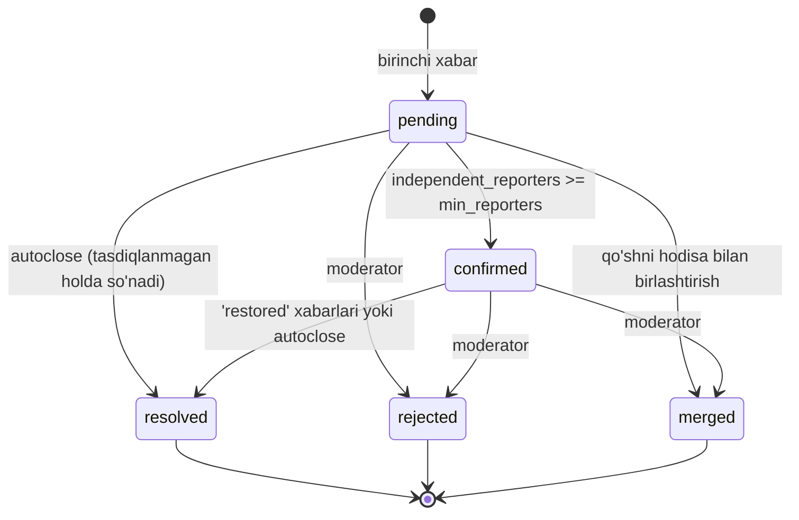

# 05. Texnik dizayn — Sveta.Net

| | |
|---|---|
| **Qamrov** | Backend, bot, geo-quvur, klasterlash, veb, ma'lumot sxemasi |
| **Daraja** | Amalga oshirish spetsifikatsiyasi (kod yozishdan oldingi oxirgi hujjat) |
| **Bog'liq** | `01_PRD_Samarkand.md` §17, §29 · `04_Epic_Roadmap_Solo.md` |
| **Hosting** | Skoupdan tashqarida — buyurtmachi hal qiladi |
| **Sana** | 2026-08-06 |

---

## 1. Repo va modul chegaralari

```
sveta/
├── alembic/                 # migratsiyalar
├── app/
│   ├── core/                # config, log, i18n, xatoliklar
│   ├── db/                  # engine, session, base modellar
│   ├── geo/                 # nuqta→hudud, H3, poligon import
│   ├── reports/             # xabar qabul qilish, validatsiya
│   ├── clustering/          # hodisa yig'ish, statuslar
│   ├── notifications/       # obuna, outbox, yuborish
│   ├── bot/                 # aiogram handlerlar, FSM
│   ├── api/                 # FastAPI routerlar (public + admin)
│   ├── admin/               # moderatsiya logikasi
│   └── jobs/                # fon vazifalari
├── web/                     # React + MapLibre (statik build)
├── tools/
│   ├── import_boundaries.py # OSM → PostGIS
│   ├── recluster.py         # retrospektiv qayta hisoblash
│   └── simulate.py          # sun'iy uzilish generatori
└── tests/
```

**Qat'iy qoida:** modul boshqa modulning jadvaliga to'g'ridan-to'g'ri murojaat qilmaydi. Faqat funksiya chaqiruvi orqali. Bu keyinchalik ajratish imkonini saqlaydi (`03` §Q-1).

**Bitta protsess:** FastAPI + aiogram webhook bitta ASGI ilovada. Fon vazifalari — alohida konteyner, bir xil kod bazasi.

---

## 2. Ma'lumot sxemasi

### 2.1 Hududlar va chegaralar

```sql
CREATE TABLE regions (
  id               uuid PRIMARY KEY,
  code             text UNIQUE NOT NULL,          -- 'tashkent', 'samarkand'
  name_uz          text NOT NULL,
  name_ru          text NOT NULL,
  default_language text NOT NULL DEFAULT 'uz',
  center           geography(Point,4326) NOT NULL,
  is_active        boolean NOT NULL DEFAULT false
);

CREATE TABLE districts (
  id          uuid PRIMARY KEY,
  region_id   uuid NOT NULL REFERENCES regions(id),
  code        text NOT NULL,
  name_uz     text NOT NULL,
  name_ru     text NOT NULL,
  geom        geometry(MultiPolygon,4326) NOT NULL,
  valid_from  timestamptz NOT NULL DEFAULT now(),
  valid_to    timestamptz,                        -- NULL = joriy
  source      text NOT NULL,                      -- 'osm', 'manual', 'official'
  source_ref  text,                               -- OSM relation id
  license     text NOT NULL,                      -- 'ODbL'
  imported_at timestamptz NOT NULL DEFAULT now()
);
CREATE INDEX ON districts USING GIST (geom);
CREATE INDEX ON districts (region_id) WHERE valid_to IS NULL;

CREATE TABLE mahallas (               -- E17, boshida bo'sh qoladi
  id          uuid PRIMARY KEY,
  district_id uuid NOT NULL REFERENCES districts(id),
  name_uz     text NOT NULL,
  name_ru     text,
  geom        geometry(MultiPolygon,4326) NOT NULL,
  valid_from  timestamptz NOT NULL DEFAULT now(),
  valid_to    timestamptz,
  source      text NOT NULL
);
CREATE INDEX ON mahallas USING GIST (geom);
```

**Chegara versiyalash qoidasi.** Chegara o'zgarganda eski qator `valid_to` bilan yopiladi, yangisi qo'shiladi. **Eski qator hech qachon o'chirilmaydi va tahrirlanmaydi** — aks holda tarixiy statistika siljiydi.

### 2.2 Foydalanuvchi va xabarlar

```sql
CREATE TABLE users (
  id           uuid PRIMARY KEY,
  tg_id        bigint UNIQUE NOT NULL,
  language     text NOT NULL DEFAULT 'uz',
  region_id    uuid REFERENCES regions(id),
  trust_score  smallint NOT NULL DEFAULT 50,      -- 0..100
  is_blocked   boolean NOT NULL DEFAULT false,
  created_at   timestamptz NOT NULL DEFAULT now()
);

CREATE TABLE reports (
  id            uuid PRIMARY KEY,
  user_id       uuid NOT NULL REFERENCES users(id),
  kind          text NOT NULL,                    -- 'outage' | 'restored'
  geom_exact    geography(Point,4326) NOT NULL,   -- HECH QACHON ommaga chiqmaydi
  geom_public   geography(Point,4326) NOT NULL,   -- siljitilgan
  h3_r9         text NOT NULL,
  region_id     uuid NOT NULL REFERENCES regions(id),
  district_id   uuid REFERENCES districts(id),    -- yozish paytida biriktiriladi
  mahalla_id    uuid REFERENCES mahallas(id),
  outage_id     uuid REFERENCES outages(id),
  source        text NOT NULL DEFAULT 'bot',
  tg_update_id  bigint UNIQUE,                    -- idempotentlik
  created_at    timestamptz NOT NULL DEFAULT now()
);
CREATE INDEX ON reports USING GIST (geom_public);
CREATE INDEX ON reports (created_at DESC);
CREATE INDEX ON reports (outage_id);
CREATE INDEX ON reports (user_id, created_at DESC);
```

**Ikkita muhim qaror shu jadvalda:**

1. **`district_id` yozish paytida biriktiriladi**, so'rov paytida hisoblanmaydi. Sabab: chegara keyinchalik o'zgarsa, tarixiy xabar o'z tumanida qoladi. `ST_Contains` ni har so'rovda bajarish — bu ham sekin, ham tarixni buzadi.

2. **`geom_exact` va `geom_public` ajratilgan.** Aniq koordinata — bu foydalanuvchining uyi. U hech qachon API dan chiqmaydi (§7.3).

### 2.3 Hodisalar

```sql
CREATE TABLE outages (
  id                    uuid PRIMARY KEY,
  region_id             uuid NOT NULL REFERENCES regions(id),
  district_id           uuid REFERENCES districts(id),
  mahalla_id            uuid REFERENCES mahallas(id),
  status                text NOT NULL,     -- pending|confirmed|resolved|rejected|merged
  layer                 text NOT NULL DEFAULT 'crowd',  -- crowd|official
  centroid              geography(Point,4326) NOT NULL,
  radius_m              integer NOT NULL,
  independent_reporters smallint NOT NULL DEFAULT 0,
  confidence            smallint NOT NULL DEFAULT 0,
  merged_into           uuid REFERENCES outages(id),
  started_at            timestamptz NOT NULL,
  confirmed_at          timestamptz,
  resolved_at           timestamptz,
  last_report_at        timestamptz NOT NULL,
  updated_at            timestamptz NOT NULL DEFAULT now()
);
CREATE INDEX ON outages USING GIST (centroid);
CREATE INDEX ON outages (status, region_id) WHERE status IN ('pending','confirmed');
```

### 2.4 Obuna, bildirishnoma, outbox

```sql
CREATE TABLE subscriptions (
  id         uuid PRIMARY KEY,
  user_id    uuid NOT NULL REFERENCES users(id),
  label      text,
  geom       geography(Point,4326) NOT NULL,
  radius_m   integer NOT NULL DEFAULT 500,
  is_active  boolean NOT NULL DEFAULT true,
  created_at timestamptz NOT NULL DEFAULT now()
);
CREATE INDEX ON subscriptions USING GIST (geom) WHERE is_active;

CREATE TABLE outbox (                    -- Kafka o'rniga
  id            bigserial PRIMARY KEY,
  topic         text NOT NULL,           -- 'outage.confirmed', 'outage.resolved'
  payload       jsonb NOT NULL,
  available_at  timestamptz NOT NULL DEFAULT now(),
  attempts      smallint NOT NULL DEFAULT 0,
  processed_at  timestamptz
);
CREATE INDEX ON outbox (available_at) WHERE processed_at IS NULL;

CREATE TABLE notifications (
  id              uuid PRIMARY KEY,
  user_id         uuid NOT NULL REFERENCES users(id),
  outage_id       uuid NOT NULL REFERENCES outages(id),
  subscription_id uuid REFERENCES subscriptions(id),
  sent_at         timestamptz,
  status          text NOT NULL DEFAULT 'queued',
  UNIQUE (user_id, outage_id)            -- takroriy yuborishdan himoya
);
```

`UNIQUE (user_id, outage_id)` — bitta hodisa bo'yicha bir odamga ikki marta yozilmaydi. Bu bazadagi kafolat, koddagi tekshiruv emas.

### 2.5 Audit va moderatsiya

```sql
CREATE TABLE audit_log (
  id         bigserial PRIMARY KEY,
  actor_id   uuid,
  actor_role text NOT NULL,
  action     text NOT NULL,       -- 'outage.confirm', 'user.block', ...
  object_id  uuid,
  before     jsonb,
  after      jsonb,
  created_at timestamptz NOT NULL DEFAULT now()
);
```

---

## 3. Geo-quvur: nuqta → hudud

```
Telegram location
  → validatsiya (region bbox ichidami?)
  → h3_r9 = h3.latlng_to_cell(lat, lon, 9)
  → district_id = SELECT id FROM districts
                  WHERE valid_to IS NULL AND ST_Contains(geom, point)
  → mahalla_id  = shunga o'xshash (mavjud bo'lsa)
  → geom_public = jitter(geom_exact)
  → INSERT
```

### 3.1 Maxfiylik: `jitter`

Aniq koordinata ommaga chiqmaydi. Ikkita usul ko'rib chiqildi:

| Usul | Muammo |
|---|---|
| Tasodifiy siljitish (±150 m) | Bir foydalanuvchi ko'p marta xabar bersa, **o'rtacha qiymat aniq uyni beradi** |
| H3 katakcha markaziga bog'lash | Aniqlik yo'qoladi, lekin takrorlashda o'rtacha ham katakcha markazini beradi |

**Tanlov: H3 r9 katakcha markazi + doimiy (deterministik) kichik siljitish.** Siljitish `hash(user_id, h3_cell)` dan olinadi — ya'ni bitta foydalanuvchi uchun bir xil katakchada **har doim bir xil** nuqta. Statistik hujum ishlamaydi.

H3 r9 ≈ 174 m o'rtacha qirra — shahar sharoitida kvartal darajasi. Bu xarita uchun yetarli, uy uchun yetarli emas. Aynan kerakli muvozanat.

### 3.2 Aniq koordinatani saqlash

`geom_exact` klasterlash va obuna radiusi uchun kerak. Uni **90 kundan keyin o'chirish** (nolga tenglashtirish emas — ustunni `NULL` qilish) fon vazifasi bilan. Tarixiy statistika uchun `district_id` + `h3_r9` yetarli.

---

## 4. Klasterlash

### 4.1 Nima uchun to'liq DBSCAN emas

To'liq qayta klasterlash har ishga tushganda **klaster identifikatorlarini qayta taqsimlaydi**. Natijada:

- hodisa `id` si o'zgaradi → obunachiga takroriy bildirishnoma ketadi;
- xaritada hodisa "sakraydi";
- tarix buziladi.

**Qaror: onlayn — inkremental biriktirish, oflayn — to'liq DBSCAN.**

### 4.2 Onlayn algoritm (har yangi xabarda)

```python
def assign(report):
    # 1. Ochiq hodisalar orasidan mos keluvchisini qidirish
    cand = query("""
        SELECT id, centroid, radius_m, last_report_at
        FROM outages
        WHERE status IN ('pending','confirmed')
          AND region_id = :region
          AND last_report_at > now() - :time_window
          AND ST_DWithin(centroid, :point, radius_m + :eps)
        ORDER BY ST_Distance(centroid, :point)
        LIMIT 1
    """)

    if cand:
        attach(report, cand.id)
        recompute_centroid_and_radius(cand.id)   # inkremental
    else:
        o = create_outage(report, status='pending')
        attach(report, o.id)

    evaluate_status(report.outage_id)
```

**Parametrlar (konfiguratsiyada, kodda emas):**

| Parametr | Boshlang'ich | Izoh |
|---|---|---|
| `eps` | 400 m | Yangi xabarni mavjud hodisaga biriktirish masofasi |
| `time_window` | 90 daq | Undan eski hodisaga biriktirilmaydi |
| `min_reporters` | 3 | Tasdiqlash uchun mustaqil xabar beruvchilar |
| `autoclose_after` | 120 daq | Yangi xabar kelmasa |
| `max_radius` | 3000 m | Undan kattasi — moderatorga |

Barcha qiymatlar `BASELINE-TAS`. Ular E11 da haqiqiy ma'lumotda sozlanadi.

### 4.3 "Mustaqil xabar beruvchi" ta'rifi

Bu — mahsulotdagi eng suiiste'molga ochiq joy. Ta'rif:

```
independent_reporters = COUNT(DISTINCT user_id) WHERE:
  - user.is_blocked = false
  - user.trust_score >= 30
  - user.created_at < now() - 10 daqiqa      (yangi akkaunt to'dasiga qarshi)
  - xabarlar orasidagi masofa >= 50 m        (bitta joydan ko'p akkaunt)
```

Oxirgi shart muhim: bitta uyda o'tirgan uch akkaunt "uchta mustaqil manba" emas.

### 4.4 Status mashinasi



**`merged` alohida status, o'chirish emas.** Birlashtirilgan hodisa `merged_into` bilan qoladi, chunki unga bildirishnoma yuborilgan bo'lishi mumkin va bu tarixda ko'rinishi kerak.

### 4.5 "Svet keldi" xabari

`reports.kind = 'restored'` — alohida tugma. Arzon, lekin hal qilish aniqligini keskin oshiradi: aks holda hodisa `autoclose_after` bo'yicha, ya'ni **2 soat kechikish bilan** yopiladi.

Qoida: ochiq hodisa doirasida `restored` xabarlari soni `min_reporters` ga yetsa — darhol `resolved`.

### 4.6 "Ma'lumot yetarli emas" verdikti

Bu **so'rov paytida** hisoblanadi, bazada saqlanmaydi:

```
Hududda ochiq hodisa yo'q. Javob:
  agar shu H3 katakchasida so'nggi 30 kunda faol foydalanuvchilar soni >= 5:
      → "Bu hududda ommaviy uzilish qayd etilmagan"
  aks holda:
      → "Bu hudud bo'yicha ma'lumot yetarli emas"
```

Farq mahsulot uchun hal qiluvchi. Ikkinchi holatda tizim **bilmasligini tan oladi**, "uzilish yo'q" demaydi.

---

## 5. Poligonlarni ochiq manbalardan olish

### 5.1 Quvur

```
Overpass API so'rovi
  → GeoJSON
  → ST_MakeValid, ST_Multi
  → sifat tekshiruvi
  → staging jadvaliga yuklash
  → qo'lda ko'rish (vizual)
  → districts ga ko'chirish (yangi valid_from bilan)
```

### 5.2 Overpass so'rovi

```
[out:json][timeout:120];
rel["boundary"="administrative"]["admin_level"~"^(6|7|8)$"]
   (39.55,66.85,39.75,67.10);      // Samarqand bbox
out geom;
```

**`admin_level` qiymati oldindan taxmin qilinmaydi** — u mamlakat va shaharga qarab farq qiladi. Import skripti avval `4..10` diapazonini so'raydi, natijani sanaydi va qaysi daraja shahar tumanlariga mos kelishini **ko'rsatadi**, tanlovni odamga qoldiradi. Bu bir martalik qaror va uni avtomatlashtirishga urinish xato beradi.

### 5.3 Sifat mezonlari (import bloklovchi)

| Tekshiruv | Shart |
|---|---|
| Geometriya haqiqiyligi | `ST_IsValid` — yo'q bo'lsa `ST_MakeValid`, keyin qayta tekshirish |
| Yopiqlik | Har bir poligon yopiq halqa |
| Ustma-ustlik | Qo'shni tumanlar kesishmasi < umumiy maydonning 1% |
| Bo'shliq | Tumanlar birlashmasi shahar chegarasining ≥98% ini qoplaydi |
| Nom to'liqligi | `name:uz` va `name:ru` — bo'lmasa qo'lda to'ldiriladi |
| Litsenziya | ODbL atributsiyasi saytda ko'rsatiladi |

**Bo'shliq tekshiruvi eng muhimi.** Qoplanmagan joydan kelgan xabar `district_id = NULL` bo'ladi va statistikadan tushib qoladi — sezilmasdan.

### 5.4 Degradatsiya

Poligonlar topilmasa yoki sifatsiz bo'lsa: `district_id = NULL`, klasterlash faqat masofa bo'yicha ishlaydi, xarita H3 katakchalarida ko'rsatiladi. **Mahsulot ishlaydi**, faqat "Registon tumanida" o'rniga "shahar markazida" deydi.

---

## 6. Bot

### 6.1 Asosiy ssenariy

```
/start → til tanlash (bir marta) → asosiy menyu

Asosiy menyu:
  [⚡ Svet yo'q]      → geolokatsiya so'raladi → xabar qabul → javob
  [💡 Svet keldi]    → geolokatsiya → restored xabari
  [🗺 Xarita]         → veb-ilovaga havola
  [🔔 Obunalarim]    → ro'yxat, qo'shish, o'chirish
  [⚙️ Til]
```

### 6.2 Javob matni — mahsulotning yadrosi

Xabar qabul qilingandan keyingi javob **10 soniyalik va'daning bajarilishi**:

| Holat | Javob |
|---|---|
| Yaqinda tasdiqlangan hodisa bor | «Sizning hududingizda ommaviy uzilish. ~N ta xabar. Boshlanishi: HH:MM» |
| Hodisa bor, lekin tasdiqlanmagan | «Yaqin atrofdan yana N ta xabar keldi. Tasdiqlash uchun ma'lumot yig'ilmoqda» |
| Hodisa yo'q, hudud qamralgan | «Yaqin atrofdan boshqa xabar yo'q. Ehtimol, muammo faqat sizda» |
| Hodisa yo'q, hudud qamralmagan | «Bu hudud bo'yicha ma'lumot yetarli emas» |

To'rtinchi qatorni uchinchisi bilan almashtirish — mahsulotning eng qimmat xatosi bo'lardi.

### 6.3 Texnik tafsilotlar

| Masala | Yechim |
|---|---|
| Webhook takrorlanishi | `tg_update_id` UNIQUE — ikkinchi urinish jimgina tushadi |
| Webhook xavfsizligi | `secret_token` sarlavhasi tekshiriladi |
| Live location | Qabul qilinadi, birinchi nuqta olinadi, keyingilari e'tiborsiz |
| Qo'lda kiritilgan manzil | E13 dan keyin (geokoder) |
| Rate limit | Foydalanuvchiga 10 daqiqada 1 `outage` xabari |
| Telegram 429 | Backoff + outbox da qayta urinish |

---

## 7. API va xarita

### 7.1 Xaritani yetkazish

Har tashrifchi uchun og'ir so'rov bajarilmaydi. Ochiq hodisalar **60 soniyada bir marta** GeoJSON snapshotiga yig'iladi:

```sql
CREATE TABLE map_snapshot (
  region_id  uuid PRIMARY KEY,
  payload    jsonb NOT NULL,
  etag       text NOT NULL,
  built_at   timestamptz NOT NULL
);
```

`GET /api/v1/map?region=samarkand` → `ETag` + `Cache-Control: public, max-age=60`. Yuklama qancha bo'lishidan qat'i nazar, bazaga tegish — daqiqasiga bir marta.

### 7.2 Asosiy endpointlar

| Endpoint | Izoh |
|---|---|
| `GET /api/v1/map` | Ochiq hodisalar snapshoti |
| `GET /api/v1/outages/{id}` | Bitta hodisa tafsiloti |
| `GET /api/v1/stats` | Hudud/davr kesimida + Coverage Index |
| `GET /api/v1/geo/districts` | Chegaralar, `valid_from`/`valid_to` bilan |
| `GET /api/v1/health` | |

`region_id` barcha geo-so'rovlarda majburiy (PRD §16).

### 7.3 Nima chiqmaydi

- `geom_exact` — hech qanday endpointda;
- `user_id`, `tg_id` — hech qachon;
- 3 tadan kam xabarli hodisa — ommaviy API da ko'rinmaydi (deanonimizatsiya riski);
- xabarlarning aniq vaqti — 5 daqiqagacha yaxlitlanadi.

---

## 8. Fon vazifalari

| Vazifa | Chastota | Ish |
|---|---|---|
| `build_map_snapshot` | 60 s | Snapshot yangilash |
| `evaluate_outages` | 60 s | Autoclose, status qayta baholash |
| `process_outbox` | 5 s | Bildirishnoma yuborish |
| `purge_exact_geom` | kuniga | 90 kundan eski `geom_exact` → NULL |
| `refresh_coverage` | soatiga | H3 bo'yicha faol foydalanuvchi zichligi |
| `daily_digest` | kuniga | Moderator uchun hisobot |

Hammasi **idempotent** — takroriy ishga tushish zarar qilmaydi.

---

## 9. Testlash

Haqiqiy ma'lumot yo'q, shuning uchun test infratuzilmasi kodning bir qismi.

### 9.1 `tools/simulate.py` — sun'iy uzilish generatori

```
Kirish: markaz, radius, boshlanish vaqti, davomiylik,
        hududdagi foydalanuvchilar soni, xabar berish ehtimoli
Chiqish: reports jadvaliga yozuvlar oqimi
```

Bu bilan tekshiriladi: klasterlash to'g'ri yig'adimi, ikki qo'shni uzilish birlashib ketmaydimi, kam zichlikda "yetarli emas" chiqadimi.

### 9.2 Test qatlamlari

| Qatlam | Nima tekshiriladi |
|---|---|
| Unit | Jitter deterministikligi, H3, status mashinasi o'tishlari |
| Integratsion | Geo-quvur (haqiqiy PostGIS, testcontainers) |
| Ssenariy | Simulyator orqali: 6 ta tipik uzilish stsenariysi |
| Regression | `recluster.py` bir xil kirishda bir xil chiqish beradi |
| Kontrakt | OpenAPI sxemasi javoblar bilan mos |

### 9.3 Oltin ssenariylar (majburiy)

1. Bitta uy — hodisa yaratilmaydi.
2. Uch qo'shni — hodisa tasdiqlanadi.
3. Bitta foydalanuvchi 5 marta — tasdiqlanmaydi.
4. Ikki uzoq mahalla bir vaqtda — ikki alohida hodisa.
5. Kam zichlikdagi hudud — "ma'lumot yetarli emas".
6. `restored` xabarlari — darhol yopilish.

---

## 10. Kuzatuvchanlik

| Metrika | Nima uchun |
|---|---|
| `reports_received_total` | Faollik |
| `outages_open` | Joriy holat |
| `time_to_confirm_seconds` | Mahsulot va'dasi |
| `snapshot_age_seconds` | Xarita yangimi |
| `outbox_lag_seconds` | Bildirishnoma kechikishi |
| `geo_unmatched_ratio` | **`district_id IS NULL` ulushi — poligon sifati signali** |
| `notifications_failed_total` | Telegram muammolari |

Ogohlantirish faqat to'rttasiga: snapshot 5 daqiqadan eski, outbox lag >2 daq, `geo_unmatched_ratio` >5%, xatolik darajasi.

---

## 11. Ochiq texnik qarorlar (ADR sifatida yoziladi)

| ID | Savol | Standart tanlov | Qachon qayta ko'riladi |
|---|---|---|---|
| ADR-01 | Til: Python | qabul qilingan | — |
| ADR-02 | Klasterlash: inkremental | qabul qilingan | Oflayn DBSCAN faqat `recluster.py` da |
| ADR-03 | H3 rezolyutsiyasi: r9 | qabul qilingan | Zichlik o'zgarsa r8/r10 |
| ADR-04 | Jitter: deterministik | qabul qilingan | — |
| ADR-05 | Kafka/Redis | yo'q | `03` §9 shartlari |
| ADR-06 | Geokoder | tanlanmagan | E13 dan oldin |
| ADR-07 | `admin_level` qiymati | aniqlanmagan | Import paytida qo'lda |
| ADR-08 | Xarita tayl manbasi | tanlanmagan | E9 dan oldin (litsenziya masalasi) |

---

## 12. Nima ataylab qilinmaydi

| Element | Sabab |
|---|---|
| To'liq DBSCAN onlayn | Klaster ID barqarorligini buzadi (§4.1) |
| Kafka, Redis | Yuklama yo'q |
| Mikroservislar | Bitta ijrochi |
| Foydalanuvchi ro'yxatdan o'tishi | Mahsulot va'dasi — ro'yxatsiz |
| Email/SMS | Nekommersiya modeli |
| ML/prognoz | Tarixiy ma'lumot yo'q |
| Aniq koordinatani doimiy saqlash | Maxfiylik (§3.2) |
