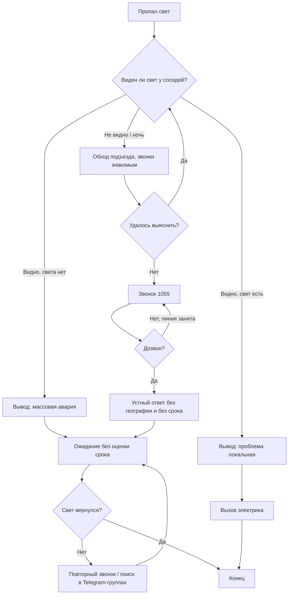
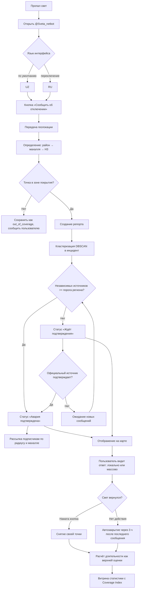
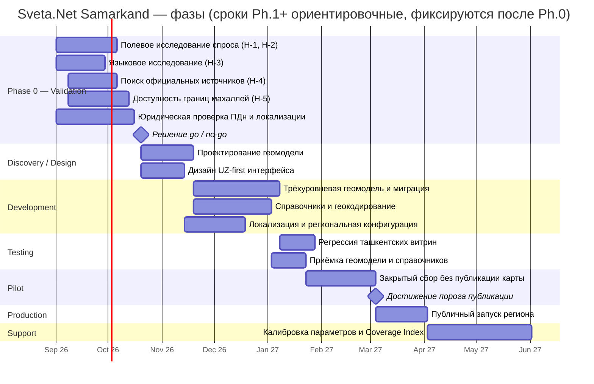
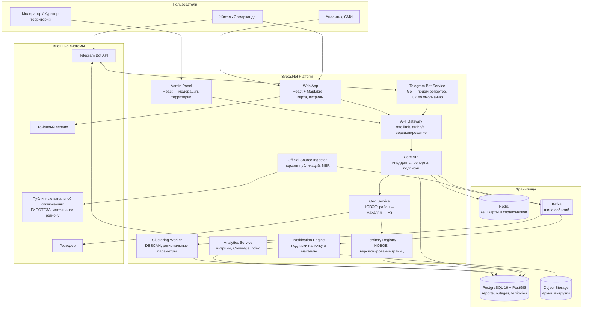

# Business Requirements Document (BRD)
## Sveta.Net — региональный запуск в Самарканде

| | |
|---|---|
| **Продукт** | Sveta.Net (svetanet.uz / chiroqyoq.uz / @Sveta_netbot) — региональный контур «Самарканд» |
| **Отрасль** | Civic Tech / Infrastructure Monitoring (некоммерческий краудсорсинг) |
| **Страна** | Республика Узбекистан, город Самарканд и Самаркандская область |
| **Языки интерфейса** | UZ (по умолчанию), RU, EN (не в текущем скоупе) |
| **Версия** | 1.0 · **Статус:** Draft for review |
| **Стандарты** | BABOK v3, PMBOK 7, IEEE 830, ISO/IEC 25010, C4, BPMN 2.0 |
| **Дата** | 2026-08-06 |

---

## 0. Регламент достоверности данных

Документ обязателен к чтению вместе с этим разделом. **В Самарканде продукт не запущен. Собственных метрик рынка не существует.** Любая цифра в этом BRD имеет один из четырёх статусов:

| Метка | Значение | Как использовать |
|---|---|---|
| `ДАННЫЕ` | Подтверждено первоисточником продукта (FAQ, «Статистика», интерфейс бота и карты) | Можно опираться |
| `BASELINE-TAS` | Перенос ташкентского показателя на Самарканд без валидации | **Не является прогнозом.** Основание для гипотезы, не для бюджета |
| `ОЦЕНКА` | Расчёт от `BASELINE-TAS` или внешних открытых источников | Требует проверки перед принятием решения |
| `ГИПОТЕЗА` | Утверждение, подлежащее опровержению в Фазе 0 | Запрещено использовать как факт |

> **Ключевое ограничение документа.** Ни один показатель раздела 21 (Success Metrics) не имеет самаркандской эмпирической базы. Все они — `BASELINE-TAS` или `ГИПОТЕЗА`. Единственное легитимное основание для утверждения бюджетов Фаз 1–2 — результаты Фазы 0 (валидация гипотез). BRD не даёт основания начинать разработку под региональный контур до закрытия Фазы 0.

---

## 1. Executive Summary

### 1.1 Краткое описание проекта

Sveta.Net — независимая некоммерческая краудсорсинговая платформа мониторинга отключений электроэнергии. Жители сообщают об отключении через Telegram-бота, система агрегирует сообщения в инциденты и публикует карту реального времени, статистику и персональные уведомления.

Продукт работает в Ташкенте и части Ташкентской области: `ДАННЫЕ` 20 969 пользователей бота, 7 403 зафиксированных случая за месяц, покрытие 12 районов, обновление карты раз в 60 секунд, узбекоязычное зеркало chiroqyoq.uz.

**Предмет данного BRD** — расширение платформы на второй по величине город страны, Самарканд, как первый региональный контур и первая проверка тезиса «продукт масштабируется за пределы столицы».

### 1.2 Цели проекта

1. Проверить переносимость продуктовой модели за пределы Ташкента при иной административной, языковой и сетевой структуре.
2. Построить трёхуровневую геомодель (городской район → махалля → H3-гексагон), пригодную не только для Самарканда, но и для последующих регионов.
3. Сделать узбекский язык языком по умолчанию, а не переводом.
4. Получить эмпирическую базу для решения о дальнейшем региональном масштабировании — вместо экстраполяции ташкентских цифр.

### 1.3 Основная проблема

Житель Самарканда, оставшийся без света, не имеет способа за разумное время узнать, локальная это проблема или массовая авария. Существующие каналы — звонок в 1055 и официальные Telegram-группы — дают текстовый поток без географии, без истории и без персональных уведомлений.

Второй слой проблемы — **проектный**: продукт спроектирован под ташкентскую административную модель (12 районов города, плоская привязка репорта к району). Прямой перенос этой модели на Самарканд невозможен (см. §3, BP-2).

### 1.4 Решение

Региональный контур Sveta.Net «Самарканд»: тот же Telegram-first вход, та же инцидентная модель, но с новой геомоделью, узбекским языком по умолчанию и собственным справочником территорий. Запуск — через обязательную Фазу 0 валидации гипотез, до принятия бюджетных обязательств.

### 1.5 Требуемые инвестиции

`ГИПОТЕЗА` Оценка ресурсов Фаз 1–2 не приводится намеренно. Продукт не имеет подтверждённой модели финансирования (открытый вопрос ташкентского пакета), а самаркандская стоимость привлечения пользователя неизвестна. Приводится только оценка Фазы 0 (§23).

---

## 2. Business Background

### 2.1 История возникновения

Sveta.Net возник как ответ на частный вопрос жителя Ташкента: «у меня одного нет света или у всего района». `ДАННЫЕ` По заявлению автора, ради ответа именно на этот вопрос сервис и создавался. Продукт вырос из MVP на Telegram-боте до сервиса с двумя языками, тремя слоями карты и публичной статистикой, оставаясь некоммерческим и не имея официального статуса.

### 2.2 Текущее состояние

| Аспект | Состояние | Статус |
|---|---|---|
| География | 12 районов Ташкента + часть области | `ДАННЫЕ` |
| Каналы | Telegram-бот, веб-карта, узбекское зеркало | `ДАННЫЕ` |
| Источники | Сообщения жителей; разбор публикаций групп 1055 | `ДАННЫЕ` |
| Геомодель | Двухуровневая: район города → точка | `ДАННЫЕ` |
| Статус в Самарканде | Не запущен; координаты Самарканда отклоняются как `GEO_OUT_OF_COVERAGE` | `ДАННЫЕ` |
| Финансирование | Не определено; проект некоммерческий | `ДАННЫЕ` |
| Официальный статус | Отсутствует; сервис заявлен как справочный, а не официальный | `ДАННЫЕ` |

### 2.3 Почему появился проект расширения

Три причины, в порядке убывания надёжности обоснования:

1. **Проверяемость модели.** Пока продукт работает в одном городе, невозможно отличить работающую продуктовую идею от совпадения со спецификой Ташкента. Самарканд — первая проверка.
2. **Архитектурный долг.** `[AS-IS]` требование FR-807 («новый регион активируется конфигурацией, без изменения кода») не выполнено: справочники, язык и геомодель зашиты под столицу. Расширение вскрывает этот долг раньше, чем он станет дороже.
3. `ГИПОТЕЗА` **Наличие спроса.** Предположение о том, что проблема отключений в Самарканде сопоставима по остроте с ташкентской, **не подтверждено**. Это гипотеза H-1 Фазы 0, а не предпосылка проекта.

---

## 3. Business Problem

Стоимость проблем не выражается в деньгах: продукт некоммерческий, выручки нет, монетизация не заявлена. Вместо денежной стоимости указана **цена бездействия** в терминах продукта.

### BP-1. Житель не может отличить локальную проблему от массовой аварии

| | |
|---|---|
| **Описание** | При отключении единственный доступный сигнал — наличие или отсутствие света у соседей, устанавливаемое вручную. |
| **Последствия** | Ожидание восстановления там, где нужен электрик; звонок в 1055 там, где идёт массовая авария и звонок бесполезен. |
| **Влияние** | Ядро ценности продукта; целевой ответ — ≤10 с (`BASELINE-TAS`, PG-1). |
| **Цена бездействия** | `ГИПОТЕЗА` Величина потерь времени по Самарканду неизвестна; предмет измерения в Фазе 0. |

### BP-2. Ташкентская геомодель неприменима к Самарканду

| | |
|---|---|
| **Описание** | В Ташкенте репорт привязывается к одному из 12 городских районов. Для Самарканда этого уровня недостаточно: город меньше по площади, районное деление даёт слишком крупную гранулярность для различения аварий, а низовой единицей социальной и адресной идентификации выступает **махалля**. |
| **Последствия** | При переносе как есть: соседние независимые аварии сливаются в один инцидент; пользователь не узнаёт свой адрес в подписи отметки; статистика по «району» бесполезна. |
| **Влияние** | Блокирующая проблема. Без её решения запуск бессмысленен. |
| **Решение** | Трёхуровневая геомодель: **городской район → махалля → H3-гексагон** (см. §11, §24). |
| **Статус** | `ДАННЫЕ` в части структуры проблемы; `ГИПОТЕЗА` в части оптимального разрешения H3. |

### BP-3. Русскоязычный интерфейс по умолчанию не соответствует рынку

| | |
|---|---|
| **Описание** | В Ташкенте русский используется как язык по умолчанию, узбекский — как зеркало. Для Самарканда это соотношение должно быть обратным. |
| **Последствия** | Повышенное трение при первом контакте с ботом; заниженная конверсия в первый репорт; искажение состава аудитории в сторону нерепрезентативной группы. |
| **Влияние** | Высокое, влияет на всю воронку. |
| **Решение** | UZ по умолчанию, RU переключением. |
| **Замечание** | Самарканд — многоязычный город со значимой таджикоязычной средой. `ГИПОТЕЗА` Потребность в третьем языке интерфейса не оценивалась и в скоуп v1 не входит; вопрос вынесен в §14 (Assumptions). |

### BP-4. Административное деление города не подтверждено

| | |
|---|---|
| **Описание** | Планируемая реорганизация города с переходом на **пять районов** документирована в проектных материалах, но **не подтверждена официальным источником** и не имеет подтверждённой даты вступления в силу. |
| **Последствия** | Справочник территорий, построенный на неподтверждённой схеме, обесценивает всю накопленную историческую статистику при её изменении. |
| **Влияние** | Высокое на данные, среднее на функциональность. |
| **Меры** | Версионирование границ (`valid_from` / `valid_to`) обязательно с первого дня; исторические витрины пересчитываются на срезе, действовавшем в момент события. |
| **Статус** | `ГИПОТЕЗА`, требует юридической и картографической проверки до Фазы 1. |

### BP-5. Отсутствие адресного справочника региона

| | |
|---|---|
| **Описание** | Двуязычный справочник улиц, домов и махаллей Самарканда у продукта отсутствует. |
| **Последствия** | Невозможны поиск по адресу, геокодирование, привязка подписок; деградация до режима «указать точку на карте». |
| **Влияние** | Соответствует зарегистрированному риску R-13 ташкентского пакета. |
| **Меры** | Подготовка справочника **до** запуска региона, а не параллельно. |

### BP-6. Оператор сети и официальный источник данных не идентифицированы

| | |
|---|---|
| **Описание** | Для Ташкента продукт разбирает публикации групп 1055. Существование, формат и регулярность аналогичного публичного потока по Самарканду не проверялись. |
| **Последствия** | При отсутствии официального слоя продукт теряет функцию сверки краудсорса с официальными данными (UC-5) — одну из заявленных ценностей. |
| **Влияние** | Среднее на v1, высокое на легитимность продукта в регионе. |
| **Статус** | `ГИПОТЕЗА`; предмет исследования H-4 Фазы 0. |

### BP-7. Нулевая плотность участников на старте

| | |
|---|---|
| **Описание** | Краудсорсинговая карта бесполезна, пока число сообщений ниже порога подтверждения. Ташкентская плотность набиралась органически и во времени. |
| **Последствия** | Классическая проблема холодного старта: пустая карта → отсутствие ценности → отсутствие притока пользователей. |
| **Влияние** | Определяющее для успеха запуска. |
| **Меры** | Явный порог запуска публичной карты; до его достижения — режим сбора без публикации статистики (см. §22, AC-3). |

---

## 4. Business Goals (SMART)

> Все целевые значения ниже имеют статус `BASELINE-TAS` или `ГИПОТЕЗА`. Они являются **предметом проверки**, а не обязательством. Фиксация целей до Фазы 0 недопустима.

| ID | Цель (SMART) | KPI | Целевое значение | Статус | Срок |
|---|---|---|---|---|---|
| BG-1 | Подтвердить или опровергнуть наличие спроса на сервис в Самарканде | Число уникальных репортов от жителей города за период наблюдения | Порог определяется в Фазе 0 | `ГИПОТЕЗА` | Ph.0, 8 недель |
| BG-2 | Достичь плотности сообщений, достаточной для автоподтверждения инцидентов | Доля инцидентов, достигших статуса «подтверждено» без ручной модерации | ≥60% | `BASELINE-TAS` | Ph.1 + 3 мес |
| BG-3 | Обеспечить ответ на вопрос «локально или массово» | Time-to-answer p90 | ≤10 с | `BASELINE-TAS` (PG-1) | Ph.1 |
| BG-4 | Сделать узбекский языком фактического использования | Доля сессий с UZ-локалью | ≥70% | `ГИПОТЕЗА` | Ph.1 + 1 мес |
| BG-5 | Обеспечить корректность геопривязки на уровне махалли | Доля репортов, автоматически привязанных к махалле | ≥90% | `ОЦЕНКА` | Ph.1 |
| BG-6 | Не допустить деградации качества данных при расширении | Расхождение между суммой по территориям и общим итогом | ≤5% | `BASELINE-TAS` (DoD Ph.1) | Ph.1 |
| BG-7 | Установить хотя бы один официальный или полуофициальный источник по региону | Число подключённых источников | ≥1 | `ГИПОТЕЗА` | Ph.2 |

---

## 5. Business Objectives

### 5.1 Краткосрочные (0–3 мес) — Фаза 0

- BO-1. Провести полевое исследование: подтвердить или опровергнуть остроту проблемы отключений в Самарканде.
- BO-2. Установить фактическое административное деление города и получить границы махаллей в машиночитаемом виде.
- BO-3. Установить наличие и формат публичных официальных публикаций об отключениях по региону.
- BO-4. Провести языковое исследование: проверить гипотезу UZ-по-умолчанию и необходимость третьего языка.
- BO-5. Принять решение go / no-go по Фазе 1 на основании BO-1…BO-4.

### 5.2 Среднесрочные (3–9 мес) — Фаза 1

- BO-6. Реализовать трёхуровневую геомодель с версионированием границ.
- BO-7. Загрузить и верифицировать двуязычный справочник территорий и адресов Самарканда.
- BO-8. Запустить региональный контур в закрытом режиме с порогом публикации карты.
- BO-9. Достичь плотности, обеспечивающей автоподтверждение (BG-2).

### 5.3 Долгосрочные (9–18 мес) — Фаза 2

- BO-10. Подключить официальный или полуофициальный источник по региону.
- BO-11. Вынести региональность в конфигурацию — выполнить FR-807 фактически, а не декларативно.
- BO-12. Получить воспроизводимый «пакет запуска региона», применимый к третьему городу без переписывания кода.

---

## 6. Scope

### 6.1 In Scope

| ID | Элемент |
|---|---|
| IS-01 | Региональный контур «Самарканд»: город + агломерация в пределах утверждённого полигона покрытия |
| IS-02 | Трёхуровневая геомодель: городской район → махалля → H3 |
| IS-03 | Справочник территорий Самарканда с версионированием границ |
| IS-04 | Двуязычный справочник улиц и адресов (UZ/RU) |
| IS-05 | UZ как язык интерфейса по умолчанию для регионального контура |
| IS-06 | Приём репортов, кластеризация, подтверждение, автозакрытие — по ташкентской логике |
| IS-07 | Карта, уведомления по подписке, витрина статистики в разрезе махаллей |
| IS-08 | Расширение справочника регионов и зон покрытия (`regions`, `coverage_zones`) |
| IS-09 | Фаза 0: исследование, полевая валидация гипотез, решение go / no-go |
| IS-10 | Региональная роль `regional_operator` со скоупом «Самарканд» |

### 6.2 Out of Scope

| ID | Элемент | Причина |
|---|---|---|
| OS-01 | Прочие регионы Узбекистана | Отдельное решение после результатов Самарканда |
| OS-02 | Мобильное нативное приложение | Стратегия Telegram-first |
| OS-03 | Монетизация, реклама, продажа данных | Противоречит некоммерческой нейтральности |
| OS-04 | Прогнозирование аварий и длительности | Ph.3 ташкентской дорожной карты; требует исторических данных, которых по региону нет |
| OS-05 | Официальная интеграция с оператором по API | Зависит от BO-10; в v1 не планируется |
| OS-06 | Таджикский язык интерфейса | Потребность не исследована; вынесено в допущения |
| OS-07 | Мониторинг иных коммунальных ресурсов (газ, вода) | Размывает продукт |
| OS-08 | Отдельная самаркандская инсталляция инфраструктуры | Единая платформа, региональность — конфигурация |

---

## 7. Stakeholders

| Stakeholder | Роль | Ответственность | Влияние | Интерес |
|---|---|---|---|---|
| Владелец продукта | Спонсор, PO | Решение go / no-go, приоритеты, финансирование | Высокое | Высокий |
| Жители Самарканда | Конечные пользователи, источник данных | Отправка репортов, отметка восстановления | Высокое (коллективно) | Высокий |
| Команда разработки | Исполнитель | Геомодель, справочники, локализация | Высокое | Средний |
| Волонтёры-модераторы (регион) | Операционная поддержка | Разбор очереди, верификация махаллей | Среднее | Средний |
| Оператор электросети региона | Внешняя сторона | Источник официальных данных (потенциально) | Высокое | `ГИПОТЕЗА` неизвестен |
| Служба 1055 | Внешний источник | Публикации об отключениях | Среднее | Низкий |
| Органы махаллей | Локальная легитимация, верификация границ | Подтверждение справочника, распространение | Среднее | `ГИПОТЕЗА` неизвестен |
| Хокимият города | Регуляторная среда, административное деление | Утверждение границ районов | Высокое | Низкий |
| Уполномоченный орган по ПДн | Регулятор | Соблюдение требований к персональным данным и локализации | Высокое | Низкий |
| СМИ и гражданские активисты | Ретрансляторы, аналитики | Использование и интерпретация статистики | Среднее | Высокий |

---

## 8. Business Requirements

Приоритеты: **High** — блокирует запуск, **Medium** — влияет на качество запуска, **Low** — улучшение.

### 8.1 Geography & Territory

| ID | Название | Описание | Приоритет | Источник |
|---|---|---|---|---|
| BR-001 | Трёхуровневая геомодель | Репорт привязывается к городскому району, махалле и H3-ячейке одновременно | High | BP-2 |
| BR-002 | Версионирование границ | Изменение административных границ не искажает историческую статистику | High | BP-4, R-14 |
| BR-003 | Справочник махаллей | Полный перечень махаллей с полигонами и названиями UZ/RU | High | BP-2, BP-5 |
| BR-004 | Полигон зоны покрытия | Явно заданная активная область регионального контура | High | FR-807 |
| BR-005 | Отказ вне покрытия | Репорт вне полигона сохраняется как `out_of_coverage` с понятным сообщением | Medium | FR-304 |
| BR-006 | Конфигурируемое разрешение H3 | Разрешение сетки задаётся на уровне региона, не константой в коде | Medium | BP-2 |

### 8.2 Localization

| ID | Название | Описание | Приоритет | Источник |
|---|---|---|---|---|
| BR-007 | UZ по умолчанию | Первый контакт с ботом и веб-карта в региональном контуре — на узбекском | High | BP-3 |
| BR-008 | Переключение языка | Пользователь может переключиться на RU в один шаг, выбор запоминается | High | BP-3 |
| BR-009 | Двуязычные топонимы | Каждая территория и улица имеет название на UZ и RU; поиск работает по любому | High | BP-5 |
| BR-010 | Языковой паритет контента | Дисклеймеры, методология и тексты ошибок переведены полностью, без смешанных экранов | Medium | PG-5 |

### 8.3 Reporting & Validation

| ID | Название | Описание | Приоритет | Источник |
|---|---|---|---|---|
| BR-011 | Приём репорта по геолокации | Как в Ташкенте: кнопка в боте, передача геолокации, автоопределение территории | High | UC-1 |
| BR-012 | Региональные параметры валидации | Радиус подтверждения, окно и минимум независимых источников настраиваются отдельно для региона | High | BP-2, C-10 |
| BR-013 | Порог публикации карты | Публичная карта региона включается только по достижении заданной плотности | High | BP-7 |
| BR-014 | Автозакрытие по TTL | Отметка закрывается через 3 ч после последнего сообщения | High | UC-3 |
| BR-015 | Разделение слоёв | Слой сообщений жителей и слой официальных публикаций не смешиваются | High | BR-08 (TAS) |

### 8.4 Notification

| ID | Название | Описание | Приоритет | Источник |
|---|---|---|---|---|
| BR-016 | Подписка на адрес | Уведомление при подтверждённом отключении рядом | High | UC-4 |
| BR-017 | Региональный радиус уведомлений | Радиус — параметр региона, а не глобальная константа 500 м | Medium | BP-2 |
| BR-018 | Подписка на махаллю | Возможность подписаться на территорию, а не только на точку | Medium | BP-2 |

### 8.5 Analytics & Reporting

| ID | Название | Описание | Приоритет | Источник |
|---|---|---|---|---|
| BR-019 | Витрина по махаллям | Статистика в разрезе территорий региона | Medium | BG-5 |
| BR-020 | Coverage Index региона | Явное предупреждение о низкой плотности участников на территории | High | BP-7, C-11 |
| BR-021 | Дисклеймер о статусе данных | Каждая витрина региона помечена как основанная на сообщениях жителей | High | BR-12 (TAS) |
| BR-022 | Запрет межрегионального сравнения без нормализации | Сопоставление Самарканда с Ташкентом допускается только с раскрытием разницы покрытия | High | C-11 |

### 8.6 Administration & Security

| ID | Название | Описание | Приоритет | Источник |
|---|---|---|---|---|
| BR-023 | Региональный скоуп ролей | `regional_operator` и `moderator` ограничены географией региона | High | RBAC (TAS) |
| BR-024 | Аудит привилегированных действий | Любое действие с региональными справочниками логируется неизменяемо | High | RBAC (TAS) |
| BR-025 | Приватность точки | Публичная координата огрубляется до сетки ~50 м | High | BR-10 (TAS) |
| BR-026 | Локализация хранения ПДн | Хранение данных соответствует требованиям законодательства РУз | High | C-09, R-14 |

### 8.7 Integration

| ID | Название | Описание | Приоритет | Источник |
|---|---|---|---|---|
| BR-027 | Региональный официальный слой | При наличии публичного источника — его разбор и отдельный слой карты | Medium | BP-6 |
| BR-028 | Геокодер региона | Преобразование адреса Самарканда в координаты с деградацией до ручного выбора точки | Medium | BP-5, R-13 |

---

## 9. Business Process (AS IS)

Текущий процесс жителя Самарканда при отключении. Sveta.Net в нём отсутствует.

**Узкие места AS-IS:** нет географии, нет истории, нет проактивного уведомления, ответ 1055 не масштабируется при массовой аварии, поиск в Telegram-группах требует ручного разбора текста.

---

## 10. Business Process (TO BE)

---

## 11. Functional Overview

| # | Функция | Описание | Отличие от Ташкента |
|---|---|---|---|
| F-01 | Приём репорта | Геолокация через бота, автоопределение территории | Трёхуровневая привязка |
| F-02 | Кластеризация в инциденты | DBSCAN по расстоянию и числу независимых акторов | Параметры eps и min_samples — региональные |
| F-03 | Подтверждение | По независимым сообщениям либо по официальному источнику | Порог настраивается отдельно |
| F-04 | Завершение | Ручное снятие точки либо TTL 3 ч | Без изменений |
| F-05 | Карта | Слои: из бота, официальный, тепловая | Тепловая — на H3-сетке региона |
| F-06 | Уведомления | Подписка на точку и на махаллю | Подписка на территорию — новое |
| F-07 | Поиск по адресу | Двуязычный, опечаткоустойчивый | Новый справочник |
| F-08 | Статистика | Витрины по махаллям и районам, Coverage Index | Новый уровень агрегации |
| F-09 | Локализация | UZ / RU | UZ по умолчанию |
| F-10 | Модерация | Очередь, действия, аудит | Региональный скоуп ролей |
| F-11 | Управление территориями | Загрузка, версионирование, верификация границ | Новая функция |

---

## 12. Non-functional Requirements

> Значения перенесены из ташкентского NFR-пакета (`BASELINE-TAS`). Нагрузочные величины для Самарканда не рассчитывались: неизвестен ожидаемый объём аудитории. Расчёт возможен только после Фазы 0.

| Категория | ID | Требование | Значение | Статус |
|---|---|---|---|---|
| Производительность | NFR-P-01 | Ответ карты по bbox, p95 | ≤300 мс | `BASELINE-TAS` |
| | NFR-P-02 | Создание репорта, p95 | ≤400 мс | `BASELINE-TAS` |
| | NFR-P-03 | Появление отметки на карте | ≤60 с | `ДАННЫЕ` |
| | NFR-P-04 | LCP на мобильном 3G | ≤2.5 с | `BASELINE-TAS` |
| Безопасность | NFR-S-01 | 2FA обязательна для всех привилегированных ролей | Обязательно | `BASELINE-TAS` |
| | NFR-S-02 | Точные координаты доступны только по праву `outage.read_exact_geo` | Обязательно | `BASELINE-TAS` |
| | NFR-S-03 | Rate limiting на приём репортов | Настраивается | `BASELINE-TAS` |
| Масштабируемость | NFR-SC-01 | Добавление региона — конфигурацией, без изменения кода | Обязательно | Целевое |
| | NFR-SC-02 | Плановый горизонт платформы | 500 тыс. пользователей (S2) | `BASELINE-TAS`, C-02 |
| Availability | NFR-A-01 | SLO публичного API и карты | 99.95% | `BASELINE-TAS` |
| | NFR-A-02 | Отказ геокодера не блокирует создание репорта | Обязательно | `BASELINE-TAS` |
| Backup | NFR-B-01 | PITR, WAL-архив | Обязательно | `BASELINE-TAS` |
| | NFR-B-02 | Резервный регион хранения | **Требует юридической проверки** | `ГИПОТЕЗА`, C-09 |
| Audit | NFR-AU-01 | Неизменяемый лог привилегированных действий | 12 мес горячее, 3 года архив | `BASELINE-TAS` |
| Localization | NFR-L-01 | Полный паритет UZ / RU без смешанных экранов | 100% строк | Целевое |
| | NFR-L-02 | Времена — Asia/Tashkent (UTC+5), API — UTC ISO-8601 | Обязательно | `ДАННЫЕ` |
| Accessibility | NFR-AC-01 | WCAG 2.1 AA | Целевое Ph.2 | `BASELINE-TAS` |
| Logging | NFR-LG-01 | Структурированные логи, `X-Request-Id`, W3C traceparent | Обязательно | `BASELINE-TAS` |
| Monitoring | NFR-MO-01 | Метрики по регионам раздельно; алерт на аномальный объём репортов | Обязательно | Целевое |

---

## 13. Business Rules

| ID | Правило |
|---|---|
| BRL-01 | ЕСЛИ репорт получен внутри полигона покрытия региона, ТО он привязывается к району, махалле и H3-ячейке; ИНАЧЕ сохраняется со статусом `out_of_coverage` и не публикуется. |
| BRL-02 | ЕСЛИ число независимых источников в кластере ≥ регионального порога в пределах окна времени, ТО инцидент получает статус «подтверждён»; ИНАЧЕ остаётся в статусе «ждёт подтверждения». |
| BRL-03 | ЕСЛИ инцидент подтверждён официальным источником, ТО его уверенность повышается до высокого, но не предельного значения; ИНАЧЕ она определяется только сообщениями жителей. При противоречии официального источника и массовых сообщений жителей поднимается флаг конфликта источников и случай направляется в модерацию. |
| BRL-04 | ЕСЛИ по инциденту не поступало новых сообщений 3 часа, ТО он автоматически закрывается. |
| BRL-05 | ЕСЛИ пользователь нажал «Свет вернулся», ТО снимается только его собственная отметка; отметки других пользователей сохраняются до своего таймаута. |
| BRL-06 | Длительность инцидента считается от первого до последнего сообщения и ВСЕГДА публикуется как верхняя оценка, а не как факт. |
| BRL-07 | ЕСЛИ плотность участников на территории ниже порога Coverage Index, ТО витрина сопровождается предупреждением о том, что малое число инцидентов может отражать отсутствие участников, а не благополучие сети. |
| BRL-08 | Слои «сообщения жителей» и «официальный источник» НИКОГДА не смешиваются в едином потоке и не суммируются в одной метрике. |
| BRL-09 | ЕСЛИ число случаев на территории за период < 30, ТО витрина помечается как статистически незначимая. |
| BRL-10 | ЕСЛИ административные границы изменились, ТО историческая статистика пересчитывается на срезе границ, действовавшем на момент события. |
| BRL-11 | Персональные данные (ФИО, номер телефона, username) НЕ хранятся ни в одной таблице; идентификатор Telegram псевдонимизируется. |
| BRL-12 | ЕСЛИ регион не достиг порога публикации карты, ТО репорты собираются, но публичная карта и статистика региона недоступны. |
| BRL-13 | ЕСЛИ язык пользователя не определён, ТО в региональном контуре «Самарканд» применяется узбекский. |
| BRL-14 | Сравнение показателей Самарканда и Ташкента без указания разницы в покрытии ЗАПРЕЩЕНО в публичных витринах. |
| BRL-15 | ЕСЛИ точность GPS хуже порогового значения, ТО вес репорта в скоринге снижается. |

---

## 14. Assumptions

| ID | Допущение | Статус | Как проверяется |
|---|---|---|---|
| A-01 | Проблема отключений в Самарканде достаточно остра, чтобы порождать спрос на сервис | `ГИПОТЕЗА` | Ph.0, H-1: полевое исследование |
| A-02 | Проникновение Telegram в Самарканде сопоставимо с ташкентским | `ГИПОТЕЗА` | Ph.0, H-2: открытые данные + опрос |
| A-03 | Узбекский — предпочтительный язык интерфейса для большинства аудитории | `ГИПОТЕЗА` | Ph.0, H-3: языковое исследование |
| A-04 | Существует публичный поток официальных сообщений об отключениях по региону | `ГИПОТЕЗА` | Ph.0, H-4: мониторинг каналов |
| A-05 | Границы махаллей доступны в машиночитаемом виде или могут быть оцифрованы за разумный срок | `ГИПОТЕЗА` | Ph.0, H-5 |
| A-06 | Переход города на пятирайонное деление состоится и будет официально оформлен | `ГИПОТЕЗА` | Юридическая проверка |
| A-07 | Поведенческие паттерны (доля отметивших возвращение света, интенсивность репортов) переносимы из Ташкента | `BASELINE-TAS` | Измеряется после запуска, не допускается как основание бюджета |
| A-08 | Потребность в третьем языке интерфейса отсутствует или несущественна | `ГИПОТЕЗА` | Ph.0, H-3; при опровержении — пересмотр скоупа |
| A-09 | Существующая инфраструктура выдержит региональный контур без отдельной инсталляции | `ОЦЕНКА` | Нагрузочный расчёт после Ph.0 |
| A-10 | Волонтёры-модераторы по региону могут быть привлечены | `ГИПОТЕЗА` | Ph.0 |

---

## 15. Constraints

| Категория | Ограничение | Статус |
|---|---|---|
| **Бюджет** | Проект некоммерческий, подтверждённой модели финансирования нет. Это ограничение первого порядка: любая архитектура, требующая устойчивого операционного бюджета, несовместима с текущим статусом продукта. | `ДАННЫЕ` |
| **Сроки** | Фаза 1 не может начаться до закрытия Фазы 0. Сроки Фазы 1 не фиксируются до получения её результатов. | Решение |
| **Законодательство** | Требования РУз к персональным данным, включая возможные требования к локализации хранения на территории страны, **не проверялись** (C-09). Рекомендация о резервном регионе может им противоречить. Юридическая проверка обязательна до Фазы 1. | `ГИПОТЕЗА` |
| **Интеграции** | Telegram Bot API — единственный канал ввода; продукт зависит от его ToS и лимитов (R-07). | `ДАННЫЕ` |
| **Технологии** | Стек фиксирован ташкентской платформой: PostgreSQL 16 + PostGIS, Redis, Kafka, Go/Python/Node, React + MapLibre, Kubernetes. Отдельный стек для региона не допускается. | `ДАННЫЕ` |
| **Данные** | Отсутствие адресного справочника региона — жёсткое ограничение старта. | `ДАННЫЕ` |
| **Организационные** | Bus factor команды; регион добавляет операционную нагрузку модерации при неизменном составе. | `ОЦЕНКА` |

---

## 16. Risks

| ID | Риск | Вероятность | Влияние | Оценка | Меры |
|---|---|---|---|---|---|
| RS-01 | Спрос в Самарканде существенно ниже ташкентского; карта остаётся пустой | Средняя | Критическое | Высокая | Фаза 0 до бюджетных обязательств; порог публикации карты; готовность к no-go |
| RS-02 | Границы махаллей недоступны или неточны | Высокая | Высокое | Высокая | Ранняя оцифровка; fallback на H3-сетку без махаллей; верификация через органы махаллей |
| RS-03 | Административная реформа изменяет деление после запуска | Средняя | Высокое | Высокая | Версионирование границ с первого дня (BR-002) |
| RS-04 | Отсутствие официального источника по региону; функция сверки недоступна | Высокая | Среднее | Средняя | Запуск без официального слоя; явный дисклеймер о неполноте картины |
| RS-05 | Языковая гипотеза неверна; UZ-по-умолчанию снижает конверсию | Низкая | Среднее | Низкая | A/B на этапе Ph.0; лёгкое переключение языка |
| RS-06 | Несоответствие требованиям к персональным данным и локализации хранения | Средняя | Высокое | Высокая | Юридическая проверка до Ph.1; хостинг с резидентностью |
| RS-07 | Расширение ломает ташкентскую статистику при миграции на трёхуровневую модель | Средняя | Высокое | Высокая | Пересчёт на копии, обратимая миграция, сверка агрегатов ≤1% |
| RS-08 | Дефицит модераторов на второй регион | Высокая | Среднее | Средняя | Приоритизация очереди, автоматизация простых кейсов, набор волонтёров в Ph.0 |
| RS-09 | Отсутствие финансирования останавливает проект в середине Фазы 1 | Средняя | Критическое | Высокая | Разбиение Ph.1 на самодостаточные инкременты; каждый — с автономной ценностью |
| RS-10 | Некорректная интерпретация самаркандской статистики в СМИ при сопоставлении с Ташкентом | Средняя | Среднее | Средняя | BRL-14, Coverage Index, страница методологии |
| RS-11 | H3-разрешение выбрано неверно: аварии либо сливаются, либо дробятся | Средняя | Среднее | Средняя | Конфигурируемое разрешение (BR-006), калибровка на первых 4 неделях |
| RS-12 | Оператор сети или органы власти воспринимают сервис враждебно | Низкая | Высокое | Средняя | Позиция кооперации, разделение слоёв, статус справочного источника |

---

## 17. Dependencies

| ID | Зависимость | Тип | Критичность | Владелец |
|---|---|---|---|---|
| D-01 | Telegram Bot API | Внешняя техническая | Критическая | Telegram |
| D-02 | Данные о границах махаллей Самарканда | Внешняя данные | Критическая | Органы махаллей / картографические источники |
| D-03 | Официальное решение об административном делении города | Внешняя правовая | Высокая | Хокимият |
| D-04 | Адресный справочник (улицы, дома) региона | Внешняя данные | Высокая | Открытые/государственные источники |
| D-05 | Публичные каналы официальных сообщений об отключениях | Внешняя данные | Средняя | 1055 / оператор сети |
| D-06 | Геокодер с покрытием Самарканда | Внешняя техническая | Высокая | Поставщик геосервисов |
| D-07 | Картографические тайлы (MapLibre) | Внешняя техническая | Средняя | Поставщик тайлов |
| D-08 | Юридическое заключение по ПДн и локализации | Внутренняя | Критическая | Владелец продукта |
| D-09 | Ташкентская Фаза 1 (инцидентная модель, дедупликация) | Внутренняя | Критическая | Команда |
| D-10 | Хостинг с резидентностью в РУз | Внешняя инфраструктурная | Высокая | Провайдер |

> **Критический путь:** D-08 → D-02 → D-09 → запуск. Ни один из трёх не находится под полным контролем команды.

---

## 18. Integrations

| Система | Назначение | Тип интеграции | Направление | Статус |
|---|---|---|---|---|
| Telegram Bot API | Приём репортов, доставка уведомлений | REST + Webhook | Двустороннее | `ДАННЫЕ`, действует |
| Telegram-каналы официальных сообщений (регион) | Официальный слой карты | Читающий клиент + парсинг (NER) | Входящее | `ГИПОТЕЗА`, источник не подтверждён |
| Геокодер | Адрес → координаты | REST | Исходящее | Требуется |
| Обратное геокодирование | Координаты → территория | Внутренний PostGIS `ST_Contains` | Внутреннее | Требуется |
| Тайловый сервис карты | Подложка | HTTP (тайлы) | Входящее | Действует |
| Kafka | Шина событий: репорты, уведомления | MQ | Внутреннее | `BASELINE-TAS` |
| PostgreSQL + PostGIS | Хранилище, гео-операции | Database | Внутреннее | `BASELINE-TAS` |
| Redis | Кеш карты и справочников | Database (in-memory) | Внутреннее | `BASELINE-TAS` |
| API оператора электросети | Официальные данные по региону | REST (проектируется) | Входящее | Out of Scope v1 |
| Open Data API | Выгрузка для СМИ и исследователей | REST + CSV/GeoJSON | Исходящее | Ph.3, вне скоупа |

---

## 19. User Roles

| Роль | Скоуп | Права |
|---|---|---|
| Гость (веб) | Публичный | Просмотр карты, статистики, методологии региона |
| Пользователь Telegram | Свои ресурсы | Отправка репорта, отметка возвращения света, подписки, выбор языка |
| Зарегистрированный пользователь (веб) | Свои ресурсы | То же + управление подписками через сайт |
| Модератор региона | Самарканд | Разбор очереди, подтверждение/отклонение/объединение/разделение инцидентов, блокировка источника |
| Региональный оператор | Самарканд | Работа с инцидентами и плановыми отключениями, импорт данных, эскалация |
| Куратор территорий | Самарканд | Загрузка и верификация границ махаллей и адресного справочника, версионирование |
| Аналитик | Глобальный (чтение) | Витрины, экспорт, отчёты; без модерации |
| Super Admin | Глобальный | Параметры валидации региона, роли, конфигурация покрытия |

**Ограничения:** 2FA обязательна для всех привилегированных ролей. Разделение обязанностей — модератор не изменяет параметры валидации. Точные координаты доступны только при наличии права `outage.read_exact_geo`.

---

## 20. Reporting

### 20.1 Отчёты

| Отчёт | Аудитория | Периодичность |
|---|---|---|
| Сводка по региону: инциденты, длительность, география | Публика, СМИ | Реальное время + периодические срезы |
| Разрез по махаллям с Coverage Index | Публика, аналитики | Реальное время |
| Отчёт качества данных: доля модерируемых, доля дублей, расхождение агрегатов | Команда, PO | Еженедельно |
| Отчёт Фазы 0: результаты проверки H-1…H-5 | PO, спонсор | Однократно, по завершении Ph.0 |
| Операционный отчёт модерации: очередь, SLA, доля отменённых решений | Команда | Еженедельно |
| Отчёт о территориальных изменениях | Команда, аналитики | По событию |

### 20.2 Dashboards

| Dashboard | Содержание |
|---|---|
| Публичный региональный | Карта, активные инциденты, медианная и P90 длительность, Coverage Index |
| Операционный | Очередь модерации, аномалии объёма, состояние источников, лаг обработки |
| Качества данных | Расхождение сумм по территориям, доля дублей, доля привязок к махалле |
| Запуска (Ph.0/Ph.1) | Прогресс к порогу публикации, покрытие территорий участниками, доля UZ-сессий |

### 20.3 KPI

| KPI | Определение | Цель | Статус |
|---|---|---|---|
| Уникальных репортёров за 30 дней | Регион | Порог из Ph.0 | `ГИПОТЕЗА` |
| Доля территорий с ненулевым покрытием | Махалли с ≥1 репортом / всего | ≥50% | `ГИПОТЕЗА` |
| Доля автоподтверждённых инцидентов | Без модерации | ≥60% | `BASELINE-TAS` |
| Доля привязок к махалле | Автоматических | ≥90% | `ОЦЕНКА` |
| Доля UZ-сессий | Регион | ≥70% | `ГИПОТЕЗА` |
| Расхождение агрегатов | Сумма территорий vs итог | ≤5% | `BASELINE-TAS` |
| Медиана времени до подтверждения | Регион | ≤3 мин | `BASELINE-TAS` |

---

## 21. Success Metrics

> **Все метрики раздела не имеют самаркандской эмпирической базы.** Их целевые значения устанавливаются по результатам Фазы 0 и до этого момента считаются гипотезами.

| Уровень | Метрика | Что означает провал |
|---|---|---|
| Продуктовый | Time-to-answer p90 ≤10 с | Продукт не решает свою основную задачу |
| Продуктовый | Плотность, достаточная для автоподтверждения | Краудсорсинговая модель в регионе не работает |
| Данные | Расхождение агрегатов ≤5% | Цифрам региона нельзя доверять |
| Данные | Доля привязок к махалле ≥90% | Геомодель не даёт заявленной гранулярности |
| Аудитория | Доля территорий с покрытием ≥50% | Сервис обслуживает нерепрезентативное меньшинство |
| Локализация | Доля UZ-сессий ≥70% | Языковая гипотеза опровергнута |
| Операционный | SLA модерации выдержан | Операционная модель не масштабируется на второй регион |
| Стратегический | Получен воспроизводимый пакет запуска региона | Каждый следующий регион будет стоить как первый |

---

## 22. Acceptance Criteria

### Фаза 0

| ID | Критерий |
|---|---|
| AC-0.1 | Гипотезы H-1…H-5 проверены; по каждой зафиксирован результат — подтверждена, опровергнута или не определена |
| AC-0.2 | Фактическое административное деление города установлено и подтверждено документально |
| AC-0.3 | Оценена доступность границ махаллей и трудоёмкость их оцифровки |
| AC-0.4 | Получено юридическое заключение по ПДн и локализации хранения |
| AC-0.5 | Принято и задокументировано решение go / no-go с обоснованием |

### Фаза 1

| ID | Критерий |
|---|---|
| AC-1.1 | Трёхуровневая геомодель реализована; репорт получает привязку ко всем трём уровням |
| AC-1.2 | Границы версионируются; тестовое изменение границ не искажает историческую витрину |
| AC-1.3 | Справочник территорий и адресов загружен, покрытие проверено выборочно |
| AC-1.4 | UZ является языком по умолчанию регионального контура; паритет строк 100% |
| AC-1.5 | Региональные параметры валидации задаются конфигурацией, без изменения кода |
| AC-1.6 | Порог публикации карты реализован и настроен |
| AC-1.7 | Ташкентские витрины после миграции воспроизводят исторические значения с расхождением ≤1% |
| AC-1.8 | Роли со скоупом «Самарканд» работают; попытка выхода за скоуп отклоняется и логируется |
| AC-1.9 | Публичная карта региона включена по достижении порога, витрины сопровождаются Coverage Index |

**Проект считается успешно завершённым**, если выполнены AC-0.* и AC-1.*, а метрики §21 измерены — независимо от того, достигнуты ли их гипотетические целевые значения. Измеримость результата, а не его величина, есть критерий успеха первого регионального запуска.

---

## 23. High-Level Timeline

| Фаза | Вопрос фазы | Критерий выхода |
|---|---|---|
| **Ph.0 Validation** | Стоит ли вообще запускать? | AC-0.1…AC-0.5, решение go / no-go |
| **Discovery / Design** | Как именно устроить геомодель и интерфейс? | Утверждённые спецификации |
| **Development** | Реализовано ли без ущерба Ташкенту? | AC-1.1…AC-1.5, AC-1.7 |
| **Testing** | Корректны ли данные? | Регрессия витрин пройдена |
| **Pilot** | Набирается ли плотность? | Достижение порога публикации |
| **Production** | Работает ли продукт публично? | AC-1.9 |
| **Support** | Верны ли параметры? | Калибровка завершена, метрики §21 измерены |

---

## 24. High-Level Architecture

Региональность реализуется как **конфигурация единой платформы**, а не как отдельная инсталляция. Новые элементы относительно ташкентской архитектуры выделены в описании.

### 24.1 C4 — Container Diagram

### 24.2 Ключевые архитектурные решения

| Решение | Обоснование |
|---|---|
| Единая платформа, регион как конфигурация | Иначе каждый следующий регион стоит как первый; выполнение NFR-SC-01 |
| Territory Registry как отдельный компонент | Версионирование границ — сквозная функция, затрагивающая витрины, подписки и кластеризацию |
| H3 как третий уровень | Даёт устойчивую агрегацию, не зависящую от административных изменений; тепловая карта строится на нём |
| Махалля как средний уровень | Единица, в которой пользователь узнаёт своё местоположение |
| Региональные параметры валидации | Плотность застройки и структура сети в Самарканде отличаются; ташкентские eps и порог неприменимы по умолчанию |
| Разделение слоёв источников | Сохраняет способность фиксировать расхождение официальной картины и наблюдений жителей |

---

## 25. Glossary

| Термин | Определение |
|---|---|
| **Отметка** | Визуальное представление сообщения или инцидента на карте |
| **Репорт (Report)** | Единичное сообщение пользователя об отключении |
| **Инцидент (Outage)** | Кластер репортов, интерпретируемый как одно отключение |
| **Подтверждение** | Переход инцидента в статус «авария подтверждена» по независимым сообщениям либо официальному источнику |
| **Автозакрытие** | Закрытие инцидента через 3 часа после последнего сообщения |
| **Махалля** | Низовая территориальная единица самоуправления; средний уровень геомодели |
| **H3** | Гексагональная иерархическая геопространственная индексная сетка |
| **Coverage Index** | Показатель плотности участников на территории; предупреждает о недостаточности данных |
| **Confidence** | Числовая оценка уверенности в реальности инцидента (0–100) |
| **DBSCAN** | Алгоритм плотностной кластеризации, применяемый для сведения репортов в инциденты |
| **TTL отметки** | Время жизни отметки без новых подтверждений (3 часа) |
| **Слои карты** | Взаимоисключающие представления по источнику: сообщения жителей, официальный источник, тепловая карта |
| **Краудсорсинг** | Сбор данных от распределённого сообщества добровольных участников |
| **1055** | Номер и связанные с ним публичные каналы информирования об отключениях |
| **BASELINE-TAS** | Ташкентский показатель, перенесённый на Самарканд без валидации |
| **Фаза 0** | Обязательный этап проверки гипотез до принятия бюджетных обязательств |
| **out_of_coverage** | Статус репорта, полученного вне активного полигона региона |

---

## 26. Appendix

### 26.1 Связанные документы

| Документ | Отношение к данному BRD |
|---|---|
| `01_BRD.md` (Ташкент) | Базовый BRD платформы; источник `BASELINE-TAS` |
| `02_PRD.md` | Vision, Mission, Product Goals, позиционирование |
| `03_Functional_Requirements.md` | FR-807 (регионы конфигурацией), FR-801…FR-808 (гео) |
| `04_NFR.md` | Источник значений §12; замечание C-02 о горизонте нагрузки |
| `06_Database.md`, `18_ERD.md` | `regions`, `districts`, `streets`, `addresses`, `coverage_zones` |
| `07_RBAC.md` | Модель ролей и региональный скоуп |
| `13_Risk_Register.md` | R-13 (справочник адресов), R-14 (локализация данных) |
| `21_Critical_Review.md` | C-02, C-08, C-09, C-10, C-11 — прямо применимы к настоящему документу |
| `svetanet-use-cases.md` | UC-1…UC-5, подтверждённая модель данных |

### 26.2 Стандарты

BABOK v3 · PMBOK 7 · IEEE 830-1998 · ISO/IEC 25010 · UML 2.5 · BPMN 2.0 · C4 Model · OWASP ASVS · WCAG 2.1 AA · OpenAPI 3.1 · RFC 3339 · WGS 84 (EPSG:4326)

### 26.3 Диаграммы документа

| # | Диаграмма | Раздел |
|---|---|---|
| 1 | AS-IS процесс (flowchart) | §9 |
| 2 | TO-BE процесс (flowchart) | §10 |
| 3 | Дорожная карта (gantt) | §23 |
| 4 | C4 Container Diagram | §24.1 |

### 26.4 Открытые вопросы, требующие решения владельца продукта

| # | Вопрос | Блокирует |
|---|---|---|
| OQ-1 | Модель финансирования проекта | Все фазы после Ph.0 |
| OQ-2 | Фактическое административное деление Самарканда | Справочник территорий |
| OQ-3 | Требования законодательства РУз к локализации хранения ПДн | Архитектуру хранения и резервирования |
| OQ-4 | Наличие публичного официального источника по региону | Официальный слой карты |
| OQ-5 | Порог публикации карты — конкретное значение | Запуск пилота |
| OQ-6 | Необходимость третьего языка интерфейса | Скоуп локализации |
| OQ-7 | Источник и правовой режим данных о границах махаллей | Ph.1 |
| OQ-8 | Лицензия проекта (не объявлена) | Публикацию API и Open Data |

---

**Конец документа.**
